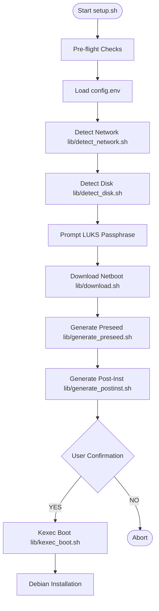

Relevant source files

The following files were used as context for generating this wiki page:

- [README.md](README.md)
- [setup.sh](setup.sh)
- [lib/detect_network.sh](lib/detect_network.sh)
- [lib/detect_disk.sh](lib/detect_disk.sh)
- [lib/download.sh](lib/download.sh)
- [lib/kexec_boot.sh](lib/kexec_boot.sh)

# Introduction & Prerequisites

The `vps-setup` project is a specialized automation suite designed to perform a clean reinstallation of Debian 13 (Trixie) on an existing Virtual Private Server (VPS). Its primary scope is to transform a running Linux system into a hardened, encrypted Debian environment using `kexec` to bypass traditional installation media. The system focuses heavily on security through LUKS full-disk encryption, SSH hardening, and automated firewall configuration.

The project operates by auto-detecting the existing environment's network and storage configurations, downloading verified Debian netboot artifacts, and injecting a custom preseed payload into a RAM-based installer. This ensures a self-contained installation process that does not rely on local HTTP servers or external connectivity once the initial `kexec` transition occurs.

Sources: [README.md:1-25](README.md#L1-L25), [setup.sh:1-20](setup.sh#L1-L20), [lib/kexec_boot.sh:37-45](lib/kexec_boot.sh#L37-L45)

## System Prerequisites

Before initiating the setup, the target environment must meet specific hardware and software requirements. The most critical constraint is the virtualization type; the system requires full virtualization (KVM, Xen, VMware, or Bare-Metal) because `kexec` cannot operate within container-based environments like LXC or OpenVZ.

### Hardware and Environment Requirements
- **Virtualization**: KVM/Full-virtualization only.
- **Access**: Root access on the host system is mandatory.
- **Connectivity**: VNC/IPMI console access is highly recommended for troubleshooting network configuration failures during the transition.
- **Base OS**: A running Debian or Ubuntu system is required to host the initial execution.
- **Architecture**: Designed for `x86_64` (amd64).

Sources: [README.md:27-33](README.md#L27-L33), [setup.sh:82-99](setup.sh#L82-L99)

### Required Dependencies
The `setup.sh` script performs an automated "Pre-flight Check" to ensure necessary binaries are present. If missing, it attempts to install them via `apt-get`.

| Command | Package | Purpose |
| :--- | :--- | :--- |
| `ip` | `iproute2` | Network interface and routing detection |
| `wget` | `wget` | Downloading Debian netboot artifacts |
| `kexec` | `kexec-tools` | Replacing the running kernel with the installer |
| `lsblk`, `findmnt` | `util-linux` | Disk and mount point discovery |
| `openssl` | `openssl` | Secret token and key generation |
| `cpio` | `cpio` | Injecting payloads into the `initrd` |

Sources: [setup.sh:101-137](setup.sh#L101-L137), [lib/kexec_boot.sh:53-57](lib/kexec_boot.sh#L53-L57), [lib/download.sh:25-29](lib/download.sh#L25-L29)

## Core Architecture and Data Flow

The project follows a linear execution model that moves from environment discovery to artifact preparation and finally to system replacement.

### Installation Flow
The following diagram illustrates the high-level sequence of operations performed by the `main()` function in `setup.sh`:

The workflow ensures that all configurations are validated and all artifacts are verified via SHA256 before the "Point of No Return" (`kexec`).

Sources: [setup.sh:305-385](setup.sh#L305-L385), [lib/download.sh:78-121](lib/download.sh#L78-L121)

## Configuration and Auto-Detection

The system relies on `config.env` for user-defined parameters but implements robust auto-detection logic to minimize manual input.

### Network Detection Logic
The `lib/detect_network.sh` module extracts current system settings to ensure the new installation retains connectivity.
- **Interface**: Identified via the default route or the first non-virtual physical interface (excluding `docker`, `veth`, etc.).
- **IPv4/IPv6**: Static addresses, netmasks (converted from CIDR), and gateways are retrieved using `iproute2`.
- **DNS**: Parsed from `/etc/resolv.conf`, filtering out local resolvers (127.0.0.1).

Sources: [lib/detect_network.sh:15-68](lib/detect_network.sh#L15-L68)

### Disk Detection Logic
The `lib/detect_disk.sh` module identifies the primary target for the OS reinstallation.
- **Root Disk Trace**: The script traces the `/` mount point back to its parent block device (e.g., `/dev/sda` or `/dev/nvme0n1`).
- **Role Handling**: 
  - `standard`: Only the OS disk is touched.
  - `storage-vps`: Scans for additional disks and prompts interactively for formatting/mounting.
- **Boot Mode**: Detects if the system is running in UEFI or BIOS/Legacy mode to select the appropriate partitioning recipe.

Sources: [lib/detect_disk.sh:11-88](lib/detect_disk.sh#L11-L88), [README.md:35-51](README.md#L35-L51)

## Security and Integrity Verification

Security is integrated into the earliest stages of the process, particularly regarding artifact integrity and secret handling.

### Artifact Verification
The `lib/download.sh` module enforces strict integrity checks:
1. **HTTPS Only**: Mirrors are restricted to HTTPS to prevent on-path substitution.
2. **Fail-Closed Verification**: Downloads both `linux` and `initrd.gz`. It then fetches `SHA256SUMS` and verifies both files. If verification fails, it deletes the artifacts and aborts.

Sources: [lib/download.sh:31-41](lib/download.sh#L31-L41), [lib/download.sh:98-121](lib/download.sh#L98-L121)

### Secret Handling in Preparation
- **Temporary Keys**: A `TEMP_LUKS_KEY` is generated using `openssl rand` for the initial automated partitioning phase.
- **Work Directory**: The `.work` directory is created with restricted `700` permissions.
- **Encrypted Payloads**: Passphrases are not stored in plain text; they are AES-256-CBC encrypted using the temporary key before being injected into the `initrd`.

Sources: [setup.sh:315-316](setup.sh#L315-L316), [lib/generate_preseed.sh:29-33](lib/generate_preseed.sh#L29-L33), [lib/generate_postinst.sh:39-44](lib/generate_postinst.sh#L39-L44)

## Summary of Prerequisites Checklist

Before running `sudo ./setup.sh`, ensure:
1. `config.env` is created from `config.env.example` with a valid `SSH_PUBKEY` and `USERNAME`.
2. The VPS is KVM-based (verified via `systemd-detect-virt`).
3. Port 22 is available (used later by Dropbear for remote LUKS unlock).
4. The user is prepared for total data destruction on the primary disk.

Sources: [README.md:55-75](README.md#L55-L75), [setup.sh:91-99](setup.sh#L91-L99), [lib/kexec_boot.sh:127-145](lib/kexec_boot.sh#L127-L145)
