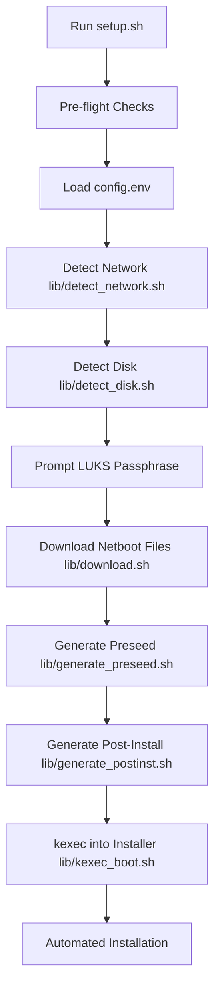
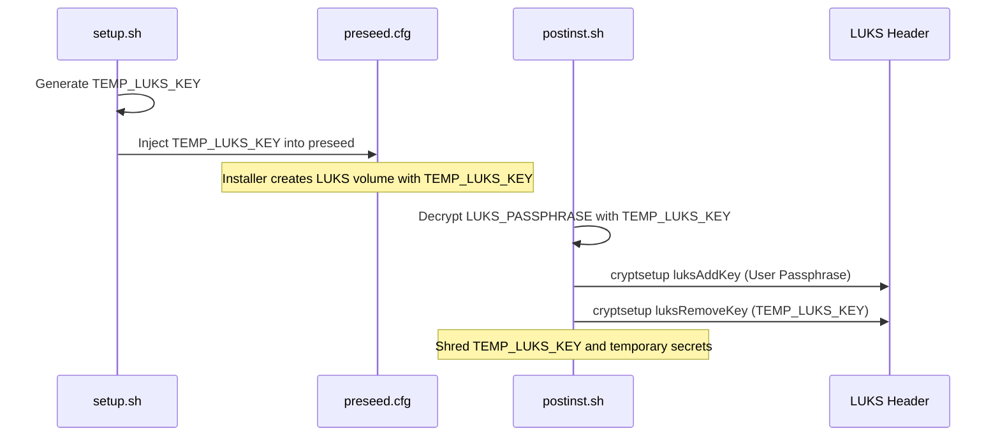

Relevant source files

The following files were used as context for generating this wiki page:

- [README.md](README.md)
- [setup.sh](setup.sh)
- [lib/detect_disk.sh](lib/detect_disk.sh)
- [lib/detect_network.sh](lib/detect_network.sh)
- [lib/download.sh](lib/download.sh)
- [lib/generate_preseed.sh](lib/generate_preseed.sh)
- [lib/generate_postinst.sh](lib/generate_postinst.sh)
- [lib/kexec_boot.sh](lib/kexec_boot.sh)

# Quick Start Guide

The `vps-setup` project provides an automated framework for reinstalling a Virtual Private Server (VPS) with Debian 13 (Trixie). It utilizes `kexec` to boot into a Debian installer directly from a running Linux environment, enabling full-disk LUKS encryption, remote SSH unlocking, and system hardening without requiring physical media or provider-specific reinstallation tools.

This guide outlines the operational flow from initial configuration to the post-installation phase, ensuring a secure and reproducible deployment of hardened Debian instances.

Sources: [README.md:1-15](README.md#L1-L15), [setup.sh:5-20](setup.sh#L5-L20)

## System Preparation and Configuration

The setup process begins with environment validation and configuration via a `config.env` file. The system requires root access on a KVM-based VPS and a running Debian/Ubuntu environment for the initial `kexec` execution.

### Configuration Parameters

Users must define identity and security parameters in `config.env`. Key fields include:

| Parameter | Mandatory | Description |
| :--- | :--- | :--- |
| `USERNAME` | Yes | Non-root user with NOPASSWD sudo access. |
| `SSH_PUBKEY` | Yes | Public key for SSH authentication (passwords are disabled). |
| `SSH_PORT` | No | Custom port for OpenSSH (default: 2222). Port 22 is reserved for LUKS unlock. |
| `INSTALL_ROLE` | No | `standard` (root disk only) or `storage-vps` (interactive secondary disk handling). |

Sources: [README.md:52-64](README.md#L52-L64), [README.md:118-142](README.md#L118-L142), [setup.sh:185-225](setup.sh#L185-L225)

### Installation Roles logic
The system supports two primary installation roles that dictate how storage devices are handled:
1.  **Standard Mode**: Automatically detects the root disk and ignores all other block devices.
2.  **Storage VPS Mode**: Scans for secondary disks and provides an interactive prompt to format (ext4) and mount them or leave them untouched.

Sources: [README.md:38-49](README.md#L38-L49), [lib/detect_disk.sh:91-105](lib/detect_disk.sh#L91-L105)

## Execution Flow

The `setup.sh` script orchestrates several modular library scripts to perform discovery, artifact retrieval, and execution.

### Deployment Process Diagram
The following flowchart illustrates the sequence of operations performed by the setup script:

The workflow ensures that all hardware and network parameters are verified before the "point of no return" in the kexec phase. 

Sources: [setup.sh:317-386](setup.sh#L317-L386), [lib/kexec_boot.sh:137-148](lib/kexec_boot.sh#L137-L148)

### Network and Hardware Discovery
The system employs automated detection to minimize manual configuration errors:
*  **Network**: Detects IPv4/IPv6 addresses, gateways, and DNS by parsing `ip route` and `/etc/resolv.conf`. It filters out virtual interfaces like Docker or Tailscale.
*  **Disk**: Resolves the parent block device of the current root filesystem using `lsblk` and `readlink`. It also detects if the system is booting via UEFI or BIOS/Legacy mode to apply the correct partitioning recipe.

Sources: [lib/detect_network.sh:15-60](lib/detect_network.sh#L15-L60), [lib/detect_disk.sh:25-75](lib/detect_disk.sh#L25-L75), [lib/detect_disk.sh:163-172](lib/detect_disk.sh#L163-L172)

## Security and Hardware Integrity

To protect against MITM (Man-in-the-Middle) attacks, the system enforces strict artifact verification.

### Netboot Artifact Verification
The `lib/download.sh` script performs the following security checks:
1.  **HTTPS Only**: Rejects non-HTTPS mirrors to prevent artifact substitution.
2.  **SHA256 Verification**: Downloads `SHA256SUMS` metadata and verifies both the `linux` kernel and `initrd.gz` images before proceeding.
3.  **Fail-Closed Logic**: If verification fails, the script shreds downloaded files and aborts the installation.

Sources: [lib/download.sh:30-40](lib/download.sh#L30-L40), [lib/download.sh:84-120](lib/download.sh#L84-L120)

### LUKS Lifecycle and Key Management
The system utilizes a temporary key during installation which is later replaced by the user's passphrase.

This mechanism ensures that no permanent installer key remains on the system.

Sources: [lib/generate_preseed.sh:28-35](lib/generate_preseed.sh#L28-L35), [lib/generate_postinst.sh:38-45](lib/generate_postinst.sh#L38-L45), [README.md:175-185](README.md#L175-L185)

## Post-Installation Access

Once the automated installation completes, the system reboots into a locked state.

### Remote Unlocking
The system uses `dropbear-initramfs` to allow remote decryption.
1.  **Unlock via SSH**: Connect to port 22 (Dropbear) using the root user.
2.  **Authentication**: Use the same SSH key provided in `config.env`.
3.  **Command**: Run `cryptroot-unlock` (automatically triggered upon login) and provide the LUKS passphrase.

Sources: [README.md:89-105](README.md#L89-L105), [setup.sh:14-25](setup.sh#L14-L25)

### Regular Access
After the disk is unlocked, the system boots the main OS. The primary OpenSSH daemon listens on the custom `SSH_PORT` (e.g., 2222). Root login is disabled in the main OS, requiring login via the configured `USERNAME`.

Sources: [README.md:107-110](README.md#L107-L110), [lib/generate_postinst.sh:47-60](lib/generate_postinst.sh#L47-L60)

## Summary
The `vps-setup` Quick Start Guide provides a path from a standard VPS to a hardened, encrypted Debian 13 environment. By leveraging `kexec` and `preseed`, the project automates complex tasks such as network auto-discovery, SHA256-verified artifact retrieval, and secure LUKS key rotation, resulting in a production-ready server with minimal manual intervention.

Sources: [README.md:1-10](README.md#L1-L10), [setup.sh:388-390](setup.sh#L388-L390)
