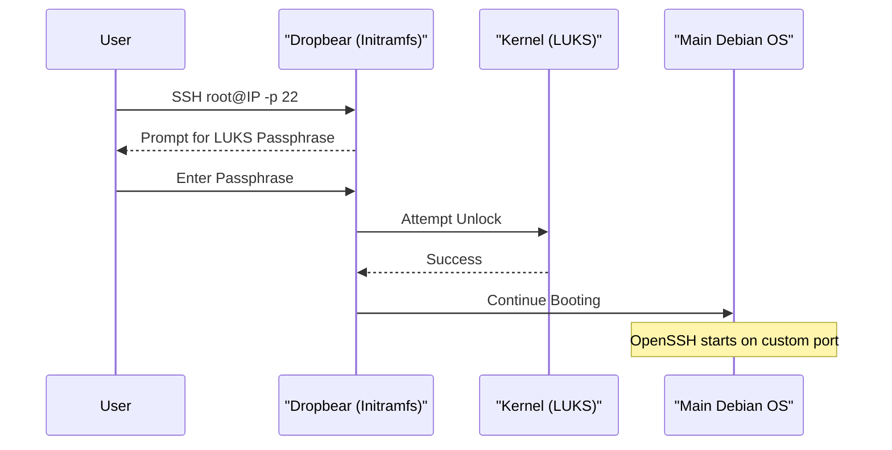

<details>
<summary>Relevant source files</summary>

The following files were used as context for generating this wiki page:

- [README.md](README.md)
- [setup.sh](setup.sh)
- [lib/generate_postinst.sh](lib/generate_postinst.sh)
- [lib/kexec_boot.sh](lib/kexec_boot.sh)
- [lib/detect_disk.sh](lib/detect_disk.sh)
- [lib/detect_network.sh](lib/detect_network.sh)

</details>

# First Boot Checklist

The **First Boot Checklist** defines the critical sequence of actions a user must perform immediately after the automated Debian reinstallation process completes. Because the project utilizes LUKS full-disk encryption and strict SSH hardening, the initial access pattern differs significantly from standard VPS deployments.

This stage is reached after the `kexec` transition replaces the host OS and the Debian installer finishes its automated routine, including the execution of the post-installation hardening script. The system at this point is encrypted and requires remote manual intervention to finalize the boot process and secure the environment.

Sources: [README.md:94-102](README.md#L94-L102), [setup.sh:396-400](setup.sh#L396-L400), [lib/kexec_boot.sh:135-155](lib/kexec_boot.sh#L135-L155)

## Remote LUKS Unlock
The primary action upon the first reboot is unlocking the encrypted root partition. The system boots into an `initramfs` environment where a minimal Dropbear SSH server is active on port 22.

### Access Mechanism
- **Port:** 22 (Reserved exclusively for Dropbear in `initramfs`).
- **User:** `root`.
- **Function:** Automatically executes `/bin/cryptroot-unlock` upon connection.
- **Security:** Root login is disabled in the main OS, but permitted here specifically for decryption.



Sources: [README.md:104-118](README.md#L104-L118), [setup.sh:22](setup.sh#L22), [lib/generate_postinst.sh:31-35](lib/generate_postinst.sh#L31-L35)

## Primary System Login
Once the disk is decrypted, the system finishes booting into the main Debian environment. The user must then switch to the hardened SSH configuration.

### Login Parameters
| Parameter | Value | Source |
| :--- | :--- | :--- |
| **User** | `USERNAME` (from `config.env`) | `setup.sh:185` |
| **Port** | `SSH_PORT` (default: 2222) | `setup.sh:186` |
| **Auth Method** | SSH Key Only (Password disabled) | `README.md:73` |
| **Sudo** | NOPASSWD | `README.md:74` |

Sources: [README.md:120-123](README.md#L120-L123), [setup.sh:185-207](setup.sh#L185-L207), [lib/generate_postinst.sh:54-57](lib/generate_postinst.sh#L54-L57)

## Verification and Post-Install Audit
After gaining access to the main system, the user should verify the integrity of the installation and the security baseline.

### Essential Verification Steps
1.  **Installation Summary:** Inspect `/root/vps-install-summary.txt` for a log of the automated setup.
2.  **Encryption Report:** Check `/root/encryption-report.txt` to confirm that temporary installer keys were successfully rotated to the user's passphrase.
3.  **Security Baseline:** Verify that immutable configuration backups are present in `/root/security-baseline/`.
4.  **Firewall Status:** Ensure UFW is active and Fail2ban is monitoring the custom SSH port.

Sources: [README.md:162-166](README.md#L162-L166), [README.md:195-200](README.md#L195-L200)

## Critical Disaster Recovery (Off-site Backup)
The project generates a LUKS header backup to ensure data recovery in the event of header corruption. **This file must be moved off the VPS immediately.**

### Header Backup Procedure
The backup is stored at `/root/luks-header-backup.img` with mode `600` permissions. The user should retrieve it using the following command pattern:

```bash
umask 077 && ssh -p [SSH_PORT] [USERNAME]@[IP] 'sudo cat /root/luks-header-backup.img' > ./luks-header-backup.img
```

Sources: [README.md:155-156](README.md#L155-L156), [README.md:167-168](README.md#L167-L168), [lib/generate_postinst.sh:61](lib/generate_postinst.sh#L61)

## Testing and Validation Checklist
Before moving the VPS to production, the following validation suite is recommended:
- **Passphrase Test:** Verify that incorrect passphrases at the Dropbear prompt do not corrupt the volume or lock out valid access.
- **Service Persistence:** Reboot the server to ensure Dropbear remains inactive in the main OS while OpenSSH consistently binds to the custom port.
- **Snapshot Integrity:** If using a cloud provider, restore a disk snapshot to a new instance and verify the LUKS prompt unlocks the clone correctly.

Sources: [README.md:173-189](README.md#L173-L189)

### Summary
The First Boot Checklist transitions the server from an automated installation state to a secure, user-managed production state. By following the remote unlock, hardened login, and header backup procedures, the architect ensures that the LUKS encryption lifecycle is complete and that the system is resilient against both network attacks and local disk failures.
