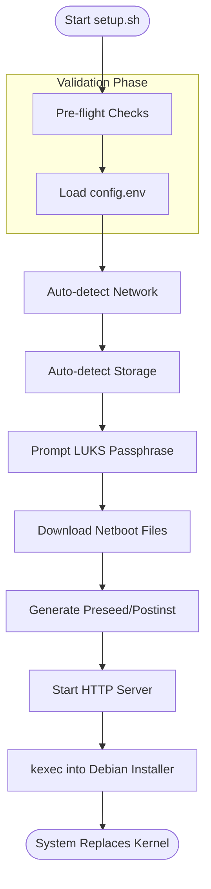
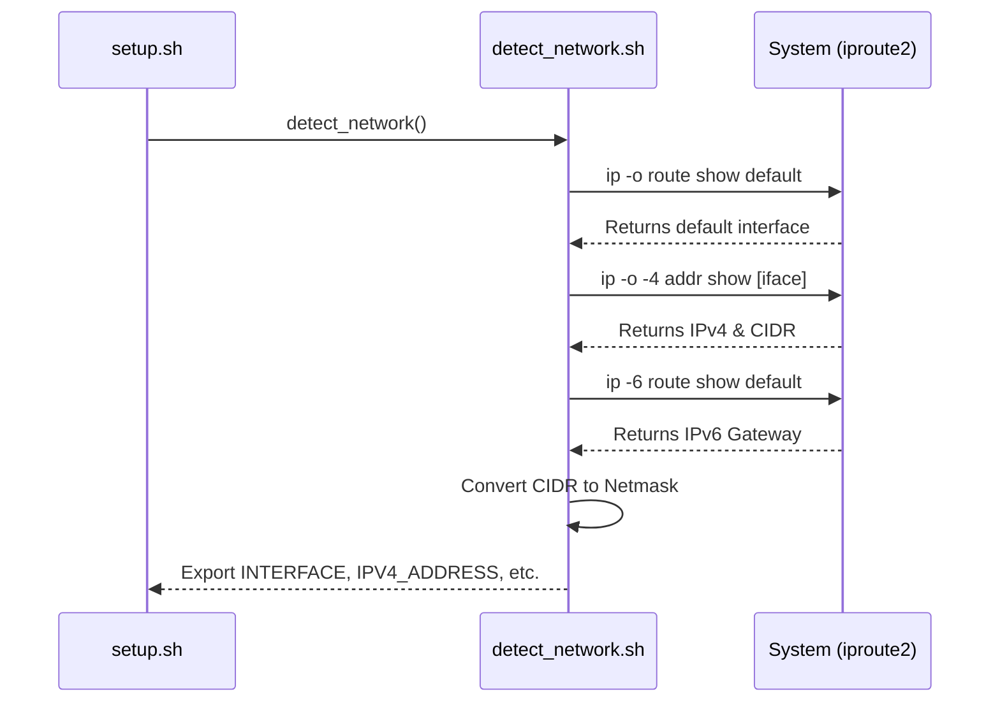

Relevant source files

The following files were used as context for generating this wiki page:

- [README.md](README.md)
- [setup.sh](setup.sh)
- [lib/detect_network.sh](lib/detect_network.sh)
- [lib/detect_disk.sh](lib/detect_disk.sh)
- [lib/download.sh](lib/download.sh)
- [lib/kexec_boot.sh](lib/kexec_boot.sh)

# Introduction & Prerequisites

The **vps-setup** project is an automated orchestration tool designed to reinstall a Virtual Private Server (VPS) with Debian 13 (Trixie) from an existing, running Linux environment. Its primary purpose is to transform a standard cloud instance into a hardened, encrypted server utilizing LUKS full-disk encryption, remote SSH unlocking via Dropbear, and comprehensive system hardening through automated preseed and post-installation scripting.

The system operates by auto-detecting existing network and storage configurations, generating temporary installation tokens, and using `kexec` to hot-boot into a Debian netboot installer. This process avoids the need for manual ISO mounting while ensuring a secure baseline that includes UFW firewall rules, Fail2ban jails, and kernel-level sysctl restrictions.

Sources: [README.md:3-23](README.md#L3-L23), [setup.sh:3-22](setup.sh#L3-L22)

## System Prerequisites

Before executing the setup, the environment must meet specific virtualization and access requirements. The project strictly requires full-virtualization capabilities, as container-based environments do not support the `kexec` system call required to swap the running kernel.

### Requirements Table

| Requirement | Description | Source |
|:---|:---|:---|
| **Access** | Root/Sudo privileges on the current VPS | [README.md:33](README.md#L33), [setup.sh:78-81](setup.sh#L78-L81) |
| **Virtualization** | KVM, Xen, VMware, or Bare-Metal (No OpenVZ/LXC) | [README.md:34](README.md#L34), [setup.sh:95-107](setup.sh#L95-L107) |
| **OS Support** | Currently running Debian or Ubuntu | [README.md:36](README.md#L36) |
| **Arch** | x86_64 (amd64) | [setup.sh:88-92](setup.sh#L88-L92) |
| **Hardware Tools** | VNC or IPMI console (recommended for recovery) | [README.md:35](README.md#L35) |

### Mandatory Software Dependencies
The `preflight_checks` function in `setup.sh` ensures the following utilities are present before proceeding:
- `iproute2` (for network detection)
- `wget` (for fetching netboot images)
- `python3` (to host the temporary preseed HTTP server)
- `kexec-tools` (to perform the kernel hot-swap)
- `util-linux` (`lsblk`, `findmnt`) and `coreutils` (`numfmt`, `shred`)

Sources: [setup.sh:110-120](setup.sh#L110-L120), [lib/kexec_boot.sh:47-50](lib/kexec_boot.sh#L47-L50)

## Execution Flow Overview

The setup process follows a sequential pipeline from environment validation to the final `kexec` jump. The following diagram illustrates the high-level logic flow within the main execution entry point.

The workflow ensures all critical parameters are gathered and validated before the destructive partitioning phase begins.
Sources: [setup.sh:293-356](setup.sh#L293-L356), [lib/kexec_boot.sh:11-40](lib/kexec_boot.sh#L11-L40)

## Configuration & Environment

The tool relies on `config.env` for user-defined parameters. While the system attempts to auto-detect most hardware and network settings, several fields are mandatory for security and user access.

### Critical User Configuration
Users must define these fields in `config.env` to prevent execution failure:
- **USERNAME**: The non-root user account to be created (must be valid alphanumeric).
- **SSH_PUBKEY**: A valid SSH public key (e.g., ed25519) for authentication.
- **SSH_PORT**: A custom port (must not be 22, as 22 is reserved for pre-boot LUKS unlocking).

Sources: [setup.sh:150-178](setup.sh#L150-L178), [README.md:65-72](README.md#L65-L72)

### Installation Roles
The system supports two distinct operational modes via the `INSTALL_ROLE` variable:

1.  **Standard Mode (`standard`)**: Operates strictly on the root OS disk. Secondary disks are ignored.
2.  **Storage VPS Mode (`storage-vps`)**: Scans for additional block devices and provides interactive prompts to format (`ext4`) and mount them under `/mnt/`.

Sources: [README.md:38-55](README.md#L38-L55), [lib/detect_disk.sh:91-155](lib/detect_disk.sh#L91-L155)

## Network Detection Logic

The `detect_network.sh` library extracts active configuration from the host to ensure the Debian installer maintains connectivity during reinstallation. It prioritizes values in `config.env` but falls back to automated discovery.

This detection is critical because the `kexec` command line requires explicit network parameters (`netcfg/...`) to fetch the preseed file from the temporary local HTTP server.
Sources: [lib/detect_network.sh:13-65](lib/detect_network.sh#L13-L65), [lib/kexec_boot.sh:65-85](lib/kexec_boot.sh#L65-L85)

## Storage and Boot Mode Detection

The system automatically identifies the primary OS disk by tracing the root mount point (`/`) back to its parent block device. It also determines the firmware type (UEFI vs. BIOS) to select the appropriate partitioning recipe.

### Boot Mode Logic
- **UEFI**: Detected if `/sys/firmware/efi` exists. Uses an EFI System Partition (ESP).
- **BIOS/Legacy**: Used otherwise. Implements a `biosgrub` partition for GPT compatibility.

Sources: [lib/detect_disk.sh:162-170](lib/detect_disk.sh#L162-L170), [lib/generate_preseed.sh:48-54](lib/generate_preseed.sh#L48-L54)

### Partitioning Strategy
The setup implements a specific LVM-on-LUKS layout:
- **Unencrypted**: `/boot` (ext4) and EFI ESP (if UEFI).
- **Encrypted (LUKS2)**: A Volume Group (default: `<hostname>-vol`) containing:
  - `root` logical volume (ext4).
  - `swap` logical volume.

Sources: [README.md:120-130](README.md#L120-L130), [lib/generate_preseed.sh:48-54](lib/generate_preseed.sh#L48-L54)

## Security & Encryption Baseline

The project emphasizes a "No Permanent Installer Key" security model. It uses a multi-stage key rotation process during installation to ensure the disk is never accessible via the temporary setup keys after completion.

| Stage | Action | Description |
|:---|:---|:---|
| **Setup** | `TEMP_LUKS_KEY` generation | Random 32-byte key generated for automated preseed partitioning. |
| **Post-Install** | `luksAddKey` | User's real passphrase added to the LUKS header. |
| **Finalization** | `luksRemoveKey` | The temporary installer key is purged from the header. |
| **Cleanup** | `shred -u` | Temporary key files and preseed data are securely deleted. |

Sources: [README.md:132-145](README.md#L132-L145), [lib/generate_preseed.sh:31-33](lib/generate_preseed.sh#L31-L33), [setup.sh:66-72](setup.sh#L66-L72)

## Summary

The **Introduction & Prerequisites** phase establishes the foundation for a successful, automated Debian reinstallation. By enforcing strict virtualization checks, auto-detecting hardware environments, and preparing a secure LUKS key rotation strategy, the system ensures that the "Point of No Return" (`kexec` execution) results in a fully functional, hardened, and encrypted server. Proper configuration of `config.env` and verification of `kexec` support are the most critical steps before deployment.

Sources: [README.md:196-220](README.md#L196-L220), [lib/kexec_boot.sh:96-126](lib/kexec_boot.sh#L96-L126)
