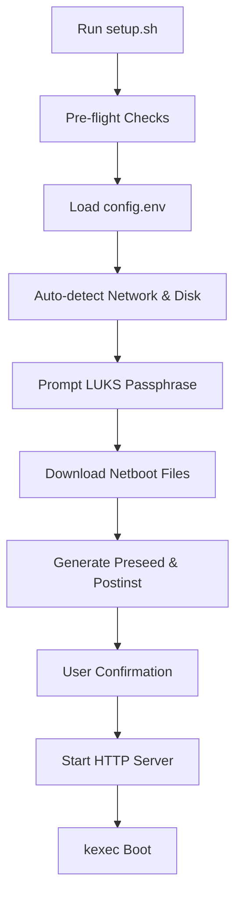
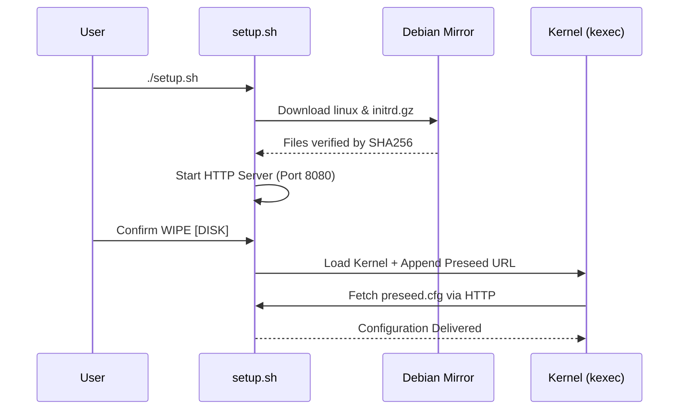

Relevant source files

The following files were used as context for generating this wiki page:

- [README.md](README.md)
- [setup.sh](https://github.com/aadilxgit/v5-setup/blob/5b6800040cb5e7b0136cc59f12a6a3989f58d791/setup.sh)
- [lib/detect_network.sh](lib/detect_network.sh)
- [lib/detect_disk.sh](lib/detect_disk.sh)
- [lib/download.sh](lib/download.sh)
- [lib/generate_preseed.sh](lib/generate_preseed.sh)
- [lib/generate_postinst.sh](lib/generate_postinst.sh)
- [lib/kexec_boot.sh](lib/kexec_boot.sh)

# Quick Start Guide

## Introduction
The VPS Setup tool provides an automated framework for reinstalling a Virtual Private Server (VPS) with Debian 13 (Trixie) while enforcing full-disk LUKS encryption and system hardening. It is designed to run from an existing Debian/Ubuntu system, utilizing `kexec` to transition into the Debian installer without requiring external boot media.

This guide outlines the essential steps to configure, validate, and execute the installation. The process automates network detection, disk partitioning (supporting both BIOS and UEFI), and post-installation security configurations, including remote LUKS unlocking via Dropbear SSH.
Sources: [README.md:1-15](README.md#L1-L15), [setup.sh:1-25](setup.sh#L1-L25)

## Installation Workflow
The setup process follows a sequential flow from environment validation to the final `kexec` jump into the Debian installer.

The workflow ensures that all dependencies and configurations are verified before any destructive changes are made to the target disk.
Sources: [setup.sh:316-370](setup.sh#L316-L370), [lib/kexec_boot.sh:89-138](lib/kexec_boot.sh#L89-L138)

## Configuration and Environment Setup
Users must configure a `config.env` file to define identity, access, and installation parameters.

### Required Configuration Fields
| Field | Description | Requirement |
|-------|-------------|-------------|
| `USERNAME` | Non-root user with NOPASSWD sudo access. | Must be alphanumeric. |
| `SSH_PORT` | Main OpenSSH daemon port. | Cannot be 22 (reserved for Dropbear). |
| `SSH_PUBKEY` | SSH public key for authentication. | Key-only auth is enforced. |
| `INSTALL_ROLE` | `standard` (OS disk only) or `storage-vps` (interactive secondary disks). | Default is `standard`. |

Sources: [README.md:112-140](README.md#L112-L140), [setup.sh:150-185](setup.sh#L150-L185)

### Disk and Network Auto-detection
The system attempts to automatically resolve infrastructure details to minimize manual entry errors.
*  **Network**: Detects IPv4, IPv6, gateways, netmasks, and DNS servers using `iproute2`.
*  **Disk**: Identifies the primary OS disk by tracing the root `/` mount point back to its parent block device.
*  **Boot Mode**: Detects if the system uses UEFI or BIOS/Legacy via the presence of `/sys/firmware/efi`.

Sources: [lib/detect_network.sh:15-60](lib/detect_network.sh#L15-L60), [lib/detect_disk.sh:15-80](lib/detect_disk.sh#L15-L80), [lib/detect_disk.sh:185-192](lib/detect_disk.sh#L185-L192)

## Execution Modes
The script supports two primary modes of operation to ensure safety and flexibility.

### 1. Dry Run Mode
Invoked via `sudo ./setup.sh --dry-run`, this mode simulates the entire process without modifying the system. It generates the `.work/preseed.cfg` and `.work/postinst.sh` files for manual inspection.
Sources: [setup.sh:267-280](setup.sh#L267-L280), [README.md:82-90](README.md#L82-L90)

### 2. Live Installation
The standard execution downloads Debian netboot files, starts a local HTTP server to serve the preseed configuration, and executes the `kexec` command to replace the running kernel.

Sources: [lib/download.sh:16-65](lib/download.sh#L16-L65), [lib/kexec_boot.sh:15-45](lib/kexec_boot.sh#L15-L45), [lib/kexec_boot.sh:97-120](lib/kexec_boot.sh#L97-L120)

## LUKS Security Mechanism
Security is handled through a multi-stage key rotation to ensure no permanent installer keys remain.

1.  **Temporary Key**: A random `TEMP_LUKS_KEY` is generated for the automated preseed installation.
2.  **Passphrase Addition**: The `postinst.sh` script adds the user's permanent passphrase to a LUKS keyslot.
3.  **Key Rotation**: The temporary key is removed, and the disk header is backed up to `/root/luks-header-backup.img`.
4.  **Verification**: The script verifies the permanent passphrase successfully unlocks the volume before finishing.

Sources: [lib/generate_preseed.sh:31-33](lib/generate_preseed.sh#L31-L33), [lib/generate_postinst.sh:38-44](lib/generate_postinst.sh#L38-L44), [README.md:162-171](README.md#L162-L171)

## Post-Installation Checklist
Once the installation completes (~10 minutes), the following steps are required for first boot:

*  **LUKS Unlock**: Connect via `ssh root@<IP> -p 22` to access the Dropbear environment and type the passphrase.
*  **System Access**: Log in via the custom port: `ssh <USERNAME>@<IP> -p <SSH_PORT>`.
*  **Verification**: Review `/root/vps-install-summary.txt` and `/root/encryption-report.txt` to confirm all security hardening measures were applied.
*  **Header Backup**: Move the LUKS header backup file off-site.

Sources: [README.md:95-108](README.md#L95-L108), [README.md:173-180](README.md#L173-L180)

## Summary
The VPS Setup tool transforms a standard VPS into a hardened, encrypted Debian server. By automating the transition from a live OS to the Debian installer via `kexec` and `preseed`, it eliminates the need for manual ISO mounting while ensuring consistent application of LUKS encryption and SSH hardening policies.
