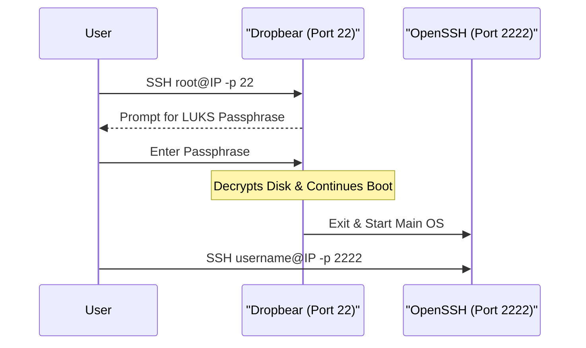
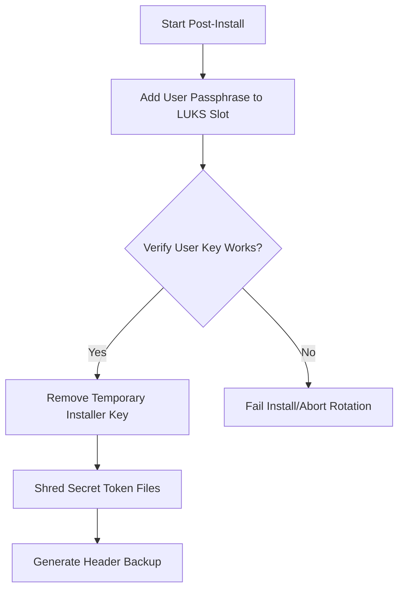

<details>
<summary>Relevant source files</summary>

The following files were used as context for generating this wiki page:

- [README.md](README.md)
- [setup.sh](setup.sh)
- [lib/detect_disk.sh](lib/detect_disk.sh)
- [lib/generate_postinst.sh](lib/generate_postinst.sh)
- [lib/generate_preseed.sh](lib/generate_preseed.sh)
- [lib/kexec_boot.sh](lib/kexec_boot.sh)

</details>

# First Boot Checklist

The **First Boot Checklist** defines the critical sequence of actions a user must perform immediately after the automated Debian installation completes and the VPS reboots. Because the system utilizes LUKS full-disk encryption and strict SSH hardening, the initial access pattern differs significantly from standard VPS deployments.

This checklist ensures the integrity of the encryption setup, verifies that hardening measures were applied correctly, and secures the LUKS header for disaster recovery. The process transitions the server from a pre-boot decryption state (handled by Dropbear) to a fully operational, hardened production environment.

Sources: [README.md:167-173](README.md#L167-L173), [setup.sh:17-25](setup.sh#L17-L25)

## Post-Installation Access Flow

Upon the first reboot, the system resides in the initramfs stage, awaiting the LUKS passphrase to mount the root filesystem. Access is restricted to a specific port and user for decryption before the main OpenSSH daemon becomes available.

### Remote LUKS Unlock
The first step requires connecting to the Dropbear SSH instance running in the initramfs. This environment is restricted solely to executing `/bin/cryptroot-unlock`. Users must clear any old host keys associated with the IP, as Dropbear generates a new key during the initramfs build.



The diagram shows the transition from the temporary pre-boot SSH environment to the hardened main system environment.
Sources: [README.md:121-137](README.md#L121-L137), [setup.sh:370-384](setup.sh#L370-L384)

## Critical Verification Tasks

Once the system is unlocked and fully booted, the user must verify the installation results and security baseline. The project generates several reports in the `/root` directory to facilitate this audit.

### System Verification Components
| Item | File Path | Description |
| :--- | :--- | :--- |
| **Installation Summary** | `/root/vps-install-summary.txt` | General overview of the installation parameters and roles. |
| **Encryption Report** | `/root/encryption-report.txt` | Details on LUKS status, LVM volume groups, and key rotation success. |
| **Security Baseline** | `/root/security-baseline/` | Directory containing immutable backups of initial security configurations. |

Sources: [README.md:175-177](README.md#L175-L177), [README.md:209-211](README.md#L209-L211)

### LUKS Key Rotation Verification
During the post-installation phase, the system rotates keys to ensure no permanent installer key remains. The user should confirm that the `TEMP_LUKS_KEY` (generated during `setup.sh`) was successfully removed and replaced by their personal passphrase.



The flow represents the security mechanism ensuring the temporary `TEMP_LUKS_KEY` is purged after the user's real passphrase is confirmed.
Sources: [README.md:154-162](README.md#L154-L162), [lib/generate_postinst.sh:42-50](lib/generate_postinst.sh#L42-L50)

## Disaster Recovery & Backups

A critical final step is the retrieval of the LUKS header backup. If the header is corrupted, the encrypted data is irretrievable even with the correct passphrase.

### Off-site Header Backup
The system automatically generates a backup at the path defined by `LUKS_HEADER_BACKUP_PATH` (defaulting to `/root/luks-header-backup.img`). This file is created with mode `600` permissions. The checklist requires moving this file to a secure, off-site location.

**Retrieval Command:**

```bash
umask 077 && ssh -p 2222 yourname@YOUR_VPS_IP 'sudo cat /root/luks-header-backup.img' > ./luks-header-backup.img
```

Sources: [README.md:178-179](README.md#L178-L179), [lib/generate_postinst.sh:58-59](lib/generate_postinst.sh#L58-L59)

## Summary Checklist
- [ ] **Remote Unlock**: Access port 22 via SSH as root to provide the passphrase.
- [ ] **Normal Login**: Access the custom `SSH_PORT` (default 2222) using the non-root `USERNAME`.
- [ ] **Audit Reports**: Inspect `/root/vps-install-summary.txt` and `/root/encryption-report.txt` for errors.
- [ ] **Secure Header**: Download `/root/luks-header-backup.img` and store it in an encrypted external vault.
- [ ] **Baseline Check**: Verify the contents of `/root/security-baseline/` to establish an audit trail.

Sources: [README.md:171-180](README.md#L171-L180), [setup.sh:22-26](setup.sh#L22-L26)
