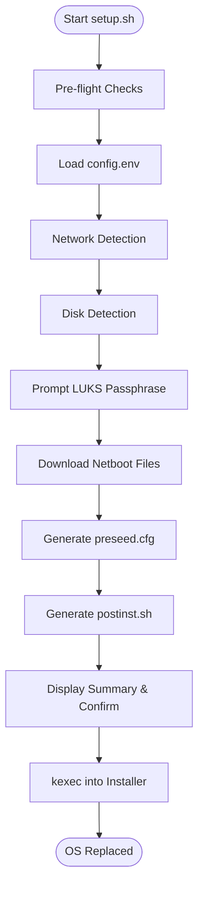
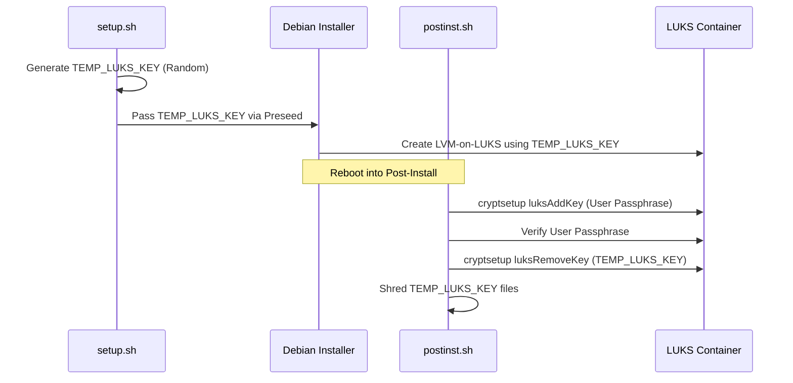

<details>
<summary>Relevant source files</summary>

The following files were used as context for generating this wiki page:

- [README.md](README.md)
- [setup.sh](setup.sh)
- [lib/detect_network.sh](lib/detect_network.sh)
- [lib/detect_disk.sh](lib/detect_disk.sh)
- [lib/download.sh](lib/download.sh)
- [lib/generate_preseed.sh](lib/generate_preseed.sh)
- [lib/generate_postinst.sh](lib/generate_postinst.sh)
- [lib/kexec_boot.sh](lib/kexec_boot.sh)
</details>

# High-Level Architecture

The **vps-setup** project is an automated orchestration framework designed to reinstall a running Linux VPS with Debian 13 (Trixie) featuring full-disk LUKS encryption and remote SSH unlocking. The architecture leverages `kexec` to replace the running OS kernel with a Debian netboot installer without requiring a physical reboot or external boot media. It utilizes a self-contained initrd payload to ensure an offline-capable installation process once the kernel has transitioned.

Sources: [README.md:1-10](README.md#L1-L10), [setup.sh:1-25](setup.sh#L1-L25), [lib/kexec_boot.sh:37-40](lib/kexec_boot.sh#L37-L40)

## Execution Lifecycle

The system follows a linear execution path from environment detection to kernel execution. The process is divided into two primary phases: the **Host Environment Preparation** (running on the existing OS) and the **Debian Installer Execution** (running in RAM).

### System Orchestration Flow

The following diagram illustrates the sequential stages performed by the `main` function in the primary controller script.



The orchestration logic ensures all environmental variables and secrets are validated before the destructive `kexec` jump.
Sources: [setup.sh:386-455](setup.sh#L386-L455), [lib/kexec_boot.sh:150-165](lib/kexec_boot.sh#L150-L165)

## Core Components and Modules

The architecture is modularized into specialized shell libraries, each handling a specific domain of the installation preparation.

| Module | File Path | Responsibility |
| :--- | :--- | :--- |
| **Network Detector** | `lib/detect_network.sh` | Resolves IPv4/IPv6, Gateways, and active Interfaces via `iproute2`. |
| **Disk Manager** | `lib/detect_disk.sh` | Identifies primary OS disk, boot mode (UEFI/BIOS), and secondary disks. |
| **Artifact Downloader** | `lib/download.sh` | Fetches Debian kernel/initrd with HTTPS enforcement and SHA256 verification. |
| **Preseed Generator** | `lib/generate_preseed.sh` | Templating engine for Debian `preseed.cfg` including partitioning recipes. |
| **Boot Orchestrator** | `lib/kexec_boot.sh` | Injects configuration into initrd and executes the `kexec` transition. |

Sources: [README.md:126-137](README.md#L126-L137), [setup.sh:401-406](setup.sh#L401-L406)

## Security and Encryption Architecture

The architecture prioritizes a "Zero-Installer-Key" approach. It uses a temporary key for the automated partitioning phase which is subsequently rotated to the user's passphrase.

### LUKS Key Lifecycle Management



The rotation ensures that no permanent installation key remains on the system.
Sources: [lib/generate_preseed.sh:33-35](lib/generate_preseed.sh#L33-L35), [README.md:179-188](README.md#L179-L188), [lib/generate_postinst.sh:40-45](lib/generate_postinst.sh#L40-L45)

### Data Hardening and Verification
1.  **SHA256 Verification**: The downloader enforces a "fail closed" policy; if the `linux` kernel or `initrd.gz` does not match official metadata, execution stops to prevent on-path substitution attacks.
  Sources: [lib/download.sh:98-120](lib/download.sh#L98-L120)
2.  **Secret Payload Injection**: Secrets (like the LUKS passphrase) are AES-256-CBC encrypted using the `TEMP_LUKS_KEY` and injected directly into the `initrd.kexec.gz` via a CPIO pipeline. This eliminates the need for a local HTTP server to host preseed files.
  Sources: [lib/generate_postinst.sh:47-51](lib/generate_postinst.sh#L47-L51), [lib/kexec_boot.sh:65-75](lib/kexec_boot.sh#L65-L75)
3.  **SSH Separation**: Port 22 is reserved for `dropbear-initramfs` (LUKS unlock), while the main OS OpenSSH daemon is restricted to a custom port (default 2222) with mandatory SSH-key authentication.
  Sources: [README.md:214-220](README.md#L214-L220), [setup.sh:220-225](setup.sh#L220-L225)

## Network and Disk Discovery

The system performs automated discovery to populate the preseed configuration without user intervention for standard setups.

### Network Resolution
The `detect_network` module filters out virtual interfaces (Docker, veth, Wireguard) and loopback DNS resolvers to ensure the installer has valid external connectivity.
Sources: [lib/detect_network.sh:16-25](lib/detect_network.sh#L16-L25), [lib/detect_network.sh:58-65](lib/detect_network.sh#L58-L65)

### Storage Configuration Roles
The architecture supports two installation roles:
*  **Standard**: Identifies the current root (`/`) mount and its parent physical disk using `lsblk` and `findmnt`. Secondary disks are ignored.
*  **Storage-VPS**: Interactively scans all non-root block devices and prompts for formatting/mounting actions.
  Sources: [lib/detect_disk.sh:12-25](lib/detect_disk.sh#L12-L25), [lib/detect_disk.sh:91-105](lib/detect_disk.sh#L91-L105)

## Boot Transition (kexec)
The transition to the new OS occurs in-memory. The system builds a complex kernel command line (`kcmdline`) that passes network parameters, locale settings, and the preseed file location to the new kernel.

```bash
# Example kexec command line construction
kcmdline+="preseed/file=/preseed.cfg "
kcmdline+="netcfg/get_ipaddress=${IPV4_ADDRESS} "
kcmdline+="console=ttyS0,115200n8 console=tty0 "
```

Sources: [lib/kexec_boot.sh:100-130](lib/kexec_boot.sh#L100-L130)

## Conclusion
The **High-Level Architecture** of vps-setup provides a robust, security-first mechanism for remote OS deployment. By combining in-memory kernel execution with encrypted secret transport and automated hardware discovery, it minimizes the risks associated with manual VPS reinstallation while enforcing modern hardening standards like LUKS2 and SSH-key-only access.
