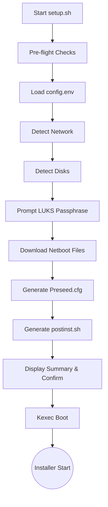
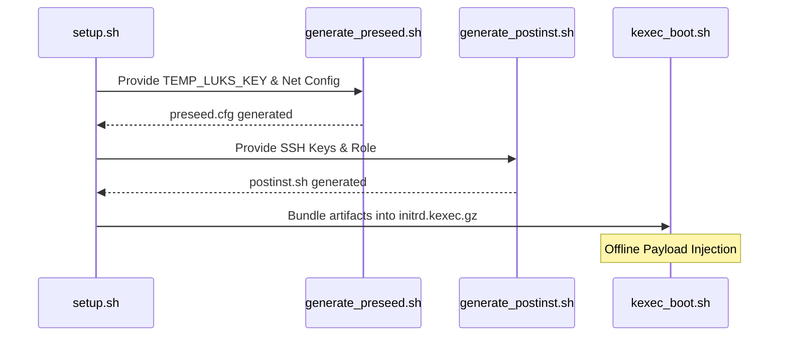

<details>
<summary>Relevant source files</summary>

The following files were used as context for generating this wiki page:

- [setup.sh](setup.sh)
- [lib/detect_network.sh](lib/detect_network.sh)
- [lib/detect_disk.sh](lib/detect_disk.sh)
- [lib/download.sh](lib/download.sh)
- [lib/generate_preseed.sh](lib/generate_preseed.sh)
- [lib/generate_postinst.sh](lib/generate_postinst.sh)
- [lib/kexec_boot.sh](lib/kexec_boot.sh)
</details>

# Core Execution Flow (setup.sh)

The `setup.sh` script serves as the primary orchestrator for the automated Debian reinstallation process. Its purpose is to transform a running Linux VPS into a hardened Debian system with full-disk LUKS encryption. It achieves this by performing environmental discovery, generating specialized configuration payloads, and executing a `kexec` transition to the Debian installer without requiring a standard reboot or local HTTP server.

The execution flow is strictly sequential, moving from pre-flight validation and environment detection to artifact preparation and finally the terminal `kexec_boot` phase. This process ensures that all necessary network, disk, and security parameters are verified before the host system is replaced.

## High-Level Execution Sequence

The main entry point of the script coordinates ten distinct steps to ensure a safe and automated transition to the new OS.



Sources: [setup.sh:455-520](setup.sh#L455-L520), [README.md:120-137](README.md#L120-L137)

## Environment Validation and Discovery

### Pre-flight Checks
The `preflight_checks` function ensures the environment is suitable for `kexec`. It verifies root privileges, Linux OS compatibility, and crucially, the virtualization type. The script explicitly blocks execution on container-based virtualization like LXC or OpenVZ, as `kexec` requires a full virtualization hypervisor (KVM, Xen, etc.).

Sources: [setup.sh:65-126](setup.sh#L65-L126)

### Network and Disk Detection
The discovery phase identifies the active infrastructure parameters to ensure the new installation retains connectivity and targets the correct hardware.

| Component | Responsibility | Relevant File |
| :--- | :--- | :--- |
| **Network** | Identifies IPv4/IPv6, Gateway, Netmask, and DNS. Filters out virtual interfaces (docker, tun). | `lib/detect_network.sh` |
| **Disk** | Locates the parent block device of the root `/` filesystem. Detects UEFI vs BIOS boot mode. | `lib/detect_disk.sh` |

Sources: [lib/detect_network.sh:13-88](lib/detect_network.sh#L13-L88), [lib/detect_disk.sh:13-89](lib/detect_disk.sh#L13-L89)

## Artifact Preparation and Security

### Secure Payload Generation
The script generates a `preseed.cfg` and a `postinst.sh` script. These are not served over a network; instead, they are injected directly into a modified initrd. This prevents "on-path" substitution attacks.



Sources: [lib/generate_preseed.sh:22-115](lib/generate_preseed.sh#L22-L115), [lib/generate_postinst.sh:18-86](lib/generate_postinst.sh#L18-L86), [lib/kexec_boot.sh:37-77](lib/kexec_boot.sh#L37-L77)

### Cryptographic Handling
A temporary random key (`TEMP_LUKS_KEY`) is used during the automated partitioning phase of the Debian installer. The user's actual passphrase is encrypted via AES-256-CBC using this temporary key and stored within the `INSTALL_TOKEN` directory in the initrd. This ensures that the user's secret passphrase is never stored in plain text during the transition.

Sources: [lib/generate_preseed.sh:33-37](lib/generate_preseed.sh#L33-L37), [lib/generate_postinst.sh:39-49](lib/generate_postinst.sh#L39-L49)

## Terminal Execution (kexec)

The final phase, `kexec_boot`, is the "Point of No Return." The script constructs a complex kernel command line including static network configuration, preseed file locations, and console redirects.

```bash
# lib/kexec_boot.sh:81-105
kcmdline+="auto=true "
kcmdline+="priority=critical "
kcmdline+="preseed/file=/preseed.cfg "
kcmdline+="netcfg/get_ipaddress=${IPV4_ADDRESS} "
kcmdline+="netcfg/confirm_static=true "
kcmdline+="console=ttyS0,115200n8 "
kcmdline+="console=tty0 "
```

The `kexec -l` command loads the Debian installer kernel and the modified initrd (containing the secrets and preseed) into memory. Upon user confirmation, `kexec -e -f` is executed, immediately terminating the host OS and jumping into the Debian installer.

Sources: [lib/kexec_boot.sh:110-163](lib/kexec_boot.sh#L110-L163)

## Summary of Core Components

| Component | Function | Line Reference |
| :--- | :--- | :--- |
| `main` | Orchestrates the entire script logic and argument parsing. | [setup.sh:455-522](setup.sh#L455-L522) |
| `load_config` | Validates `config.env` required fields (SSH keys, Ports, Mirror). | [setup.sh:196-258](setup.sh#L196-L258) |
| `download_netboot_files` | Fetches kernel/initrd with SHA256 checksum verification. | [lib/download.sh:12-115](lib/download.sh#L12-L115) |
| `kexec_boot` | Injects payloads into initrd and triggers the kernel swap. | [lib/kexec_boot.sh:12-163](lib/kexec_boot.sh#L12-L163) |

The `setup.sh` execution flow ensures that the reinstallation is self-contained. By injecting the `preseed.cfg` and `postinst.sh` directly into the RAM-based initrd, the project eliminates external dependencies that often cause failures in standard automated re-installs when the network stack is reset.
