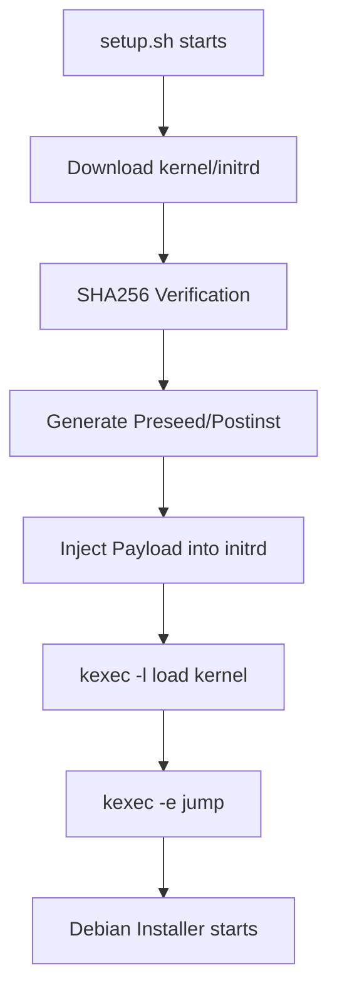
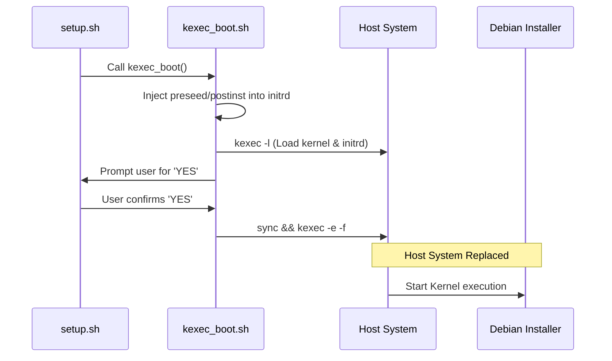

Relevant source files

The following files were used as context for generating this wiki page:

- [lib/kexec_boot.sh](lib/kexec_boot.sh)
- [setup.sh](setup.sh)
- [lib/download.sh](lib/download.sh)
- [lib/generate_preseed.sh](lib/generate_preseed.sh)
- [lib/generate_postinst.sh](lib/generate_postinst.sh)
- [README.md](README.md)

# Kexec & RAMdisk Payload Injection

Kexec & RAMdisk Payload Injection is the core mechanism within the `vps-setup` project that enables a fully automated, offline-capable reinstallation of a Debian OS from a running system. This process leverages `kexec` to replace the existing kernel with the Debian installer without a full hardware reboot, utilizing a self-contained RAMdisk (`initrd`) injected with critical configuration files and encrypted secrets.

The system ensures reliability by eliminating dependencies on local HTTP servers for preseed delivery, which often fail when the host OS terminates. Instead, it creates an `initrd.kexec.gz` containing all necessary instructions for the installer to execute a complete, LUKS-encrypted setup autonomously.

Sources: [README.md:144-147](README.md#L144-L147), [lib/kexec_boot.sh:42-45](lib/kexec_boot.sh#L42-L45)

## Architectural Overview

The injection architecture follows a linear progression: environment preparation, artifact acquisition, payload creation, and kernel execution. By injecting payloads directly into the `initrd`, the system achieves 100% offline self-contained RAM installation.

*The diagram above illustrates the sequence from script execution to the transition into the Debian installer environment.*

Sources: [setup.sh:343-410](setup.sh#L343-L410), [lib/kexec_boot.sh:42-45](lib/kexec_boot.sh#L42-L45)

## RAMdisk Payload Injection Logic

The project uses `cpio` and `gzip` to append a configuration payload to the standard Debian `initrd.gz`. This payload includes the `preseed.cfg` for automated installation, `postinst.sh` for system hardening, and an optional encrypted secret directory identified by a unique `INSTALL_TOKEN`.

### Injection Process
1.  **Preparation**: The original `initrd.gz` is copied to a new workspace file `initrd.kexec.gz`.
2.  **CPIO Bundling**: A `newc` format CPIO archive is created containing `preseed.cfg`, `postinst.sh`, and the secret directory.
3.  **Concatenation**: The CPIO archive is compressed with `gzip -9` and appended directly to the end of the `initrd.kexec.gz`. 
4.  **Validation**: The system verifies the new file is larger than the original to ensure the payload was successfully appended.

Sources: [lib/kexec_boot.sh:58-89](lib/kexec_boot.sh#L58-L89)

### Secret Protection
Secrets, specifically the user's `LUKS_PASSPHRASE`, are not stored in plain text within the scripts. Instead, they are encrypted into a `.secret_keys.enc` file using AES-256-CBC with a `TEMP_LUKS_KEY` before being bundled into the payload.

Sources: [lib/generate_postinst.sh:38-46](lib/generate_postinst.sh#L38-L46)

## Kexec Boot Parameters

The `kexec` command line (`kcmdline`) is dynamically constructed to point the installer to the injected files and configure network settings derived from the host system.

| Parameter | Value / Purpose |
| :--- | :--- |
| `auto=true` | Enables non-interactive automation mode. |
| `priority=critical` | Suppresses non-critical prompts during installation. |
| `preseed/file=/preseed.cfg` | Instructs the installer to find the preseed file at the root of the initrd. |
| `netcfg/choose_interface` | Sets the interface (e.g., `eth0`) detected by the host. |
| `console=ttyS0` | Configures serial console support for IPMI/VNC. |
| `nomodeset` | Disables KMS handover to maintain VGA text console stability. |

Sources: [lib/kexec_boot.sh:97-124](lib/kexec_boot.sh#L97-L124)

## Execution Sequence

The `kexec_boot` function handles the final transition. It performs a "Point of No Return" check before executing the jump.

*The sequence diagram shows the transition of control from the setup script to the new Debian environment.*

Sources: [lib/kexec_boot.sh:128-180](lib/kexec_boot.sh#L128-L180)

### Security Controls during Download
Before injection, `lib/download.sh` ensures that artifacts are untampered:
*  **HTTPS Enforcement**: Mirrors are limited to HTTPS to prevent on-path artifact substitution.
*  **SHA256 Verification**: Both `linux` (kernel) and `initrd.gz` are verified against `SHA256SUMS` metadata before the injection process begins.

Sources: [lib/download.sh:25-30](lib/download.sh#L25-L30), [lib/download.sh:97-133](lib/download.sh#L97-L133)

## Key Functions

| Function | File | Description |
| :--- | :--- | :--- |
| `download_netboot_files` | `lib/download.sh` | Fetches and verifies Debian installer artifacts. |
| `generate_preseed` | `lib/generate_preseed.sh` | Renders the preseed template with local environment variables. |
| `generate_postinst` | `lib/generate_postinst.sh` | Creates the post-installation hardening script and encrypts secrets. |
| `kexec_boot` | `lib/kexec_boot.sh` | Performs payload injection, loads the kernel into memory, and executes the jump. |

Sources: [lib/download.sh:11](lib/download.sh#L11), [lib/generate_preseed.sh:16](lib/generate_preseed.sh#L16), [lib/generate_postinst.sh:17](lib/generate_postinst.sh#L17), [lib/kexec_boot.sh:13](lib/kexec_boot.sh#L13)

## Summary

The Kexec & RAMdisk Payload Injection module is critical for the project's ability to reinstall a system without human intervention or external network dependencies for configuration. By bundling all requirements—preseed instructions, hardening scripts, and encrypted passphrases—into a single `initrd.kexec.gz` and using `kexec` for execution, the system provides a robust and secure path for remote VPS re-provisioning.

Sources: [README.md:144-147](README.md#L144-L147), [lib/kexec_boot.sh:43-45](lib/kexec_boot.sh#L43-L45)
