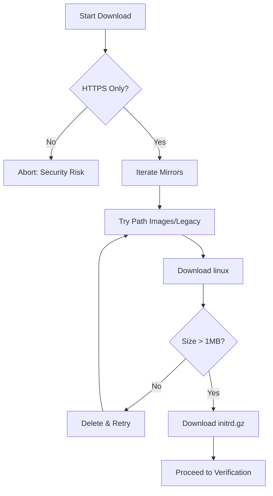
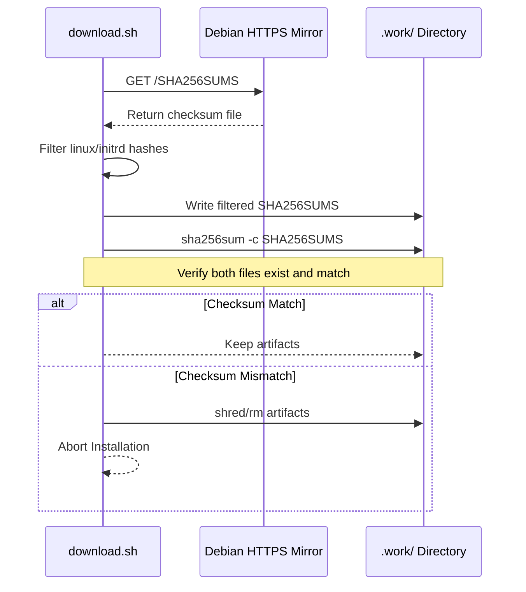

Relevant source files

The following files were used as context for generating this wiki page:

- [lib/download.sh](lib/download.sh)
- [setup.sh](setup.sh)
- [README.md](README.md)
- [lib/kexec_boot.sh](lib/kexec_boot.sh)
- [lib/generate_preseed.sh](lib/generate_preseed.sh)

# Debian Netboot Download & Verification

The Debian Netboot Download & Verification system is a critical component of the `vps-setup` project, responsible for securely acquiring the necessary artifacts to perform an automated OS reinstallation. It handles the retrieval of the Debian installer kernel (`linux`) and initial RAM disk (`initrd.gz`) from official mirrors using high-security protocols to prevent on-path tampering.

This module ensures that the project can transition from a running host OS to a fresh Debian installation via `kexec`. By enforcing HTTPS-only downloads and mandatory SHA256 checksum verification, the system protects against artifact substitution attacks, which is essential since the downloaded kernel is executed with root privileges during the [Installation Lifecycle](#installation-lifecycle).

Sources: [README.md:91-95](README.md#L91-L95), [lib/download.sh:13-18](lib/download.sh#L13-L18)

## Download Architecture and Failover Logic

The download process is designed for high availability and security. It utilizes a multi-mirror failover strategy, iterating through a list of official Debian HTTPS mirrors and potential directory paths until the required files are successfully retrieved.

### Mirror Selection and Path Discovery
The system prioritizes the mirror defined in `config.env` but falls back to official Debian global mirrors if the primary source fails. It also accounts for variations in Debian mirror structures by checking both standard and legacy image paths.

| Category | Values |
| :--- | :--- |
| **Primary Mirrors** | `deb.debian.org`, `cdn-fastly.deb.debian.org`, `ftp.debian.org` |
| **Relative Paths** | `.../current/images/netboot/...`, `.../current/legacy-images/netboot/...` |
| **Artifacts** | `linux` (Kernel), `initrd.gz` (Initrd) |

Sources: [lib/download.sh:33-46](lib/download.sh#L33-L46), [README.md:20](README.md#L20)

### Download Security Enforcement
A core architectural requirement is the use of HTTPS. The system explicitly rejects non-HTTPS mirrors to prevent man-in-the-middle attacks. It also validates that the downloaded artifacts meet a minimum size threshold (1MB) to ensure they are not empty or corrupted HTML error pages.

This diagram illustrates the iterative download logic and size-based validation steps.
Sources: [lib/download.sh:22-25](lib/download.sh#L22-L25), [lib/download.sh:54-68](lib/download.sh#L54-L68)

## SHA256 Integrity Verification

Verification is the final gate before the installer artifacts are prepared for `kexec`. The system implements a "fail-closed" security model: if verification fails for either the kernel or the initrd, the entire process is aborted, and the files are deleted.

### Verification Workflow
1. **Metadata Acquisition**: The script attempts to download `SHA256SUMS` from multiple candidate locations relative to the working mirror URL.
2. **Parsing**: It uses `grep` and `sed` to extract specific hashes for `linux` and `initrd.gz`, ignoring unrelated files in the manifest.
3. **Validation**: The `sha256sum -c` command is executed within the temporary work directory.

Sources: [lib/download.sh:85-110](lib/download.sh#L85-L110)

### Verification Sequence

The sequence above shows the strict requirement for both files to pass verification before the system proceeds to payload injection.
Sources: [lib/download.sh:112-125](lib/download.sh#L112-L125), [setup.sh:65-69](setup.sh#L65-L69)

## Integration with Setup Lifecycle

The download and verification phase is triggered after network and disk detection but before the final user confirmation. This ensures that all secrets (like LUKS passphrases) and artifacts are ready in the `.work` directory.

### Configuration Dependencies
The download process relies on the following variables defined in `config.env` or detected by the system:
*  `DEBIAN_RELEASE`: Defaults to `trixie` (Debian 13).
*  `DEBIAN_MIRROR`: The base URL for official packages.
*  `WORK_DIR`: The local path (typically `.work/`) where artifacts are stored with restricted `700` permissions.

Sources: [setup.sh:176-178](setup.sh#L176-L178), [setup.sh:319-328](setup.sh#L319-L328), [lib/download.sh:26](lib/download.sh#L26)

### Payload Injection
Once verified, these artifacts are not used in their raw state. The `lib/kexec_boot.sh` script creates a new `initrd.kexec.gz` by appending a `cpio` archive containing `preseed.cfg` and `postinst.sh` to the verified `initrd.gz`. This creates a self-contained offline installation medium.

Sources: [lib/kexec_boot.sh:32-55](lib/kexec_boot.sh#L32-L55), [README.md:96-98](README.md#L96-L98)

## Technical Summary
The Debian Netboot Download & Verification system ensures the integrity of the base installation media through:
*  **Encrypted Transport**: Mandatory HTTPS for all artifact and metadata downloads.
*  **Redundancy**: Automatic failover across four official mirrors and two path structures.
*  **Cryptographic Assurance**: Mandatory SHA256 verification of the kernel and initrd.
*  **Security Isolation**: Use of a restricted `.work` directory and immediate cleanup of unverified or temporary artifacts.

Sources: [lib/download.sh:127-133](lib/download.sh#L127-L133), [setup.sh:65-70](setup.sh#L65-L70)
