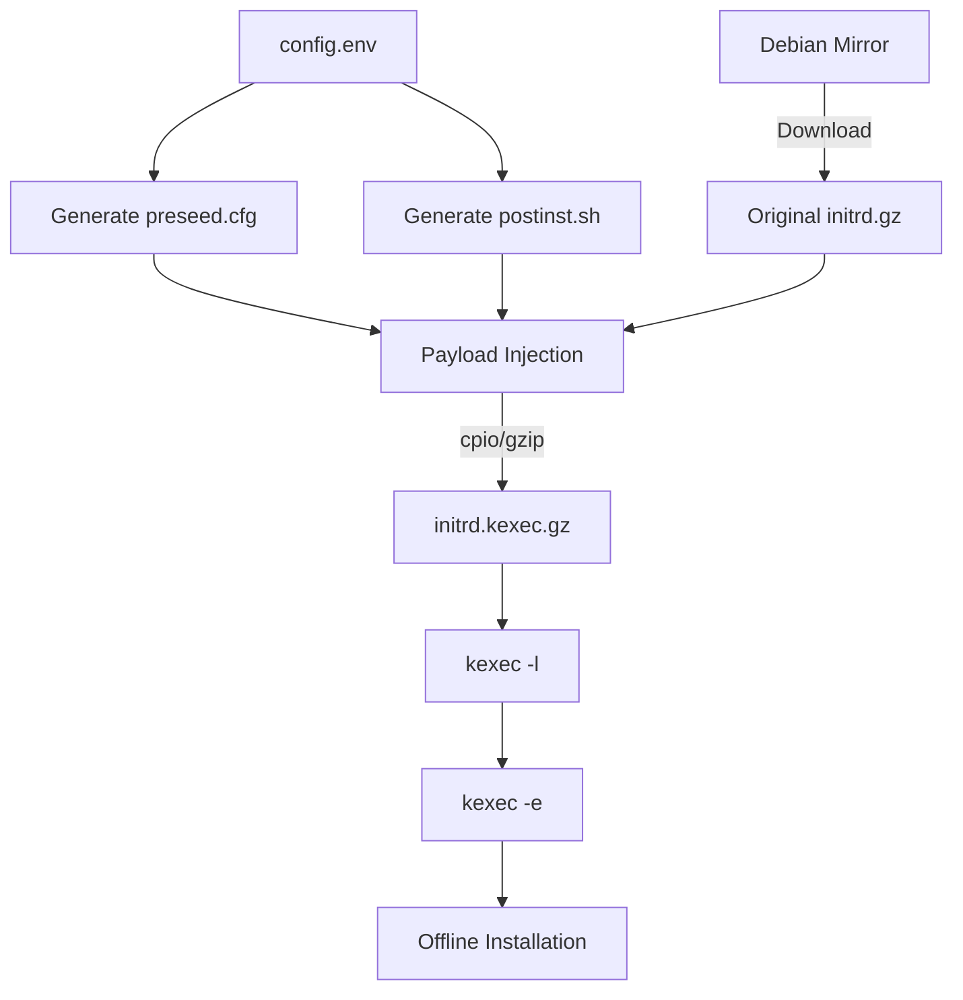
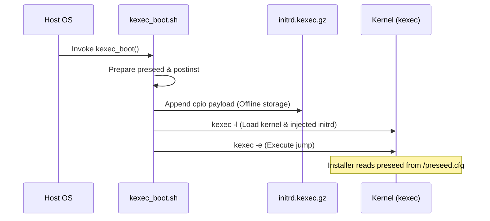

Relevant source files

The following files were used as context for generating this wiki page:

- [lib/kexec_boot.sh](lib/kexec_boot.sh)
- [setup.sh](setup.sh)
- [README.md](README.md)
- [lib/generate_preseed.sh](lib/generate_preseed.sh)
- [lib/generate_postinst.sh](lib/generate_postinst.sh)
- [lib/download.sh](lib/download.sh)

# Temporary HTTP Server Architecture

The `vps-setup` project intentionally avoids the use of a traditional temporary HTTP server for delivering installation artifacts (like preseed files and post-install scripts) during the `kexec` boot process. In many automated installation architectures, a local HTTP server is started to serve these files to the installer. However, this project utilizes a **Self-Contained Offline RAMdisk Payload** architecture.

This approach ensures that all necessary configurations, scripts, and encrypted secrets are injected directly into the initial RAM disk (initrd) before the `kexec` jump. This eliminates dependencies on a local network service that might be terminated when the host OS is replaced by the new kernel.

Sources: [README.md:143-145](README.md#L143-L145), [lib/kexec_boot.sh:32-35](lib/kexec_boot.sh#L32-L35)

## Core Architectural Components

The architecture relies on the preparation of a modified `initrd` that carries the entire installation state. This is achieved through three primary phases: asset generation, payload injection, and kernel execution.

### Artifact Preparation
The system first generates specific configuration files based on the environment detection and user-provided `config.env`. These include `preseed.cfg` for the Debian installer and `postinst.sh` for post-installation hardening.

### Offline RAMdisk Injection
Instead of serving these files via HTTP, the `lib/kexec_boot.sh` script uses `cpio` to append the generated artifacts directly to the `initrd.gz` file downloaded from the Debian mirrors. This creates a new, larger `initrd.kexec.gz` which contains the complete "instruction set" for the offline installation.

Sources: [lib/kexec_boot.sh:38-60](lib/kexec_boot.sh#L38-L60), [README.md:143-145](README.md#L143-L145)

### Data Flow Diagram
The following diagram illustrates the flow from configuration generation to the offline payload injection, replacing the need for an external HTTP server.

The diagram shows how local artifacts and remote assets are merged into a single offline payload.
Sources: [lib/kexec_boot.sh:46-67](lib/kexec_boot.sh#L46-L67), [lib/download.sh:16-25](lib/download.sh#L16-L25)

## Secret Transport and Security

Because no HTTP server is used, secrets (such as the LUKS passphrase) are not transmitted over the network during the installation phase. Instead, they are handled through a secure injection mechanism.

*  **Encryption**: The `LUKS_PASSPHRASE` is AES-256-CBC encrypted using a `TEMP_LUKS_KEY` before injection.
*  **Tokenization**: Secrets are stored under a single-use random subpath defined by an `INSTALL_TOKEN`.
*  **Injection**: This tokenized and encrypted directory is included in the `cpio` archive appended to the `initrd`.

Sources: [lib/generate_postinst.sh:34-42](lib/generate_postinst.sh#L34-L42), [README.md:175-177](README.md#L175-L177)

### Component Summary Table

| Component | Role in Architecture | Implementation Detail |
| :--- | :--- | :--- |
| **preseed.cfg** | Installer instructions | Injected into initrd root; referenced via `preseed/file=/preseed.cfg` |
| **postinst.sh** | Late-stage hardening | Injected into initrd root; executed by installer `late_command` |
| **.secret_keys.enc** | Encrypted credentials | AES-256-CBC encrypted payload stored in a tokenized sub-directory |
| **initrd.kexec.gz** | Self-contained payload | Created via `cpio -H newc -o | gzip -9 >> original_initrd` |

Sources: [lib/kexec_boot.sh:50-60](lib/kexec_boot.sh#L50-L60), [lib/kexec_boot.sh:87-88](lib/kexec_boot.sh#L87-L88), [lib/generate_postinst.sh:40-42](lib/generate_postinst.sh#L40-L42)

## Execution Sequence

The transition from the live environment to the offline installer environment is managed by the `kexec_boot` function.

The sequence demonstrates the shift from host-managed files to an initrd-internal filesystem.
Sources: [lib/kexec_boot.sh:62-115](lib/kexec_boot.sh#L62-L115), [lib/kexec_boot.sh:146-150](lib/kexec_boot.sh#L146-L150)

## Conclusion

The "Temporary HTTP Server Architecture" in `vps-setup` is characterized by its absence. By opting for a **Self-Contained Offline RAMdisk Payload**, the project eliminates common points of failure associated with network-based artifact delivery during `kexec`. This design ensures that all configurations, scripts, and secrets are physically present in the system's memory before the transition to the installer begins, providing a more robust and secure automated reinstallation process.

Sources: [README.md:143-145](README.md#L143-L145), [lib/kexec_boot.sh:32-35](lib/kexec_boot.sh#L32-L35)
