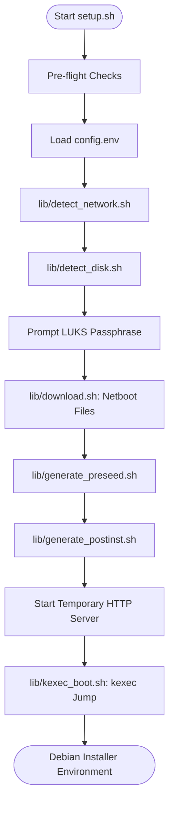
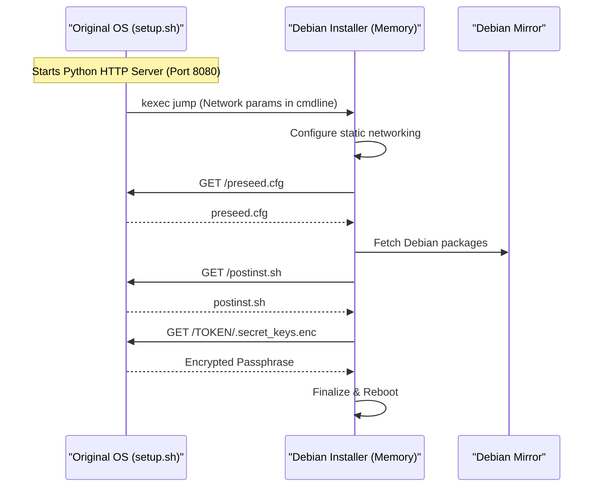

Relevant source files

The following files were used as context for generating this wiki page:

- [README.md](README.md)
- [setup.sh](setup.sh)
- [lib/detect_disk.sh](lib/detect_disk.sh)
- [lib/detect_network.sh](lib/detect_network.sh)
- [lib/generate_preseed.sh](lib/generate_preseed.sh)
- [lib/generate_postinst.sh](lib/generate_postinst.sh)
- [lib/download.sh](lib/download.sh)
- [lib/kexec_boot.sh](lib/kexec_boot.sh)

# High-Level Architecture

The VPS Setup project is an automated orchestration framework designed to reinstall a running Linux VPS with Debian 13 (Trixie) featuring LUKS full-disk encryption and remote SSH unlocking. The system operates by leveraging `kexec` to replace the existing kernel with a Debian netboot installer without a hard reboot, controlled via automated preseed configurations.

The architecture is modular, separating concerns into auto-detection of hardware (network and disks), artifact generation (preseed and post-installation scripts), and execution (HTTP serving and kexec). It emphasizes security through SSH hardening, firewall automation, and a specific "Key Rotation" mechanism that transitions from a temporary installer LUKS key to a user-defined passphrase during the final stages of installation.

Sources: [README.md:1-25](README.md#L1-L25), [setup.sh:1-25](setup.sh#L1-L25)

## System Workflow & Lifecycle

The installation process follows a linear lifecycle from environment validation to the final execution of the `kexec` jump. The orchestration is managed by the `main` function in `setup.sh`.

### Execution Flow Diagram

The following diagram illustrates the sequence of operations from initial configuration to the point of no return where the system enters the Debian installer environment.

Sources: [setup.sh:255-326](setup.sh#L255-L326), [lib/kexec_boot.sh:81-125](lib/kexec_boot.sh#L81-L125)

## Component Architecture

The system is composed of several specialized shell libraries that handle distinct phases of the setup.

### 1. Hardware & Network Detection
These modules gather the necessary state from the host environment to populate the automated installer templates.

*  **`detect_network.sh`**: Uses `iproute2` to identify the active interface, IPv4/IPv6 addresses, gateways, and DNS servers. It prioritizes manual overrides from `config.env`.
  *  *Key Functions*: `detect_network`, `cidr_to_netmask`.
*  **`detect_disk.sh`**: Identifies the primary OS disk by tracing the root `/` mount point upward through the block device hierarchy. It also handles "Storage VPS" roles by scanning for secondary non-removable disks.
  *  *Key Functions*: `detect_disk`, `detect_secondary_disks`, `detect_boot_mode`.

Sources: [lib/detect_network.sh:13-75](lib/detect_network.sh#L13-L75), [lib/detect_disk.sh:13-90](lib/detect_disk.sh#L13-L90)

### 2. Artifact Generation
These modules transform templates into deployment-ready scripts by injecting detected environment variables and security secrets.

*  **`generate_preseed.sh`**: Creates the `preseed.cfg` file. It generates a `TEMP_LUKS_KEY` (32-byte hex) used by the Debian installer for the initial automated encryption of the disk.
*  **`generate_postinst.sh`**: Generates a script that runs in the installer's "late_command" phase. It prepares an encrypted secret payload (containing the final user passphrase) using `openssl enc -aes-256-cbc`.

Sources: [lib/generate_preseed.sh:26-30](lib/generate_preseed.sh#L26-L30), [lib/generate_postinst.sh:35-48](lib/generate_postinst.sh#L35-L48)

### 3. Execution Engine
The final stage involves serving these artifacts to the Debian installer and performing the kernel swap.

*  **`download.sh`**: Fetches the `linux` kernel and `initrd.gz` from Debian mirrors, performing SHA256 verification.
*  **`kexec_boot.sh`**: Orchestrates a local Python-based HTTP server to host the preseed and post-install artifacts. It constructs a complex kernel command line containing all network parameters and the preseed URL before invoking `kexec -l` and `systemctl kexec`.

Sources: [lib/download.sh:13-35](lib/download.sh#L13-L35), [lib/kexec_boot.sh:18-40](lib/kexec_boot.sh#L18-L40), [lib/kexec_boot.sh:81-105](lib/kexec_boot.sh#L81-L105)

## Data Security & Encryption Architecture

A critical feature of the architecture is the handling of the LUKS passphrase to ensure full automation without leaving permanent installation keys on the disk.

### LUKS Key Security Lifecycle

| Phase | Action | Mechanism |
| :--- | :--- | :--- |
| **Setup Phase** | Generate `TEMP_LUKS_KEY` | `openssl rand -hex 32` |
| **Preseed Phase** | Automated Partitioning | Installer uses `TEMP_LUKS_KEY` to encrypt partitions |
| **Post-Install** | Secret Transport | User passphrase sent to installer via AES-encrypted file |
| **Hardening** | Key Rotation | `cryptsetup luksAddKey` (User Key) followed by `luksRemoveKey` (Temp Key) |
| **Finalization** | Cleanup | Temporary keys shredded using `shred -u` |

Sources: [README.md:120-135](README.md#L120-L135), [lib/generate_preseed.sh:26-30](lib/generate_preseed.sh#L26-L30), [lib/generate_postinst.sh:35-48](lib/generate_postinst.sh#L35-L48)

### LUKS Header Backup
The system generates a 600-permission backup of the LUKS header at `LUKS_HEADER_BACKUP_PATH` (default `/root/luks-header-backup.img`) to allow for recovery in case of header corruption.

Sources: [README.md:130-135](README.md#L130-L135), [lib/generate_postinst.sh:58-60](lib/generate_postinst.sh#L58-L60)

## Disk Partitioning Strategy

The architecture supports two primary boot modes (BIOS and UEFI) and two installation roles. The LVM Volume Group is dynamically named based on the hostname (e.g., `vps-vol`).

### Partition Layout Table
| Partition | Size | Type | Mount Point | Encryption |
| :--- | :--- | :--- | :--- | :--- |
| **ESP** | 512 MB | fat32 | `/boot/efi` | No (UEFI only) |
| **BIOS Boot** | 1 MB | free | N/A | No (BIOS only) |
| **Boot** | 512 MB | ext4 | `/boot` | No |
| **LUKS PV** | Remaining | LUKS2 | N/A | Yes |
| **LVM Swap** | 1 GB | swap | N/A | Yes (Inside LUKS) |
| **LVM Root** | Remaining | ext4 | `/` | Yes (Inside LUKS) |

Sources: [README.md:105-115](README.md#L105-L115), [lib/generate_preseed.sh:53-62](lib/generate_preseed.sh#L53-L62)

## Network Communication Flow

During the installation, the Debian installer must communicate with the temporary HTTP server hosted by the `setup.sh` process on the original OS.

Sources: [lib/kexec_boot.sh:18-40](lib/kexec_boot.sh#L18-L40), [lib/kexec_boot.sh:81-105](lib/kexec_boot.sh#L81-L105), [lib/generate_postinst.sh:35-48](lib/generate_postinst.sh#L35-L48)

## Conclusion

The High-Level Architecture of the `vps-setup` tool relies on a seamless transition from a running OS to an automated installer via `kexec`. By modularizing network and disk detection and automating the secure transport of encryption keys, the system achieves a "zero-touch" reinstallation of a VPS with a focus on LUKS-based security and system hardening.
