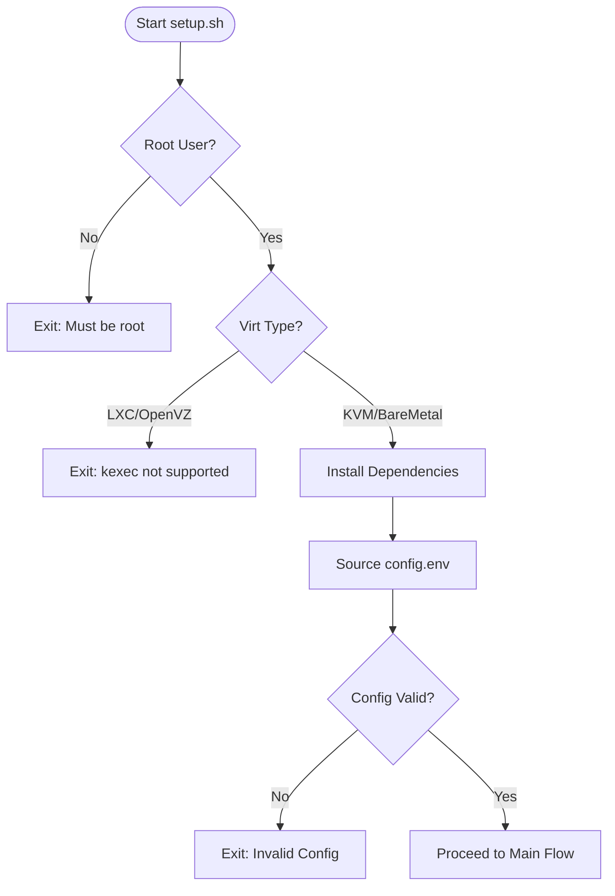
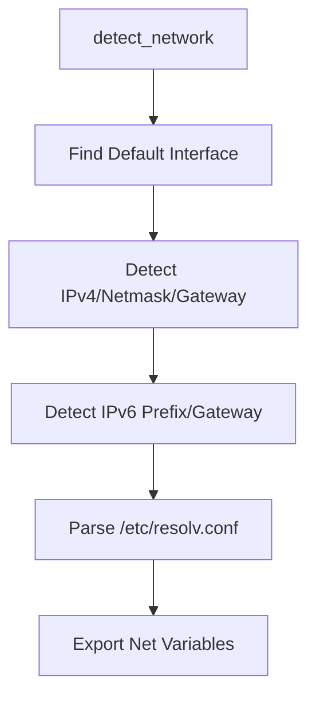
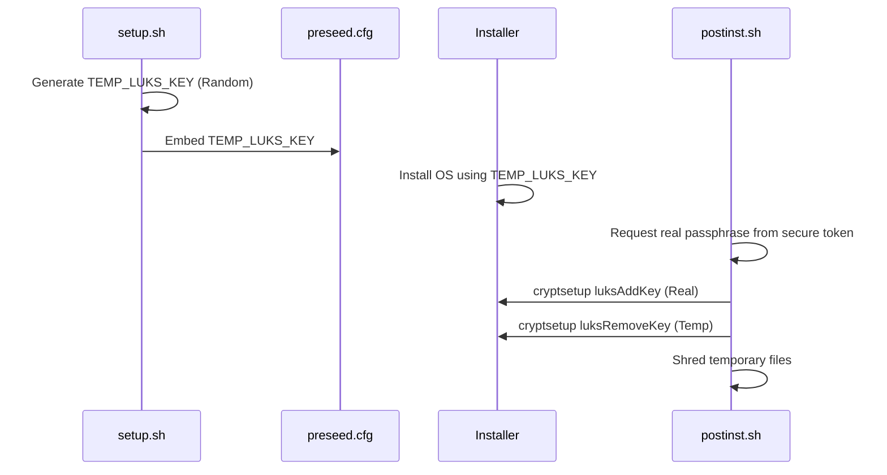
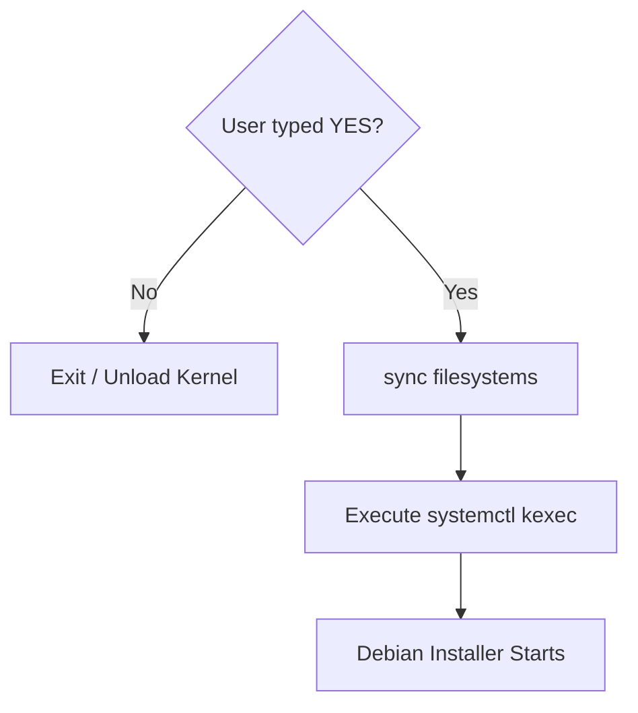

Relevant source files

The following files were used as context for generating this wiki page:

- [README.md](README.md)
- [setup.sh](setup.sh)
- [lib/detect_disk.sh](lib/detect_disk.sh)
- [lib/detect_network.sh](lib/detect_network.sh)
- [lib/download.sh](lib/download.sh)
- [lib/generate_postinst.sh](lib/generate_postinst.sh)
- [lib/generate_preseed.sh](lib/generate_preseed.sh)
- [lib/kexec_boot.sh](lib/kexec_boot.sh)

# Core Execution Flow (setup.sh)

The `setup.sh` script serves as the primary orchestrator for the automated Debian reinstallation process. Its purpose is to transition a running VPS into a new Debian 13 (Trixie) installation with LUKS full-disk encryption and remote SSH unlocking capabilities. It manages the entire lifecycle from environment validation and hardware auto-detection to the final `kexec` jump that replaces the running kernel.

The execution flow is strictly linear, divided into distinct phases: initialization, detection, configuration generation, and deployment. The script utilizes a modular architecture, sourcing specialized logic from the `lib/` directory to handle complex tasks like network topology discovery, disk partitioning strategies, and secure credential handling.

Sources: [README.md:1-13](README.md#L1-L13), [setup.sh:1-26](setup.sh#L1-L26)

## 1. Initialization and Environment Validation

The first phase ensures the script is running in a compatible environment. This includes root privilege verification, architecture checks, and virtualization detection. The script specifically requires KVM or bare-metal virtualization, as `kexec` is not supported on container-based platforms like LXC or OpenVZ.

The flow starts by ensuring the execution context is safe for low-level system modifications and `kexec` kernel replacement.
Sources: [setup.sh:79-138](setup.sh#L79-L138), [setup.sh:144-196](setup.sh#L144-L196)

### Key Functions
| Function | Description | Source |
| :--- | :--- | :--- |
| `preflight_checks` | Validates root access, Linux OS, architecture, and virtualization type. | [setup.sh:79-142](setup.sh#L79-L142) |
| `load_config` | Sources `config.env` and validates required fields like `USERNAME` and `SSH_PUBKEY`. | [setup.sh:144-196](setup.sh#L144-L196) |

## 2. Hardware and Network Auto-Detection

The script automatically discovers system parameters to minimize manual configuration. This includes scanning for network interfaces, IP addresses (IPv4 and IPv6), and identifying the primary OS disk to be targeted for reinstallation.

### Network Discovery
The `detect_network` function queries the running system for routing information and interface details. It prioritizes the interface associated with the default route.

Sources: [lib/detect_network.sh:12-70](lib/detect_network.sh#L12-L70)

### Disk and Role Handling
Disk detection varies based on the `INSTALL_ROLE`. In `standard` mode, only the root disk is targeted. In `storage-vps` mode, the script interactively prompts the user to handle secondary storage devices.

Sources: [lib/detect_disk.sh:10-74](lib/detect_disk.sh#L10-L74), [lib/detect_disk.sh:88-154](lib/detect_disk.sh#L88-L154)

## 3. Configuration and Secret Generation

Once hardware details are known, the script generates the necessary artifacts for the Debian installer. This includes the `preseed.cfg` for automated installation and a `postinst.sh` script for server hardening.

### LUKS Key Security Flow
The script uses a two-stage key mechanism to ensure no permanent installer key remains on the disk.
1.  **Stage 1:** Generates a `TEMP_LUKS_KEY` for the initial partitioning.
2.  **Stage 2:** During post-installation, the user's real passphrase is added, and the temporary key is shredded.

Sources: [lib/generate_preseed.sh:22-25](lib/generate_preseed.sh#L22-L25), [lib/generate_postinst.sh:33-44](lib/generate_postinst.sh#L33-L44), [README.md:121-131](README.md#L121-L131)

## 4. Deployment and Kernel Replacement

The final phase involves downloading the netboot files, serving the configuration via a local HTTP server, and executing the `kexec` jump.

### Execution Steps
1.  **Download:** Fetches `linux` kernel and `initrd.gz` from the Debian mirror. Sources: [lib/download.sh:12-42](lib/download.sh#L12-L42)
2.  **HTTP Server:** Starts a temporary Python-based HTTP server to host `preseed.cfg` and `postinst.sh`. Sources: [lib/kexec_boot.sh:17-48](lib/kexec_boot.sh#L17-L48)
3.  **Kexec Load:** Loads the new kernel into memory with specific network parameters passed via the command line. Sources: [lib/kexec_boot.sh:80-101](lib/kexec_boot.sh#L80-L101)
4.  **Kexec Jump:** The `systemctl kexec` command replaces the running kernel. This is the "Point of No Return." Sources: [lib/kexec_boot.sh:137-142](lib/kexec_boot.sh#L137-L142)

### Point of No Return Sequence

Sources: [lib/kexec_boot.sh:119-142](lib/kexec_boot.sh#L119-L142)

## Summary of Core Components
| Component | Relevant Files | Purpose |
| :--- | :--- | :--- |
| **Orchestrator** | `setup.sh` | Main loop and user interaction. |
| **Net Detector** | `lib/detect_network.sh` | IPv4/IPv6/DNS auto-discovery. |
| **Disk Manager** | `lib/detect_disk.sh` | OS disk identification and secondary disk roles. |
| **Config Generator** | `lib/generate_preseed.sh`, `lib/generate_postinst.sh` | Building automated install scripts and secure key handling. |
| **Boot Loader** | `lib/kexec_boot.sh` | HTTP delivery and kernel replacement via `kexec`. |

Sources: [setup.sh:317-360](setup.sh#L317-L360), [README.md:88-103](README.md#L88-L103)

The Core Execution Flow ensures a deterministic path from a standard Linux environment to a hardened, encrypted Debian system, leveraging `kexec` to bypass traditional BIOS/UEFI reboot cycles for the initial installation phase.
