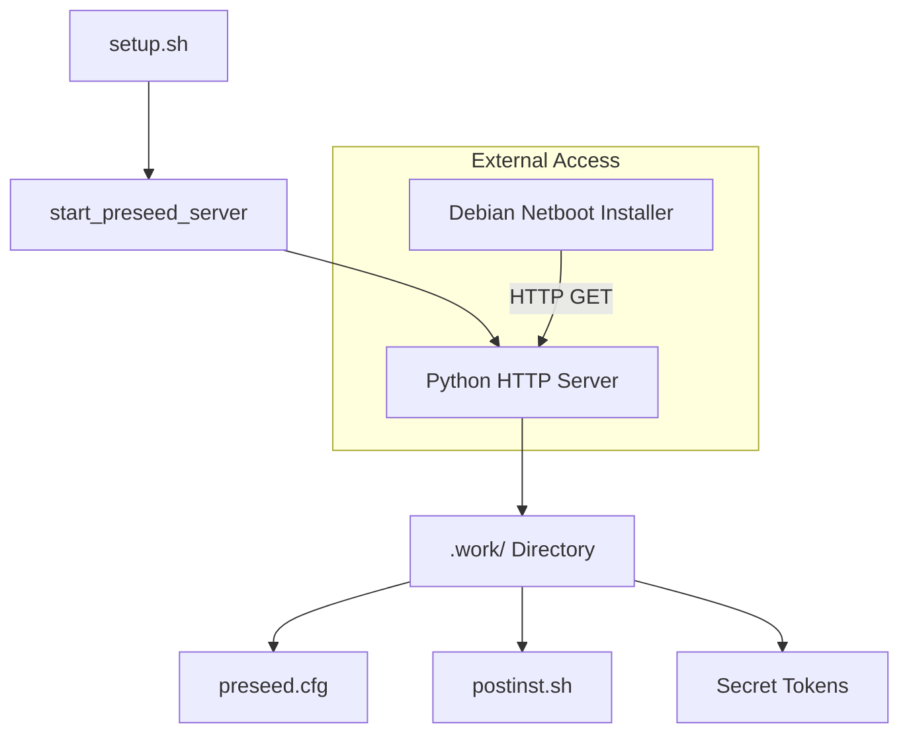
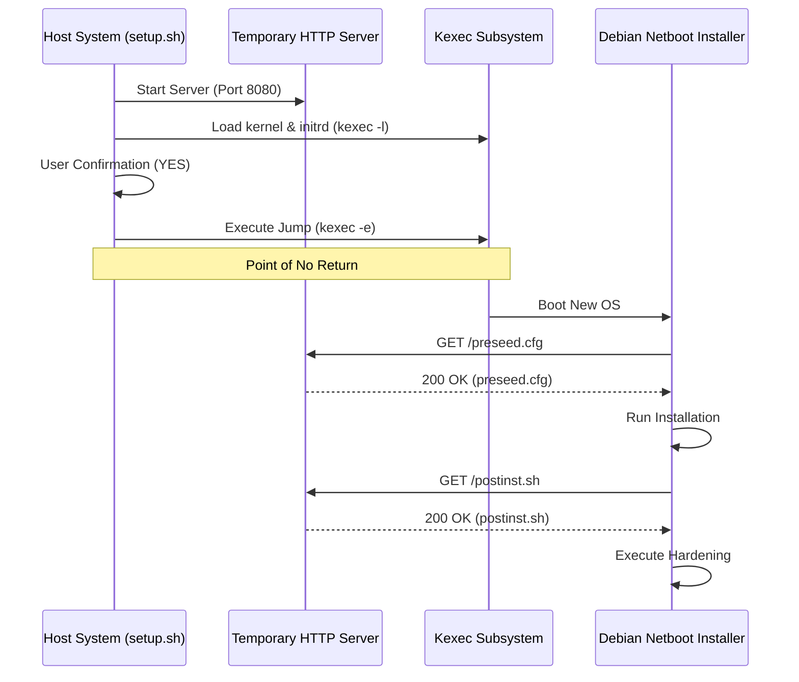

<details>
<summary>Relevant source files</summary>

The following files were used as context for generating this wiki page:

- [lib/kexec_boot.sh](lib/kexec_boot.sh)
- [setup.sh](setup.sh)
- [lib/download.sh](lib/download.sh)
- [lib/generate_preseed.sh](lib/generate_preseed.sh)
- [lib/generate_postinst.sh](lib/generate_postinst.sh)
- [lib/detect_network.sh](lib/detect_network.sh)
- [README.md](README.md)
</details>

# Kexec & Temporary HTTP Server

The **Kexec & Temporary HTTP Server** system provides the mechanism for a "point-of-no-return" automated reinstallation of a running VPS. It leverages a local, transient Python-based web server to host installation assets and uses the `kexec` system call to pivot from the current running Linux environment into a new Debian netboot installer without a hardware-level reboot.

This module is responsible for bridging the gap between the initial environment and the new OS. It serves the generated `preseed.cfg` and `postinst.sh` files, configures the kernel command line for the installer, and handles the final execution jump. Sources: [README.md:129-138](README.md#L129-L138), [lib/kexec_boot.sh:8-12](lib/kexec_boot.sh#L8-L12)

## Temporary HTTP Server

To facilitate automated installation, the script starts a temporary HTTP server on the host before the `kexec` jump. This server provides the Debian installer with access to the pre-generated configuration files stored in the `.work` directory.

### Server Lifecycle and Operation
The server is initialized using `python3 -m http.server`. It binds to port `8080` (or a configured `PRESEED_PORT`) on all interfaces (`0.0.0.0`). The server serves the contents of `${WORK_DIR}`, which includes the netboot kernel, initrd, and configuration scripts. Sources: [setup.sh:31-32](setup.sh#L31-L32), [lib/kexec_boot.sh:16-36](lib/kexec_boot.sh#L16-L36)

### Asset Distribution
The HTTP server hosts three critical types of assets:
1.  **Installation Configs**: `preseed.cfg` for automated Debian partitioning and setup. Sources: [lib/generate_preseed.sh:16-17](lib/generate_preseed.sh#L16-L17)
2.  **Post-Install Scripts**: `postinst.sh` for hardening and LUKS key rotation. Sources: [lib/generate_postinst.sh:16-17](lib/generate_postinst.sh#L16-L17)
3.  **Encrypted Secrets**: A single-use tokenized directory (`/INSTALL_TOKEN/.secret_keys.enc`) containing AES-256-CBC encrypted LUKS passphrases. Sources: [lib/generate_postinst.sh:33-43](lib/generate_postinst.sh#L33-L43)



*The diagram shows how the setup script initializes a Python HTTP server to serve local work assets to the remote Debian installer.* Sources: [lib/kexec_boot.sh:16-41](lib/kexec_boot.sh#L16-L41)

## Kexec Boot Process

The `kexec` mechanism allows the system to load a new kernel and `initrd` into memory and immediately switch execution to them. This is critical for VPS environments where a traditional BIOS/UEFI reboot might not trigger a network boot.

### Execution Flow
1.  **Preparation**: The script verifies the existence of `linux` (kernel) and `initrd.gz` in the work directory. Sources: [lib/kexec_boot.sh:58-62](lib/kexec_boot.sh#L58-L62)
2.  **Kernel Loading**: The `kexec -l` command is used to load the installer kernel and initrd into memory, along with a complex command line. Sources: [lib/kexec_boot.sh:100-105](lib/kexec_boot.sh#L100-L105)
3.  **Execution Jump**: After user confirmation, the system triggers the execution using `systemctl kexec` or `kexec -e -f`. The `-f` (force) flag is used to bypass potential hangs in hypervisor or systemd shutdown handlers. Sources: [lib/kexec_boot.sh:129-135](lib/kexec_boot.sh#L129-L135)

### Kernel Command Line Construction
The kernel command line is dynamically built to ensure the Debian installer has immediate network connectivity to reach the temporary HTTP server. Sources: [lib/kexec_boot.sh:75-98](lib/kexec_boot.sh#L75-L98)

| Parameter | Value / Source | Description |
| :--- | :--- | :--- |
| `netcfg/get_ipaddress` | `${IPV4_ADDRESS}` | Static IPv4 of the VPS |
| `netcfg/get_netmask` | `${IPV4_NETMASK}` | Subnet mask for the network |
| `netcfg/get_gateway` | `${IPV4_GATEWAY}` | Default gateway |
| `preseed/url` | `http://<IP>:<PORT>/preseed.cfg` | Location of the preseed file |
| `console` | `tty0 console=ttyS0,115200n8` | Dual console output for VNC and Serial |

Sources: [lib/kexec_boot.sh:79-98](lib/kexec_boot.sh#L79-L98), [lib/detect_network.sh:65-71](lib/detect_network.sh#L65-L71)

## Workflow Sequence

The following sequence diagram illustrates the interaction between the host system, the temporary HTTP server, and the Debian installer during the kexec transition.



*The sequence demonstrates the transition from the running host to the installer, highlighting the dependency on the HTTP server for configuration fetching.* Sources: [lib/kexec_boot.sh:44-135](lib/kexec_boot.sh#L44-L135), [setup.sh:353-356](setup.sh#L353-L356)

## Safety and Requirements

### Virtualization Compatibility
`kexec` requires full virtualization (KVM, Xen, VMware, or Bare-Metal). It does not work on container-based virtualization like OpenVZ or LXC because containers do not have their own kernel to replace. The system performs a check via `systemd-detect-virt` before proceeding. Sources: [setup.sh:86-98](setup.sh#L86-L98)

### Cleanup Mechanism
A trap is established on the `EXIT` signal to ensure that if the script fails before the `kexec` jump, the HTTP server process is terminated and the sensitive `.work` directory (containing the LUKS passphrase) is securely shredded. Sources: [setup.sh:58-66](setup.sh#L58-L66)

```bash
cleanup() {
    # Kill any HTTP server we started
    if [[ -n "${HTTP_SERVER_PID:-}" ]]; then
        kill "${HTTP_SERVER_PID}" 2>/dev/null || true
    fi
    # Securely shred temporary work files
    if [[ "${DRY_RUN:-false}" != true ]] && [[ -d "${WORK_DIR}" ]]; then
        shred -u "${WORK_DIR}"/* 2>/dev/null || rm -rf "${WORK_DIR}"
    fi
}
trap cleanup EXIT
```

Sources: [setup.sh:58-66](setup.sh#L58-L66)
