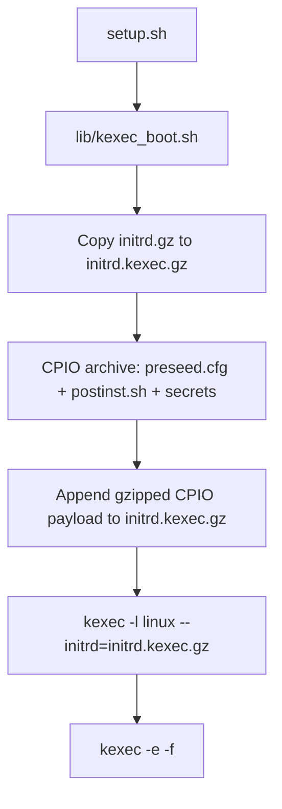
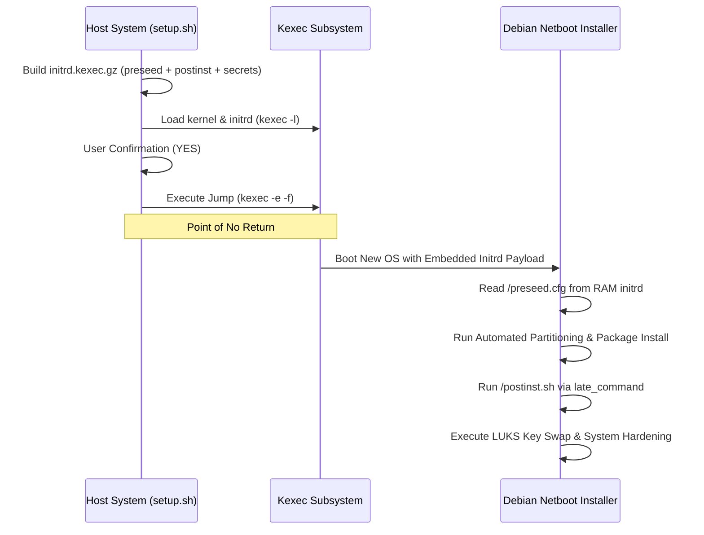

<details>
<summary>Relevant source files</summary>

The following files were used as context for generating this wiki page:

- [lib/kexec_boot.sh](lib/kexec_boot.sh)
- [setup.sh](setup.sh)
- [lib/download.sh](lib/download.sh)
- [lib/generate_preseed.sh](lib/generate_preseed.sh)
- [lib/generate_postinst.sh](lib/generate_postinst.sh)
- [lib/detect_network.sh](lib/detect_network.sh)
- [README.md](README.md)
</details>

# Kexec & Offline Initrd Injection

The **Kexec & Offline Initrd Injection** system provides the mechanism for a "point-of-no-return" automated reinstallation of a running VPS. It injects the preseed configuration (`preseed.cfg`), post-install script (`postinst.sh`), and encrypted secrets directly into a transient `initrd.kexec.gz` payload in RAM, then uses the `kexec` system call to pivot from the current running Linux environment into the new Debian netboot installer without requiring an external HTTP server during installation.

This module is responsible for bridging the gap between the initial environment and the new OS. It constructs the self-contained initrd, configures the kernel command line for the installer, and handles the final execution jump. Sources: [README.md:129-138](README.md#L129-L138), [lib/kexec_boot.sh:8-12](lib/kexec_boot.sh#L8-L12)

## Offline Initrd Payload

To guarantee 100% reliable installation across cloud environments without external network HTTP dependencies, `kexec_boot.sh` generates a temporary `initrd.kexec.gz` payload:

1. **Clean Initrd Base**: Copies the official Debian netboot `initrd.gz` to `initrd.kexec.gz` to avoid endless accumulation across multiple runs.
2. **CPIO Archive Generation**: Packages `preseed.cfg`, `postinst.sh`, and the single-use tokenized secret directory (`INSTALL_TOKEN/.secret_keys.enc`).
3. **Initrd Payload Append**: Concatenates the gzipped CPIO payload onto `initrd.kexec.gz`.

### Asset Distribution
The initrd payload embeds three critical types of assets:
1.  **Installation Configs**: `preseed.cfg` for automated Debian partitioning and setup. Sources: [lib/generate_preseed.sh:16-17](lib/generate_preseed.sh#L16-L17)
2.  **Post-Install Scripts**: `postinst.sh` for hardening and LUKS key rotation. Sources: [lib/generate_postinst.sh:16-17](lib/generate_postinst.sh#L16-L17)
3.  **Encrypted Secrets**: A single-use tokenized directory (`/INSTALL_TOKEN/.secret_keys.enc`) containing AES-256-CBC encrypted LUKS passphrases. Sources: [lib/generate_postinst.sh:33-43](lib/generate_postinst.sh#L33-L43)



*The diagram shows how the setup script creates the self-contained initrd payload for offline kexec boot.* Sources: [lib/kexec_boot.sh:16-87](lib/kexec_boot.sh#L16-L87)
## Kexec Boot Process

The `kexec` mechanism allows the system to load a new kernel and `initrd` into memory and immediately switch execution to them. This is critical for VPS environments where a traditional BIOS/UEFI reboot might not trigger a network boot.

### Execution Flow
1.  **Preparation**: The script verifies the existence of `linux` (kernel) and `initrd.gz` in the work directory, then creates `initrd.kexec.gz`. Sources: [lib/kexec_boot.sh:58-62](lib/kexec_boot.sh#L58-L62)
2.  **Kernel Loading**: The `kexec -l` command is used to load the installer kernel and self-contained initrd into memory, along with kernel parameters (`file=/preseed.cfg`, static IP, dual console). Sources: [lib/kexec_boot.sh:100-105](lib/kexec_boot.sh#L100-L105)
3.  **Execution Jump**: After user confirmation, the system triggers the execution using `kexec -e -f` (with fallback to `systemctl kexec`). The `-f` (force) flag is used to bypass potential hangs in hypervisor or systemd shutdown handlers. Sources: [lib/kexec_boot.sh:129-135](lib/kexec_boot.sh#L129-L135)

### Kernel Command Line Construction
The kernel command line is dynamically built to ensure static IP binding, console output, and fully automated preseed operation. Sources: [lib/kexec_boot.sh:94-122](lib/kexec_boot.sh#L94-L122)

| Parameter | Value / Source | Description |
| :--- | :--- | :--- |
| `auto` | `true` | Enable automatic preseed mode |
| `priority` | `critical` | Suppress all non-critical installer prompts |
| `DEBCONF_DEBUG` | `5` | Full debug output visible on console |
| `preseed/file` / `file` | `/preseed.cfg` | Embedded initrd preseed path |
| `netcfg/choose_interface` | `${INTERFACE}` | Force specific network interface |
| `netcfg/disable_autoconfig` | `true` | Prevent DHCP (use static IP) |
| `netcfg/get_ipaddress` | `${IPV4_ADDRESS}` | Static IPv4 of the VPS |
| `netcfg/get_netmask` | `${IPV4_NETMASK}` | Subnet mask for the network |
| `netcfg/get_gateway` | `${IPV4_GATEWAY}` | Default gateway |
| `netcfg/get_nameservers` | First DNS server | DNS for installer network |
| `netcfg/use_autoconfig` | `false` | Prevent installer DHCP attempts |
| `debian-installer/locale` | `${LOCALE}` | Locale for d-i environment |
| `keyboard-configuration/xkb-keymap` | `${KEYMAP}` | Keyboard layout for d-i |
| `console` | `ttyS0,115200n8 console=tty0` | Dual console for Serial + VNC (`tty0` last for VNC primary) |
| `hw-detect/load_firmware` | `true` | Auto-load firmware for hardware |

### Late Command Anti-Hang Design
The `preseed/late_command` is the most critical part of the installation flow. It copies the embedded `postinst.sh` from the initrd into the target system and executes it via `in-target`. Key anti-hang measures:

1. **stdin from `/dev/null`**: Prevents any command from blocking on TTY input.
2. **stdout/stderr to log**: All output captured in `/var/log/vps-postinst.log`.
3. **Exit status propagation**: Captures and exits with in-target's status so post-install failures abort the installer rather than being silently ignored.
4. **`DEBIAN_FRONTEND=noninteractive`**: Set globally in `postinst.sh` to prevent apt prompts.
5. **`NEEDRESTART_MODE=a`**: Auto-restart services without prompting.
6. **No `set -e`**: Individual commands check their own return codes; global errexit is disabled to prevent cascading failures.
## Workflow Sequence

The following sequence diagram illustrates the self-contained kexec transition from the running host to the Debian installer via embedded initrd payload.



*The sequence demonstrates the self-contained transition from the running host to the installer via embedded initrd payload.* Sources: [lib/kexec_boot.sh:44-135](lib/kexec_boot.sh#L44-L135), [setup.sh:353-356](setup.sh#L353-L356)
## Safety and Requirements

### Virtualization Compatibility
`kexec` requires full virtualization (KVM, Xen, VMware, or Bare-Metal). It does not work on container-based virtualization like OpenVZ or LXC because containers do not have their own kernel to replace. The system performs a check via `systemd-detect-virt` before proceeding. Sources: [setup.sh:86-98](setup.sh#L86-L98)

### Cleanup Mechanism
A trap is established on the `EXIT` signal to ensure that if the script fails before the `kexec` jump, any background processes are terminated and the sensitive `.work` directory (containing the LUKS passphrase) is securely shredded. Sources: [setup.sh:58-66](setup.sh#L58-L66)

```bash
cleanup() {
    # Securely shred temporary work files
    if [[ "${DRY_RUN:-false}" != true ]] && [[ -d "${WORK_DIR}" ]]; then
        shred -u "${WORK_DIR}"/* 2>/dev/null || rm -rf "${WORK_DIR}"
    fi
}
trap cleanup EXIT
```

Sources: [setup.sh:58-66](setup.sh#L58-L66)
