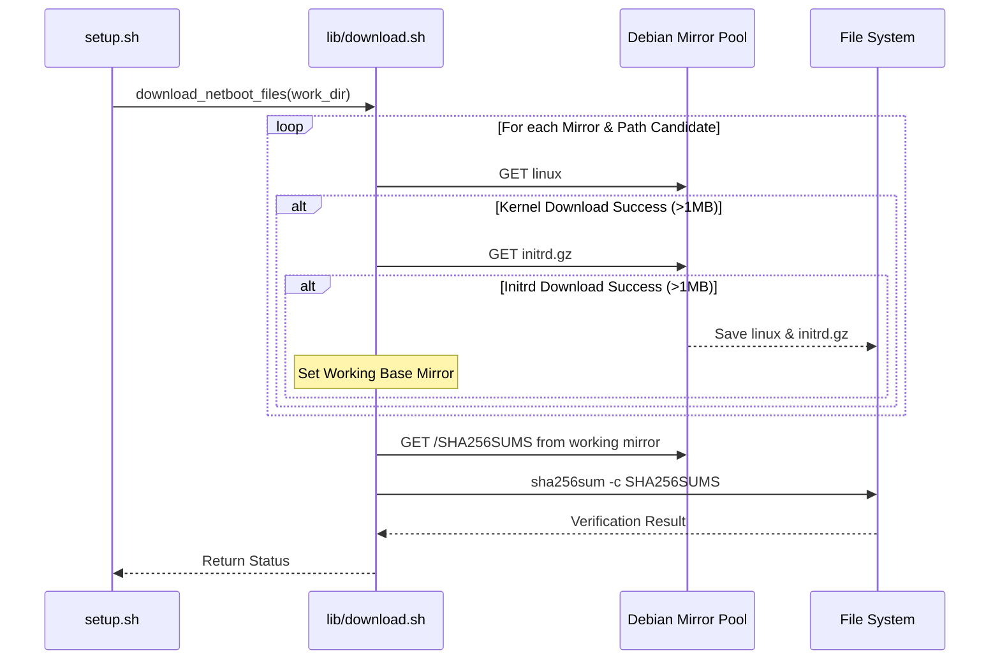

<details>
<summary>Relevant source files</summary>

The following files were used as context for generating this wiki page:

- [lib/download.sh](lib/download.sh)
- [setup.sh](setup.sh)
- [README.md](README.md)
- [lib/kexec_boot.sh](lib/kexec_boot.sh)
- [lib/detect_network.sh](lib/detect_network.sh)
- [lib/generate_preseed.sh](lib/generate_preseed.sh)

</details>

# Debian Netboot Download

The Debian Netboot Download process is a critical preparatory phase in the `vps-setup` project, responsible for acquiring the necessary Debian installer components from official mirrors. Its primary purpose is to retrieve the Linux kernel and the initial RAM disk (`initrd.gz`) required to bootstrap a new Debian installation via `kexec`. This automated retrieval ensures that the system can transition from its current running state into the Debian installer environment without requiring physical media.

Sources: [README.md:1-15](README.md#L1-L15), [lib/download.sh:7-10](lib/download.sh#L7-L10)

## Download Architecture and Multi-Mirror Failover

The download logic is encapsulated within `lib/download.sh` and is orchestrated by `setup.sh`. To guarantee 100% download success even if a specific mirror is unreachable, slow, or returning HTTP errors, `download_netboot_files` implements automated multi-mirror failover and path resolution across primary and fallback mirrors.

### Candidate Mirror & Path Resolution
The script iterates across candidate mirrors and relative netboot paths until valid artifacts (verified size > 1MB) are retrieved:

1. **Mirrors**:
   - `DEBIAN_MIRROR` (configured in `config.env`, e.g. `http://deb.debian.org/debian`)
   - `http://deb.debian.org/debian` (official global HTTP endpoint)
   - `https://cdn-fastly.deb.debian.org/debian` (Fastly CDN mirror)
   - `http://ftp.debian.org/debian` (official primary FTP mirror)

2. **Relative Netboot Paths**:
   - `dists/${release}/main/installer-amd64/current/images/netboot/debian-installer/amd64`
   - `dists/${release}/main/installer-amd64/current/legacy-images/netboot/debian-installer/amd64`

### Workflow Sequence
The following diagram illustrates the sequential failover and verification logic:


## Components and Verification

The system fetches three primary artifacts to ensure a successful and secure boot environment.

### Target Artifacts
| Artifact | Destination | Purpose |
| :--- | :--- | :--- |
| `linux` | `.work/linux` | The Debian installer kernel. |
| `initrd.gz` | `.work/initrd.gz` | The compressed initial RAM disk containing installer tools. |
| `SHA256SUMS` | Temporary | Metadata used to verify the integrity of the downloaded binaries. |

Sources: [lib/download.sh:15-17](lib/download.sh#L15-L17), [setup.sh:293-298](setup.sh#L293-L298)

### Validation Logic
To prevent corrupt installations, the script performs multiple checks:
1.  **Dependency Check**: It ensures `wget` is installed, attempting to install it via `apt-get` if missing.
2.  **Size Validation**: Both the kernel and `initrd.gz` must exceed 1,000,000 bytes. If a file is smaller, the download is considered failed.
3.  **Integrity Verification**: The script downloads the `SHA256SUMS` file from the mirror and executes `sha256sum -c --ignore-missing` to validate the files against official metadata.

Sources: [lib/download.sh:25-28](lib/download.sh#L25-L28), [lib/download.sh:47-58](lib/download.sh#L47-L58), [lib/download.sh:61-71](lib/download.sh#L61-L71)

## Configuration Integration

The download process is highly dependent on global variables exported during the configuration loading phase in `setup.sh`.

```bash
# Example URL construction in lib/download.sh
local base_url="${DEBIAN_MIRROR}/dists/${DEBIAN_RELEASE}/main/installer-amd64/current/images/netboot/debian-installer/amd64"
local kernel_url="${base_url}/linux"
local initrd_url="${base_url}/initrd.gz"
```

Sources: [lib/download.sh:14-17](lib/download.sh#L14-L17)

### Relevant Configuration Variables
| Variable | Default Value | Description |
| :--- | :--- | :--- |
| `DEBIAN_RELEASE` | `trixie` | The version of Debian to download (e.g., trixie, bookworm). |
| `DEBIAN_MIRROR` | `http://deb.debian.org/debian` | The base URL of the Debian APT mirror. |
| `WORK_DIR` | `.work` | The directory where files are stored (defaulting to a subdirectory of the script path). |

Sources: [setup.sh:159-160](setup.sh#L159-L160), [setup.sh:32](setup.sh#L32)

## Execution Environment

The download process is triggered within the `main` function of `setup.sh`. It can be modified by command-line arguments:
*  **Dry Run (`--dry-run`)**: Instead of downloading, the script creates empty "mock" files in the `.work` directory to allow template generation and inspection without network activity.
*  **Skip Download (`--skip-download`)**: Allows the user to reuse existing files already present in the `.work` directory.

Sources: [setup.sh:345-356](setup.sh#L345-L356), [setup.sh:304-315](setup.sh#L304-L315)

After successful download and verification, these files are utilized by `lib/kexec_boot.sh` to load the installer into memory, replacing the current running kernel.

Sources: [lib/kexec_boot.sh:56-70](lib/kexec_boot.sh#L56-L70)
