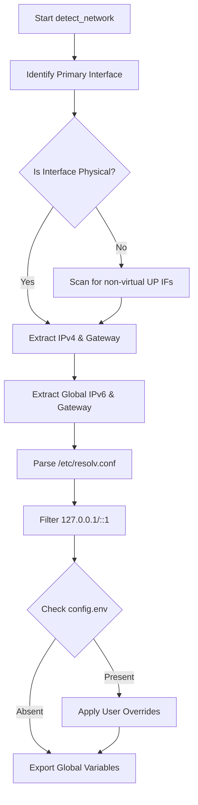
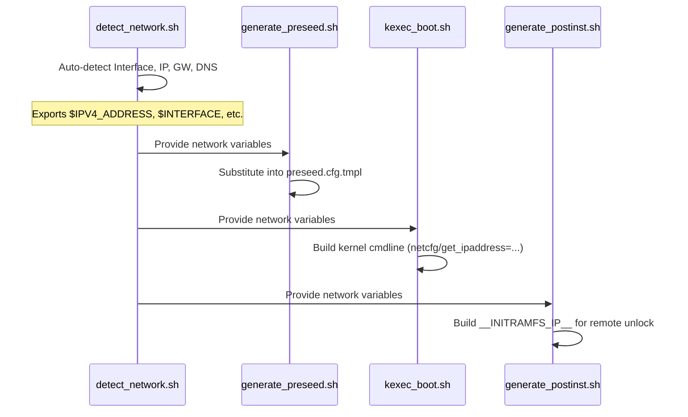

<details>
<summary>Relevant source files</summary>

The following files were used as context for generating this wiki page:

- [lib/detect\_network.sh](lib/detect_network.sh)
- [setup.sh](setup.sh)
- [lib/generate\_preseed.sh](lib/generate_preseed.sh)
- [lib/kexec\_boot.sh](lib/kexec_boot.sh)
- [lib/generate\_postinst.sh](lib/generate_postinst.sh)
- [README.md](README.md)
</details>

# Network Auto-Detection

The Network Auto-Detection module is a critical component of the `vps-setup` project, designed to programmatically identify the host's network configuration to facilitate an automated Debian reinstallation via `kexec`. Its primary purpose is to capture valid IPv4 and IPv6 addresses, gateways, netmasks, and DNS servers from the currently running system, ensuring the new installation maintains connectivity without manual intervention.

This module operates during the early stages of the `setup.sh` execution. It prioritizes user-defined overrides in `config.env` but falls back to automated discovery using `iproute2` utilities. The detected parameters are subsequently injected into the Debian installer's preseed configuration and the `kexec` kernel command line to ensure a seamless transition between the legacy system and the new environment.
Sources: [setup.sh:367-370](setup.sh#L367-L370), [lib/detect_network.sh:1-12](lib/detect_network.sh#L1-L12), [README.md:14-14](README.md#L14)

## Core Detection Logic

The detection process is encapsulated within the `detect_network` function. It systematically queries the system state to populate global environment variables.

### Interface Discovery
The system first attempts to identify the default routing interface. If a default route is not found, it scans for the first physical interface that is in the "UP" state, explicitly filtering out virtual or container-related interfaces such as `docker*`, `veth*`, `tun*`, or `tailscale*`. This ensures the installer targets a real hardware or hypervisor-provided NIC.
Sources: [lib/detect_network.sh:20-27](lib/detect_network.sh#L20-L27)

### Address and Gateway Resolution
Once an interface is identified, the module extracts:
*  **IPv4 Address & CIDR**: Parsed from `ip -o -4 addr show`.
*  **IPv4 Gateway**: Extracted from the default IPv4 routing table.
*  **IPv6 Global Address**: Filters for non-link-local global addresses.
*  **IPv6 Gateway**: Extracted from the default IPv6 routing table.
Sources: [lib/detect_network.sh:31-52](lib/detect_network.sh#L31-L52)

### DNS Discovery
DNS servers are parsed from `/etc/resolv.conf`. The logic includes a filter to exclude loopback resolvers (e.g., `127.*` or `::1`) to ensure the installer uses reachable external name servers. If no valid DNS servers are found, it defaults to a known set of public resolvers (1.1.1.1 and 8.8.8.8).
Sources: [lib/detect_network.sh:55-66](lib/detect_network.sh#L55-L66), [lib/detect_network.sh:76-78](lib/detect_network.sh#L76-L78)

### Network Detection Flow
The following diagram illustrates the logical progression of the detection suite:



The flow ensures that detection only proceeds with physical-like interfaces and that manual configuration always takes precedence over discovered values.
Sources: [lib/detect_network.sh:16-92](lib/detect_network.sh#L16-L92)

## Data Conversion and Validation

The module includes utility functions to handle the conversion between CIDR notation and dotted-decimal netmasks, which are required for different parts of the Debian installer (e.g., `netcfg`).

| Function | Input | Output | Description |
| :--- | :--- | :--- | :--- |
| `cidr_to_netmask` | CIDR (e.g., 24) | Dotted-Decimal (e.g., 255.255.255.0) | Converts prefix length to a standard IPv4 netmask. |
| `netmask_to_cidr` | Dotted-Decimal | CIDR Integer | Converts a standard netmask back to prefix length for configuration consistency. |
| `is_valid_hostname` | String | Boolean | Validates if a hostname or IP authority is RFC compliant. |

Sources: [lib/detect_network.sh:95-135](lib/detect_network.sh#L95-L135), [setup.sh:147-178](setup.sh#L147-L178)

## Integration with Installer Components

Network parameters captured by this module are consumed by three primary subsystems to ensure the target system is reachable:

1.  **Preseed Generation**: Variables like `__IPV4_ADDRESS__` and `__PRIMARY_DNS__` are substituted into the `preseed.cfg` template.
2.  **Kexec Command Line**: The kernel is booted with `netcfg` arguments (e.g., `netcfg/get_ipaddress`) to initialize the network during the installer phase.
3.  **Post-Install Hardening**: The detected IP settings are used to generate a static network configuration for the final OS and to configure `dropbear-initramfs` for remote LUKS unlocking.

### Sequence of Configuration Transfer
The sequence below shows how detected data travels through the system:



Sources: [lib/generate_preseed.sh:105-112](lib/generate_preseed.sh#L105-L112), [lib/kexec_boot.sh:91-100](lib/kexec_boot.sh#L91-L100), [lib/generate_postinst.sh:33-47](lib/generate_postinst.sh#L33-L47)

## Configuration Reference

The following table summarizes the network-related environment variables managed by the auto-detection system:

| Variable | Description | Source File Reference |
| :--- | :--- | :--- |
| `INTERFACE` | Target network interface name (e.g., eth0) | [lib/detect\_network.sh:20](lib/detect\_network.sh#L20) |
| `IPV4_ADDRESS` | Static IPv4 address for the system | [lib/detect\_network.sh:35](lib/detect\_network.sh#L35) |
| `IPV4_NETMASK` | Subnet mask in dotted-decimal format | [lib/detect\_network.sh:37](lib/detect\_network.sh#L37) |
| `IPV4_GATEWAY` | Default IPv4 gateway | [lib/detect\_network.sh:41](lib/detect\_network.sh#L41) |
| `DNS_SERVERS` | Space-separated list of DNS name servers | [lib/detect\_network.sh:76](lib/detect\_network.sh#L76) |
| `IPV6_ADDRESS` | Global-scope IPv6 address | [lib/detect\_network.sh:48](lib/detect\_network.sh#L48) |

## Technical Implementation Details

The interface detection utilizes specific regex filtering to avoid misconfiguring the installer on virtualized platforms.

```bash
# lib/detect_network.sh:23
detected_iface=$(ip -o link show up 2>/dev/null | awk -F': ' '{print $2}' | grep -vE '^(lo|docker|veth|br-|tun|tap|virbr|wg|cni|flannel|tailscale)' | head -n1)
```

This line ensures that common virtual network interfaces are ignored, preventing the script from attempting to use a Docker bridge or a WireGuard tunnel as the primary installation interface.
Sources: [lib/detect_network.sh:23-23](lib/detect_network.sh#L23)

## Conclusion

Network Auto-Detection serves as the foundation for the project's "zero-touch" installation goal. By accurately mirroring the existing host's network topology and providing fallbacks for common virtualization environments, it enables `kexec` to successfully transition into a network-aware Debian installer. This automation is vital for remote VPS environments where manual console access may be restricted or difficult to use.
