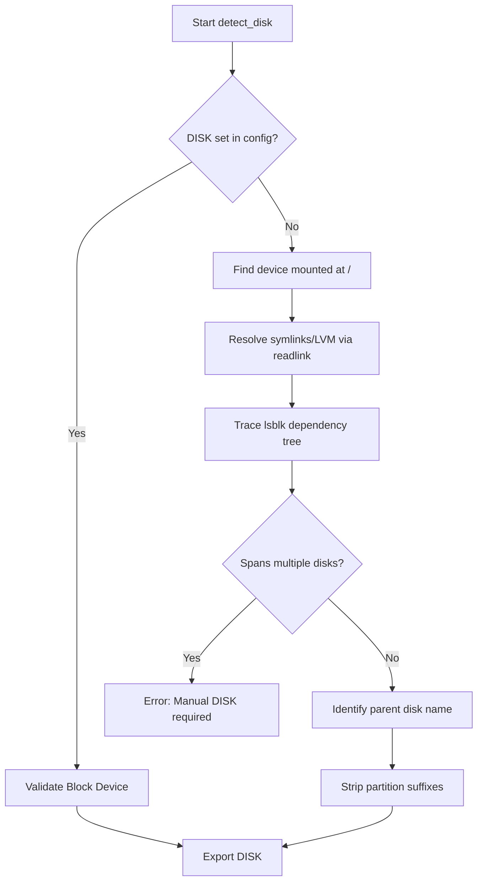
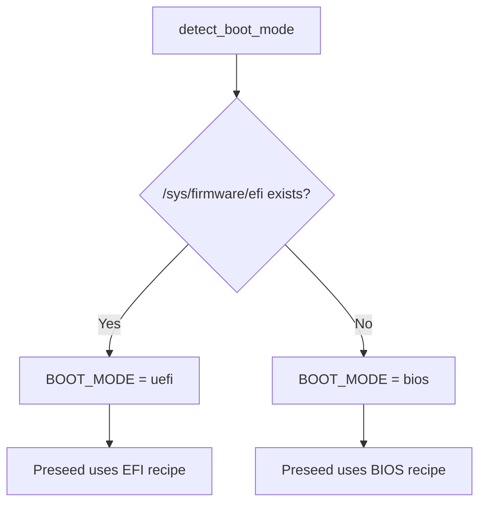

<details>
<summary>Relevant source files</summary>

The following files were used as context for generating this wiki page:

- [lib/detect_disk.sh](lib/detect_disk.sh)
- [setup.sh](setup.sh)
- [README.md](README.md)
- [lib/generate_preseed.sh](lib/generate_preseed.sh)
- [lib/kexec_boot.sh](lib/kexec_boot.sh)
</details>

# Disk & Boot Mode Auto-Detection

The Disk & Boot Mode Auto-Detection system is a critical component of the VPS Setup project, responsible for identifying the hardware environment before initiating a Debian re-installation. Its primary purpose is to discover the target OS disk, identify secondary storage devices, and determine if the system is booting via Legacy BIOS or UEFI. This automation ensures that the subsequent `kexec` boot and Debian preseed partitioning logic are correctly tailored to the specific VPS hardware without requiring manual user input for standard deployments.

This module operates during the "Pre-flight" and "Detection" phases of the `setup.sh` execution flow. By accurately mapping the current root filesystem back to a physical block device, the system can safely prepare for full-disk LUKS encryption while preserving or formatting secondary disks based on the selected installation role.

Sources: [setup.sh:419-423](setup.sh#L419-L423), [lib/detect_disk.sh:10-14](lib/detect_disk.sh#L10-L14), [README.md:9-11](README.md#L9-L11)

## Primary OS Disk Detection Logic

The system identifies the primary target disk by tracing the active root filesystem (`/`) back to its parent block device. This approach avoids guessing by disk size, which is intentionally disabled for safety. The logic handles standard SCSI/VirtIO devices (e.g., `/dev/sda`, `/dev/vda`) as well as NVMe and MMC devices that use different partition naming conventions.

### Detection Workflow

1.  **Manual Override**: Checks if `DISK` is already defined in `config.env`. If it exists as a block device, auto-detection is skipped.
2.  **Mount Point Analysis**: Uses `findmnt` to locate the source device for the root directory.
3.  **Dependency Tracing**: Resolves symlinks (like LVM mappers) to physical devices and uses `lsblk` to trace the dependency tree upward to find the physical "disk" type device.
4.  **Device Normalization**: Strips partition suffixes (e.g., `p1` for NVMe or numeric suffixes for SDA) to identify the raw block device.



The diagram shows the logical progression from configuration checking to filesystem tracing and device normalization.
Sources: [lib/detect_disk.sh:17-86](lib/detect_disk.sh#L17-L86), [README.md:124-128](README.md#L124-L128)

## Secondary Disk Handling

The system supports two distinct installation roles that dictate how non-OS disks are treated. This is managed by the `detect_secondary_disks` function, which scans for block devices that are not the primary `DISK`.

| Role | Behavior |
| :--- | :--- |
| `standard` | All secondary disks are completely ignored and left untouched. |
| `storage-vps` | Scans for additional disks and prompts the user interactively to leave untouched, format (ext4), or skip. |

### Storage-VPS Interaction
In `storage-vps` mode, the script filters for physical disks where the Removable (`RM`) attribute is `0` and the device path does not match the primary OS disk. For each found device, it displays the size, model, and current partition layout.

Sources: [lib/detect_disk.sh:103-125](lib/detect_disk.sh#L103-L125), [README.md:46-60](README.md#L46-L60)

## Boot Mode Identification

The `detect_boot_mode` function determines the firmware interface used by the VPS. This is achieved by checking for the existence of the `/sys/firmware/efi` directory.

-  **UEFI**: Detected if `/sys/firmware/efi` exists. `BOOT_MODE` is set to `uefi`.
-  **BIOS/Legacy**: Detected if the directory is missing. `BOOT_MODE` is set to `bios`.

This detection directly impacts the partitioning recipe generated for the Debian installer. UEFI systems receive an EFI System Partition (ESP), while BIOS systems receive a `biosgrub` partition.



This diagram illustrates how boot mode detection branches into different preseed partitioning strategies.
Sources: [lib/detect_disk.sh:185-193](lib/detect_disk.sh#L185-L193), [lib/generate_preseed.sh:65-72](lib/generate_preseed.sh#L65-L72)

## Integration with Partitioning Recipes

The detected disk and boot mode are used to construct the `partman/expert_recipe` inside the `preseed.cfg`. The recipe defines the exact layout for the LUKS container and LVM volume groups.

### Partitioning Structure
The system enforces a consistent layout regardless of boot mode, with the primary difference being the initial boot partition:

1.  **Boot Header**: `efi` partition for UEFI or `biosgrub` for BIOS.
2.  **Static Boot**: A 512MB `ext4` partition mounted at `/boot`.
3.  **LUKS Container**: A `crypto` method partition consuming the remaining space.
4.  **LVM Volumes**: Inside the LUKS container, a 1GB `swap` volume and a `root` volume for the remainder.

```bash
# Example logic from lib/generate_preseed.sh
if [[ "${BOOT_MODE:-uefi}" == "uefi" ]]; then
    partman_recipe="boot-crypto :: 538 538 1075 free \$primary{ } ... method{ efi } format{ } . 512 512 512 ext4 ... mountpoint{ /boot } . 2048 10000 -1 ext4 ... method{ crypto } ..."
else
    partman_recipe="boot-crypto :: 1 1 1 free \$gptonly{ } ... method{ biosgrub } . 512 512 512 ext4 ... mountpoint{ /boot } . 2048 10000 -1 ext4 ... method{ crypto } ..."
fi
```

Sources: [lib/generate_preseed.sh:65-75](lib/generate_preseed.sh#L65-L75), [README.md:144-152](README.md#L144-L152)

## Summary of Key Components

The following table summarizes the key environmental variables and functions derived from the disk and boot detection process.

| Component | Function / Variable | Description |
| :--- | :--- | :--- |
| **Primary Disk** | `DISK` | The target physical block device (e.g., `/dev/vda`). |
| **Volume Group** | `VG_NAME` | Defaults to `${HOSTNAME}-vol`. Used for LVM on LUKS. |
| **Boot Mode** | `BOOT_MODE` | Set to `uefi` or `bios` based on firmware presence. |
| **Secondary Disks**| `MOUNT_EXTRA_DISKS` | List of secondary disks approved for formatting in storage role. |
| **Detection Fn** | `detect_disk()` | Core logic for finding the root device and its parent disk. |

Sources: [lib/detect_disk.sh:17](lib/detect_disk.sh#L17), [lib/detect_disk.sh:91](lib/detect_disk.sh#L91), [lib/detect_disk.sh:185](lib/detect_disk.sh#L185), [setup.sh:220-224](setup.sh#L220-L224)

## Conclusion
Disk & Boot Mode Auto-Detection provides a safety-first approach to hardware discovery. By strictly anchoring detection to the existing root filesystem and providing interactive gates for secondary storage, the project minimizes the risk of accidental data loss on non-OS volumes. The automated identification of UEFI vs BIOS ensures that the resulting Debian installation is bootable on any supported VPS hypervisor without manual partitioning configuration.
