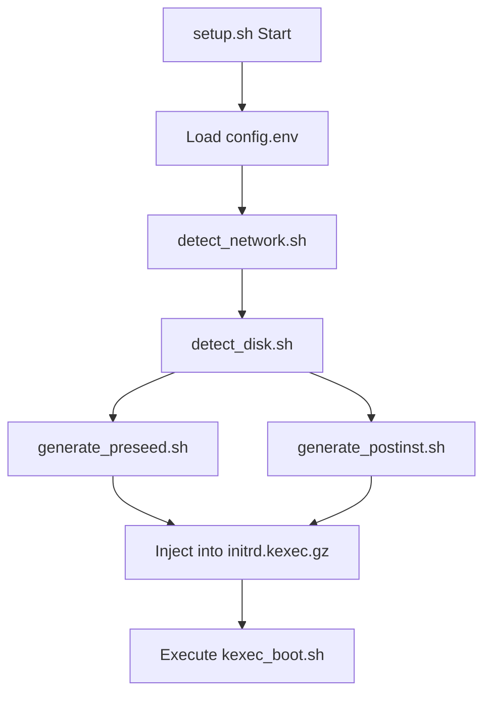
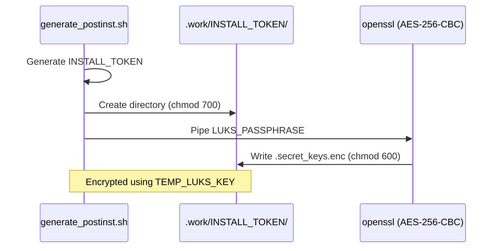

<details>
<summary>Relevant source files</summary>

The following files were used as context for generating this wiki page:

- [lib/generate_preseed.sh](lib/generate_preseed.sh)
- [lib/generate_postinst.sh](lib/generate_postinst.sh)
- [setup.sh](setup.sh)
- [lib/kexec_boot.sh](lib/kexec_boot.sh)
- [lib/detect_disk.sh](lib/detect_disk.sh)
- [lib/detect_network.sh](lib/detect_network.sh)
</details>

# Preseed Generation & Templating

Preseed Generation and Templating is a core module of the `vps-setup` project designed to automate the Debian installation process. It acts as the bridge between user configuration (via `config.env`) and the Debian Installer (d-i), programmatically generating a `preseed.cfg` file and a corresponding `postinst.sh` script. These files contain all the logic necessary to handle disk partitioning, network setup, and initial system hardening without user intervention.

The system utilizes a template-based approach where placeholders in `.tmpl` files are replaced with auto-detected values or user-specified parameters. This ensures that the resulting installation environment is tailored to the specific hardware (UEFI vs BIOS) and network environment of the target VPS. Once generated, these files are injected into a custom initrd for a self-contained, offline-capable installation via kexec.
Sources: [lib/generate_preseed.sh:8-13](lib/generate_preseed.sh#L8-L13), [lib/kexec_boot.sh:40-45](lib/kexec_boot.sh#L40-L45), [setup.sh:374-386](setup.sh#L374-L386)

## Generation Workflow

The generation process is sequential and relies on the successful completion of network and disk detection modules. The `setup.sh` main function orchestrates these steps to ensure all variables are populated before template substitution occurs.



This diagram illustrates the dependency chain required to produce valid configuration files.
Sources: [setup.sh:361-395](setup.sh#L361-L395), [lib/kexec_boot.sh:40-62](lib/kexec_boot.sh#L40-L62)

## Preseed Configuration (preseed.cfg)

The `generate_preseed` function handles the creation of the primary Debian installer configuration. It processes network settings, disk partitioning recipes, and installation mirrors.

### Dynamic Partitioning Recipes
The system generates a `partman_recipe` based on the detected `BOOT_MODE` (UEFI or BIOS). This recipe defines the layout for the EFI partition, `/boot`, and the LUKS-encrypted LVM volume containing `root` and `swap`.

| Boot Mode | Key Components in Recipe | Derived From |
| :--- | :--- | :--- |
| **UEFI** | `method{ efi }`, `/boot` (ext4), `method{ crypto }` (LUKS) | `BOOT_MODE="uefi"` |
| **BIOS** | `method{ biosgrub }`, `/boot` (ext4), `method{ crypto }` (LUKS) | `BOOT_MODE="bios"` |

Sources: [lib/generate_preseed.sh:65-71](lib/generate_preseed.sh#L65-L71), [lib/detect_disk.sh:162-170](lib/detect_disk.sh#L162-L170)

### Template Substitution Logic
The generator uses `sed` to replace placeholders with escaped shell variables. Key placeholders include:

*  `__PARTMAN_RECIPE__`: The dynamically generated disk layout.
*  `__TEMP_LUKS_KEY__`: A temporary random key used for automated LUKS setup during installation.
*  `__DEBIAN_MIRROR_HOST__`: Parsed from the user-provided `DEBIAN_MIRROR` URL.

Sources: [lib/generate_preseed.sh:80-112](lib/generate_preseed.sh#L80-L112)

## Post-Install Script Generation (postinst.sh)

The `postinst.sh` script is executed via the preseed `late_command`. It handles hardening tasks that the standard Debian installer cannot perform, such as SSH port customization and LUKS key rotation.

### Secret Handling and Encryption
To protect sensitive data like the user's permanent `LUKS_PASSPHRASE`, the generator creates an encrypted payload.



This flow shows how secrets are prepared for the post-installation environment without being stored in plain text in the script itself.
Sources: [lib/generate_postinst.sh:35-47](lib/generate_postinst.sh#L35-L47)

### Configuration Parameters
The script inherits parameters for system setup and network persistence:
*  **Initramfs Networking**: A specific `initramfs_ip` string is built to ensure Dropbear can be reached for remote LUKS unlocking.
*  **SSH Hardening**: Variables like `__SSH_PORT__` and `__SSH_PUBKEY__` are injected for OpenSSH configuration.
Sources: [lib/generate_postinst.sh:29-31](lib/generate_postinst.sh#L29-L31), [lib/generate_postinst.sh:58-70](lib/generate_postinst.sh#L58-L70)

## Implementation Details

### Initialization and Permissions
Both generation scripts strictly enforce file permissions to protect sensitive configuration data during the build process.

```bash
# From lib/generate_preseed.sh:33
install -m 600 /dev/null "${output_file}"

# From lib/generate_postinst.sh:26
install -m 700 /dev/null "${output_file}"
```

Sources: [lib/generate_preseed.sh:33](lib/generate_preseed.sh#L33), [lib/generate_postinst.sh:26](lib/generate_postinst.sh#L26)

### Key Variables Used in Templates

| Variable | Source | Description |
| :--- | :--- | :--- |
| `INSTALL_TOKEN` | `openssl rand` | Random 16-hex token for single-installation secret paths. |
| `TEMP_LUKS_KEY` | `openssl rand` | Temporary 32-hex key for automated disk encryption. |
| `VG_NAME` | `detect_disk.sh` | LVM Volume Group name, defaults to `${HOSTNAME}-vol`. |
| `PRIMARY_DNS` | `detect_network.sh` | Extracted first DNS server for `netcfg`. |

Sources: [lib/generate_preseed.sh:36-41](lib/generate_preseed.sh#L36-L41), [lib/generate_preseed.sh:54-61](lib/generate_preseed.sh#L54-L61), [lib/detect_disk.sh:34](lib/detect_disk.sh#L34)

## Summary

The Preseed Generation & Templating module provides the automation logic for `vps-setup`. By dynamically generating `preseed.cfg` and `postinst.sh`, it ensures that every installation is customized for the target environment while maintaining high security through temporary LUKS keys and encrypted secret transport. The integration of disk detection, network auto-discovery, and kexec injection creates a robust, hands-off reinstallation experience.
Sources: [lib/generate_preseed.sh](lib/generate_preseed.sh), [lib/generate_postinst.sh](lib/generate_postinst.sh), [lib/kexec_boot.sh](lib/kexec_boot.sh)
