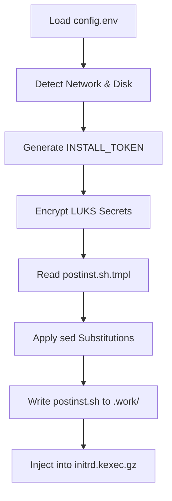
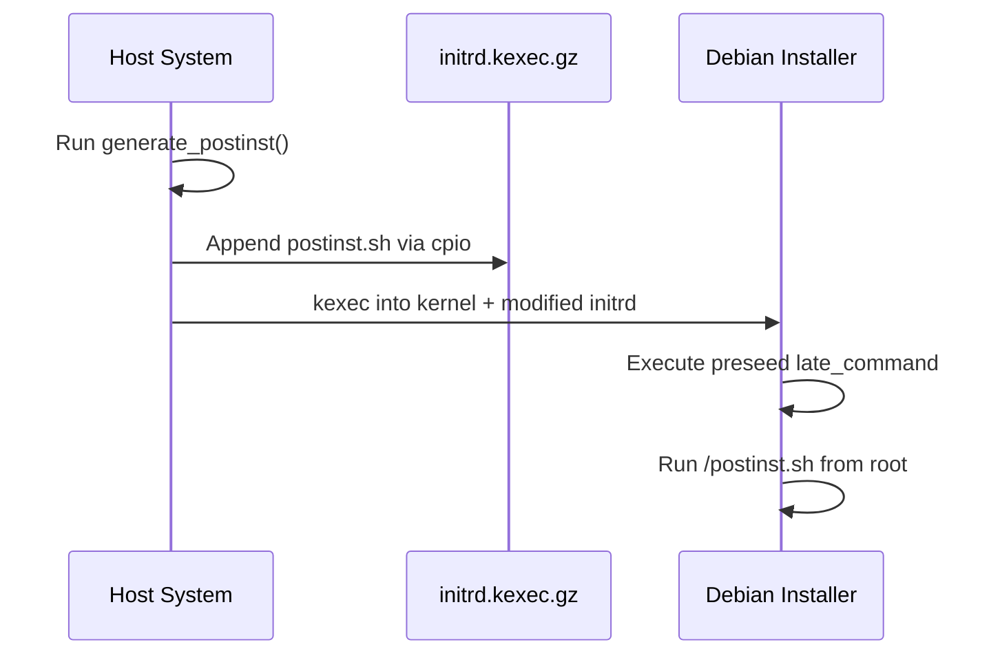

Relevant source files

The following files were used as context for generating this wiki page:

- [lib/generate_postinst.sh](lib/generate_postinst.sh)
- [setup.sh](setup.sh)
- [lib/kexec_boot.sh](lib/kexec_boot.sh)
- [README.md](README.md)
- [lib/generate_preseed.sh](lib/generate_preseed.sh)

# Post-Install Script Generation

The **Post-Install Script Generation** module is a critical component of the VPS Setup project. Its primary purpose is to transform a static template into a functional `postinst.sh` script that automates system hardening, network configuration, and LUKS key management within the newly installed Debian environment. This script is executed during the `late_command` phase of the Debian installer preseed process.

By dynamically replacing placeholders with environment-specific data, the generator ensures that security policies—such as SSH hardening, UFW firewall rules, and Fail2ban configurations—are applied consistently. It also handles the secure transport of sensitive data, such as the LUKS passphrase, by encrypting them into a single-use payload for the installer to consume.

Sources: [lib/generate_postinst.sh:8-12](lib/generate_postinst.sh#L8-L12), [README.md:10-18](README.md#L10-L18)

## Script Generation Workflow

The generation process involves locating the base template, preparing security tokens, and executing a series of string substitutions. The resulting script is stored in a restricted workspace before being bundled into the deployment payload.

### Architectural Logic and Data Flow

The following diagram illustrates the flow from configuration detection to the creation of the final post-installation script:

The workflow ensures that the final script contains no raw secrets while possessing all necessary metadata for system configuration.
Sources: [lib/generate_postinst.sh:17-106](lib/generate_postinst.sh#L17-L106), [lib/kexec_boot.sh:42-59](lib/kexec_boot.sh#L42-L59)

### Key Functions and Components

| Function / Component | Description | Source File |
| :--- | :--- | :--- |
| `generate_postinst()` | The main driver function that handles file creation, secret encryption, and template substitution. | `lib/generate_postinst.sh:17` |
| `sed_escape()` | Escapes special characters (backslash, ampersand, pipe) to ensure safe string replacement during `sed` operations. | `lib/generate_postinst.sh:13` |
| `INSTALL_TOKEN` | A random 16-byte hex string used to create a unique, single-use directory for secret payloads. | `lib/generate_postinst.sh:34` |
| `TEMP_LUKS_KEY` | A temporary random 32-byte key used for initial disk partitioning, later replaced by the user's passphrase. | `lib/generate_preseed.sh:31` |

## Security and Secret Management

A core responsibility of the post-install generator is the handling of the user's LUKS passphrase. To prevent exposing the passphrase in plain text within the `postinst.sh` script (which might be logged or stored in the clear), the project uses an encrypted transport mechanism.

### LUKS Secret Transport
The generator creates an encrypted payload rather than embedding the passphrase directly:
1.  **Encryption**: The `LUKS_PASSPHRASE` is encrypted using `openssl enc -aes-256-cbc` with a PBKDF2-derived key from `TEMP_LUKS_KEY`.
2.  **Storage**: The encrypted blob is saved to a restricted directory path defined by the `INSTALL_TOKEN`.
3.  **Rotation**: The `postinst.sh` script contains logic to rotate the keys from the temporary installation key to the user's permanent passphrase.

Sources: [lib/generate_postinst.sh:40-49](lib/generate_postinst.sh#L40-L49), [README.md:126-136](README.md#L126-L136)

### Template Substitutions
The module maps internal shell variables to `__PLACEHOLDER__` tags in the template.

| Placeholder | Variable Source | Description |
| :--- | :--- | :--- |
| `__USERNAME__` | `USERNAME` | Non-root user with sudo privileges. |
| `__SSH_PORT__` | `SSH_PORT` | The custom port for the OpenSSH daemon. |
| `__INITRAMFS_IP__` | `initramfs_ip` | Static IP string for the Dropbear unlock environment. |
| `__INSTALL_TOKEN__` | `INSTALL_TOKEN` | Token for locating the encrypted secret files. |

Sources: [lib/generate_postinst.sh:65-95](lib/generate_postinst.sh#L65-L95)

## Deployment and Execution

Once generated, the `postinst.sh` script is not served over a network. Instead, it is injected directly into a custom RAMdisk.

This self-contained approach removes the need for a local HTTP server during installation, increasing reliability on VPS providers with restrictive networking.
Sources: [lib/kexec_boot.sh:42-70](lib/kexec_boot.sh#L42-L70), [README.md:65-71](README.md#L65-L71)

### Hardening Features Applied
The generated script automates several hardening tasks as defined in the project scope:
*  **SSH**: Disables root login and password authentication on the main OS.
*  **Firewall**: Configures UFW to deny all incoming traffic except for the specified `SSH_PORT`.
*  **Audit**: Sets up `auditd` and system hardening via `sysctl`.
*  **LUKS**: Generates a header backup at `/root/luks-header-backup.img`.

Sources: [setup.sh:8-16](setup.sh#L8-L16), [lib/generate_postinst.sh:58-62](lib/generate_postinst.sh#L58-L62)

## Summary
The Post-Install Script Generation module bridges the gap between the initial setup environment and the final hardened state of the VPS. By utilizing secure tokenization and template-based substitution, it ensures that every deployment is tailored to the user's configuration while maintaining a high security posture through encrypted secret transport and automated system hardening.
