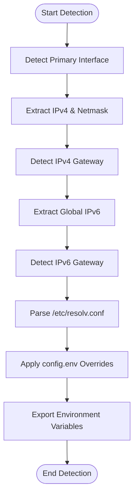

<details>
<summary>Relevant source files</summary>

The following files were used as context for generating this wiki page:

- [lib/detect_network.sh](lib/detect_network.sh)
- [setup.sh](setup.sh)
- [lib/generate_preseed.sh](lib/generate_preseed.sh)
- [lib/generate_postinst.sh](lib/generate_postinst.sh)
- [lib/kexec_boot.sh](lib/kexec_boot.sh)
- [README.md](README.md)
</details>

# Network Auto-Detection

Network Auto-Detection is a critical subsystem of the VPS Setup project designed to automatically identify and extract the current network configuration of a running Linux system. Its primary purpose is to ensure that the subsequent Debian installation, performed via `kexec`, maintains connectivity by passing accurate static network parameters to the Debian installer and the final installed system.

This module automates the discovery of IPv4 and IPv6 addresses, gateways, CIDR prefixes, netmasks, and DNS servers. While it operates automatically, it respects user overrides defined in `config.env`, allowing for manual configuration when auto-detection is not desired or fails.

Sources: [README.md:12](README.md#L12), [lib/detect_network.sh:1-12](lib/detect_network.sh#L1-L12)

## Detection Logic and Data Flow

The detection process relies on `iproute2` commands to query the Linux kernel's networking stack. The logic follows a hierarchical approach where it first identifies the primary network interface and then probes that interface for specific address families.

### Logic Flow Diagram
The following flowchart illustrates the sequential steps taken by the `detect_network` function to build the network profile.



Sources: [lib/detect_network.sh:16-95](lib/detect_network.sh#L16-L95)

### Key Detection Components

| Component | Logic Source | Description |
| :--- | :--- | :--- |
| **Interface** | `ip route show default` | Finds the interface associated with the default route. Falls back to the first non-loopback `UP` interface. |
| **IPv4 Address** | `ip -4 addr show` | Extracts the address and CIDR prefix from the primary interface. |
| **Netmask** | `cidr_to_netmask` | A helper function that converts CIDR integers (e.g., 24) to dotted-decimal (e.g., 255.255.255.0). |
| **IPv6 Address** | `ip -6 addr scope global` | Specifically targets global-scope addresses, ignoring link-local (fe80::) addresses. |
| **DNS Servers** | `/etc/resolv.conf` | Parses the `nameserver` directives to identify active DNS resolvers. |

Sources: [lib/detect_network.sh:22-63](lib/detect_network.sh#L22-L63), [lib/detect_network.sh:100-118](lib/detect_network.sh#L100-L118)

## Integration with Installer Pipeline

The auto-detected network parameters are used across three distinct phases of the installation process. 

### 1. Kernel Command Line (kexec)
Before jumping into the Debian installer, the parameters are formatted into `netcfg` strings and appended to the kernel command line. This allows the installer to configure the network without DHCP.

```bash
kcmdline+="netcfg/get_ipaddress=${IPV4_ADDRESS} "
kcmdline+="netcfg/get_netmask=${IPV4_NETMASK} "
kcmdline+="netcfg/get_gateway=${IPV4_GATEWAY} "
kcmdline+="netcfg/get_nameservers=${DNS_SERVERS%% *} "
```

Sources: [lib/kexec_boot.sh:70-80](lib/kexec_boot.sh#L70-L80)

### 2. Preseed Generation
The `generate_preseed.sh` script uses the detected values to populate the `preseed.cfg` template, ensuring the installer has the correct mirror and networking information throughout the OS installation.

Sources: [lib/generate_preseed.sh:65-71](lib/generate_preseed.sh#L65-L71)

### 3. Post-Installation Hardening
The `generate_postinst.sh` script incorporates these values into a `postinst.sh` script. This script is responsible for configuring static networking in the final installed Debian system and setting up `dropbear-initramfs` for remote LUKS unlocking.

Sources: [lib/generate_postinst.sh:29-59](lib/generate_postinst.sh#L29-L59)

## Network Configuration Parameters

The following table lists the variables managed by the Network Auto-Detection module and their roles within the system.

| Variable | Description | Source File |
| :--- | :--- | :--- |
| `INTERFACE` | Primary network interface name | `detect_network.sh:71` |
| `IPV4_ADDRESS` | Static IPv4 address of the VPS | `detect_network.sh:72` |
| `IPV4_NETMASK` | Dotted-decimal subnet mask | `detect_network.sh:73` |
| `IPV4_CIDR` | IPv4 prefix length (integer) | `detect_network.sh:74` |
| `IPV6_ADDRESS` | Static IPv6 address (if available) | `detect_network.sh:76` |
| `DNS_SERVERS` | Space-separated list of DNS resolvers | `detect_network.sh:79` |

Sources: [lib/detect_network.sh:71-79](lib/detect_network.sh#L71-L79)

## Remote LUKS Unlock Configuration

A unique application of the detected network data is the generation of the `INITRAMFS_IP` string. This string is used by `klibc-ipconfig` during the boot process to enable SSH access via Dropbear before the root filesystem is mounted.

The format used is:
`IP=<client-ip>:<server-ip>:<gateway>:<netmask>:<hostname>:<device>:<autoconf>`

In this project, it is constructed as:
`${IPV4_ADDRESS}::${IPV4_GATEWAY}:${IPV4_NETMASK}:${HOSTNAME}::none`

Sources: [lib/generate_postinst.sh:29-32](lib/generate_postinst.sh#L29-L32), [README.md:99-110](README.md#L99-L110)

## Conclusion
Network Auto-Detection serves as the backbone for the project's "zero-touch" philosophy. By accurately capturing the existing network environment and propagating those settings through kernel parameters, preseed configurations, and post-installation scripts, the system ensures that the VPS remains reachable via SSH at every stage—from the initial `kexec` boot to the final remote LUKS unlock.
