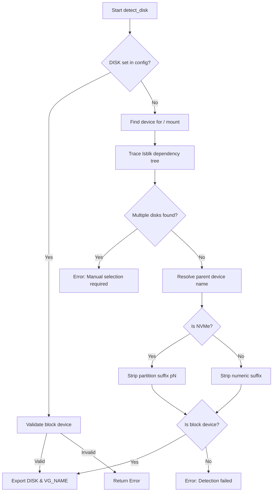
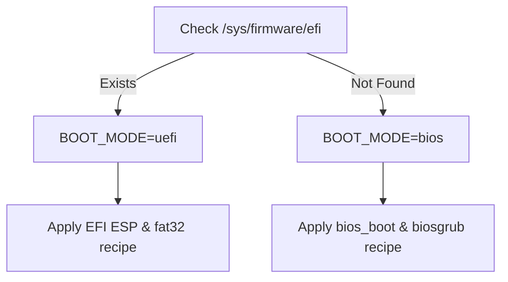

<details>
<summary>Relevant source files</summary>

The following files were used as context for generating this wiki page:

- [lib/detect_disk.sh](lib/detect_disk.sh)
- [setup.sh](setup.sh)
- [README.md](README.md)
- [lib/generate_preseed.sh](lib/generate_preseed.sh)
- [lib/generate_postinst.sh](lib/generate_postinst.sh)
- [lib/kexec_boot.sh](lib/kexec_boot.sh)
</details>

# Disk & Boot Mode Auto-Detection

## Introduction

The Disk & Boot Mode Auto-Detection system is a critical component of the VPS Setup project, responsible for identifying the hardware environment before proceeding with the automated Debian reinstallation. Its primary purpose is to ensure that the installer targets the correct physical disk and applies the appropriate partitioning scheme based on the system's firmware (BIOS or UEFI). By automating this process, the system minimizes human error during the destructive reinstallation phase.

The detection logic is primarily contained within `lib/detect_disk.sh` and is integrated into the main execution flow in `setup.sh`. The system handles two primary installation roles: `standard`, which focuses exclusively on the OS disk, and `storage-vps`, which provides interactive handling for secondary storage devices. These detections subsequently inform the generation of the `preseed.cfg` file, ensuring that the Debian installer uses the correct recipes for partitioning and bootloader installation.

Sources: [README.md:14-18](README.md#L14-L18), [setup.sh:373-376](setup.sh#L373-L376), [lib/detect_disk.sh:5-9](lib/detect_disk.sh#L5-L9)

## Primary OS Disk Detection

The system employs a multi-step heuristic to identify the primary disk containing the current root filesystem (`/`). It prioritizes manual configuration from `config.env` if provided, otherwise, it traces the device dependency tree from the mount point upward to the physical hardware.

### Detection Logic Flow

The following diagram illustrates the decision-making process for identifying the target OS disk:



The logic ensures that the script does not guess the disk based on size, which could lead to data loss on incorrect drives.
Sources: [lib/detect_disk.sh:16-90](lib/detect_disk.sh#L16-L90)

### Key Variables and Functions

| Function / Variable | Description | Source |
| :--- | :--- | :--- |
| `detect_disk()` | Main function to identify the OS target disk and set LVM Volume Group names. | [lib/detect_disk.sh:12](lib/detect_disk.sh#L12) |
| `DISK` | Environment variable storing the path (e.g., `/dev/sda`) of the target disk. | [lib/detect_disk.sh:86](lib/detect_disk.sh#L86) |
| `VG_NAME` | LVM Volume Group name, defaults to `${HOSTNAME}-vol`. | [lib/detect_disk.sh:89](lib/detect_disk.sh#L89) |
| `findmnt` | Utility used to identify the source device for the root filesystem. | [lib/detect_disk.sh:42](lib/detect_disk.sh#L42) |

## Secondary Disk Handling (`storage-vps` Role)

When `INSTALL_ROLE` is set to `storage-vps`, the system scans for additional disks that are not the primary OS disk. This feature is designed for servers with multiple block devices where the user may want to format and mount extra storage automatically.

### Storage Scanning Process

1. **Filtering**: The script filters `lsblk` output to find devices where `TYPE="disk"` and `RM="0"` (non-removable), excluding the identified `DISK`.
2. **Interaction**: If the session is interactive, it presents the user with choices for each disk: Leave untouched, Format (ext4) and mount, or Manual configuration.
3. **Confirmation**: Users must type the full device path to confirm formatting actions.
4. **Automation**: In non-interactive or dry-run modes, secondary disks are kept untouched by default for safety.

Sources: [lib/detect_disk.sh:105-188](lib/detect_disk.sh#L105-L188), [README.md:43-52](README.md#L43-L52)

## Boot Mode Detection

The system automatically detects whether the VPS is booting via Legacy BIOS or UEFI. This detection is crucial for selecting the correct partitioning "recipe" in the Debian preseed configuration.

### UEFI vs BIOS Logic

The detection relies on the presence of the `/sys/firmware/efi` directory:
- **UEFI**: If the directory exists, `BOOT_MODE` is set to `uefi`.
- **BIOS**: If the directory is absent, `BOOT_MODE` is set to `bios`.



Sources: [lib/detect_disk.sh:196-204](lib/detect_disk.sh#L196-L204), [lib/generate_preseed.sh:53-58](lib/generate_preseed.sh#L53-L58)

## Integration with Preseed Generation

The detected disk and boot mode are used to construct the `partman` expert recipe. This recipe defines the exact partition layout for the automated installer.

### Partition Layouts by Boot Mode

| Partition | UEFI Recipe | BIOS/Legacy Recipe |
| :--- | :--- | :--- |
| **System Partition** | 512MB EFI ESP (fat32) | 1MB BIOS Boot (biosgrub) |
| **Boot Partition** | 512MB ext4 (`/boot`) | 512MB ext4 (`/boot`) |
| **LUKS Container** | Remaining space | Remaining space |
| **LVM Swap** | 1GB within VG | 1GB within VG |
| **LVM Root** | Remaining space within VG | Remaining space within VG |

Sources: [lib/generate_preseed.sh:53-58](lib/generate_preseed.sh#L53-L58), [README.md:144-153](README.md#L144-L153)

### Implementation Detail: Preseed Mapping

```bash
# From lib/generate_preseed.sh
if [[ "${BOOT_MODE:-uefi}" == "uefi" ]]; then
    partman_recipe="boot-crypto :: 512 512 512 fat32 \$primary{ } method{ efi } format{ } . 512 512 512 ext4 \$primary{ } \$bootable{ } method{ format } format{ } use_filesystem{ } filesystem{ ext4 } mountpoint{ /boot } . 1024 1024 1024 linux-swap \$lvmok{ } lv_name{ swap } in_vg{ ${vg_name} } method{ swap } format{ } . 4096 10000 -1 ext4 \$lvmok{ } lv_name{ root } in_vg{ ${vg_name} } method{ format } format{ } use_filesystem{ } filesystem{ ext4 } mountpoint{ / } ."
else
    partman_recipe="boot-crypto :: 1 1 1 free \$bios_boot{ } method{ biosgrub } . ..."
fi
```

Sources: [lib/generate_preseed.sh:53-58](lib/generate_preseed.sh#L53-L58)

## Conclusion

The Disk & Boot Mode Auto-Detection system provides a robust safety net for the automated reinstallation process. By combining active filesystem tracing with firmware detection, it ensures the project can support diverse VPS environments (BIOS vs. UEFI) while preventing accidental data loss on secondary drives. The resulting configuration is exported as variables that drive the `preseed.cfg` generation, bridging the gap between the currently running environment and the target Debian installation.

Sources: [setup.sh:373-376](setup.sh#L373-L376), [lib/detect_disk.sh:207-230](lib/detect_disk.sh#L207-L230)
