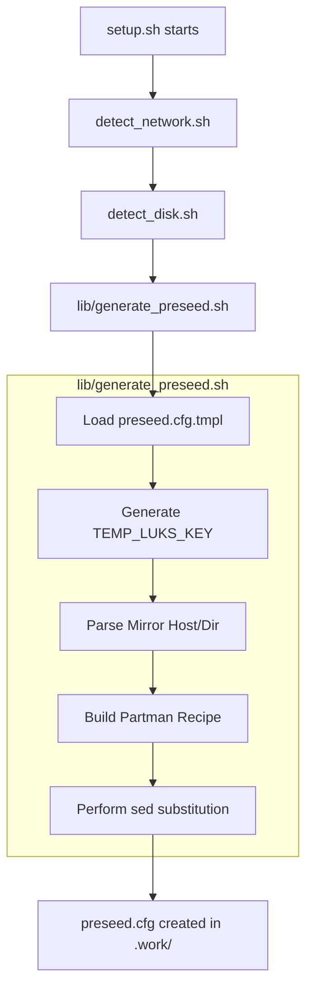
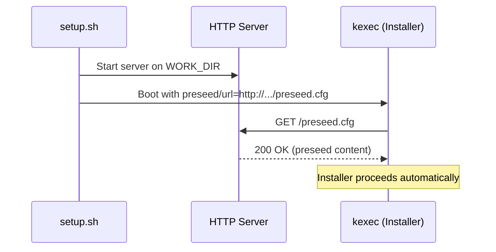

<details>
<summary>Relevant source files</summary>

The following files were used as context for generating this wiki page:

- [lib/generate_preseed.sh](lib/generate_preseed.sh)
- [setup.sh](setup.sh)
- [README.md](README.md)
- [lib/generate_postinst.sh](lib/generate_postinst.sh)
- [lib/detect_disk.sh](lib/detect_disk.sh)
- [lib/detect_network.sh](lib/detect_network.sh)
- [lib/kexec_boot.sh](lib/kexec_boot.sh)

</details>

# Preseed Generation

Preseed Generation is a critical module in the `vps-setup` project responsible for creating a customized `preseed.cfg` file. This file automates the Debian installation process by providing answers to installer questions that would normally require manual input. It bridges the gap between the host environment's auto-detected configurations (network, disk, locale) and the requirements of the Debian `d-i` (Debian Installer) environment.

The generation process involves reading a template, performing variable substitution using values derived from `config.env` and runtime discovery, and exporting the final configuration to a temporary directory. This automated approach ensures consistent deployments with full-disk LUKS encryption and specific partitioning schemes tailored to the detected boot mode (UEFI or BIOS).
Sources: [lib/generate_preseed.sh:1-12](lib/generate_preseed.sh#L1-L12), [README.md:1-10](README.md#L1-L10)

## Generation Workflow

The generation starts after the system has completed pre-flight checks and gathered environmental data. The `generate_preseed` function serves as the primary entry point.



This diagram illustrates the sequence of operations required to transform environmental data into a functional preseed configuration.
Sources: [setup.sh:370-430](setup.sh#L370-L430), [lib/generate_preseed.sh:17-105](lib/generate_preseed.sh#L17-L105)

## Key Components and Logic

### LUKS Key Security
A unique aspect of the generation is the creation of a temporary random LUKS key (`TEMP_LUKS_KEY`). This 32-byte hex key is used strictly for the automated installation phase. Post-installation, this key is replaced by the user's permanent passphrase to ensure security.
Sources: [lib/generate_preseed.sh:33-35](lib/generate_preseed.sh#L33-L35), [README.md:120-130](README.md#L120-L130)

### Partitioning Recipes
The module dynamically builds a `partman-auto/expert_recipe` based on the detected `BOOT_MODE`.

| Boot Mode | Recipe Components | Purpose |
| :--- | :--- | :--- |
| **UEFI** | `fat32 $primary{ } method{ efi }` | EFI System Partition (ESP) |
| **BIOS** | `free $bios_boot{ } method{ biosgrub }` | BIOS boot partition for GPT |
| **Common** | `ext4 /boot`, `lvmok swap`, `lvmok /` | Standard system partitions within LVM |

The LVM volume group is named using the pattern `${HOSTNAME}-vol`.
Sources: [lib/generate_preseed.sh:53-60](lib/generate_preseed.sh#L53-L60), [lib/detect_disk.sh:226-231](lib/detect_disk.sh#L226-L231)

### Template Variable Substitution
The generation uses `sed` to replace placeholders in `templates/preseed.cfg.tmpl`. To handle special characters in user inputs (like SSH public keys or custom locales), a `sed_escape` helper function is utilized.

```bash
sed_escape() {
    printf '%s' "$1" | sed -e 's/[\\&|]/\\&/g'
}
```

Sources: [lib/generate_preseed.sh:13-15](lib/generate_preseed.sh#L13-L15), [lib/generate_preseed.sh:70-101](lib/generate_preseed.sh#L70-L101)

## Configuration Mapping

The generated `preseed.cfg` maps internal script variables to standard Debian Installer parameters.

| Placeholder | Source Variable | Description |
| :--- | :--- | :--- |
| `__INTERFACE__` | `INTERFACE` | Target network interface (e.g., eth0) |
| `__IPV4_ADDRESS__` | `IPV4_ADDRESS` | Static IP assigned to the new system |
| `__PRIMARY_DNS__` | `primary_dns` | First entry from `DNS_SERVERS` |
| `__DEBIAN_MIRROR_HOST__`| `mirror_host` | Extracted from `DEBIAN_MIRROR` |
| `__PARTMAN_RECIPE__` | `partman_recipe` | Boot-mode specific disk layout |
| `__TEMP_LUKS_KEY__` | `TEMP_LUKS_KEY` | Temporary key for `partman-crypto` |

Sources: [lib/generate_preseed.sh:37-51](lib/generate_preseed.sh#L37-L51), [lib/detect_network.sh:65-73](lib/detect_network.sh#L65-L73)

## Integration with Installer Boot
Once generated, the `preseed.cfg` is served via a temporary Python HTTP server. The URL to this file is passed to the kernel via the `kexec` command line, ensuring the installer can retrieve it immediately after network initialization.



Sources: [lib/kexec_boot.sh:18-42](lib/kexec_boot.sh#L18-L42), [lib/kexec_boot.sh:78-95](lib/kexec_boot.sh#L78-L95)

## Conclusion
Preseed Generation is the engine of the automated install, translating high-level user requirements and hardware detection into the low-level syntax required by the Debian Installer. By handling complex logic like dynamic partitioning recipes and temporary encryption keys, it enables a "hands-off" reinstallation of a running VPS.
Sources: [README.md:100-115](README.md#L100-L115), [lib/generate_preseed.sh:102-105](lib/generate_preseed.sh#L102-L105)
