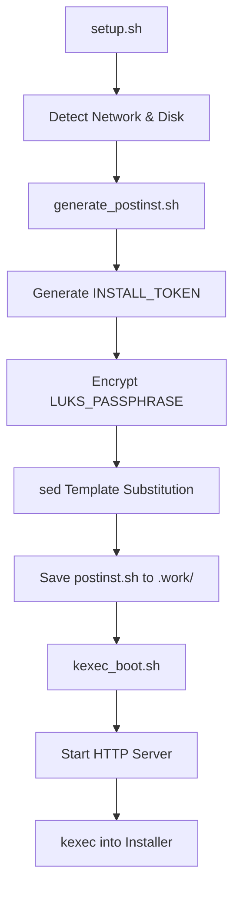
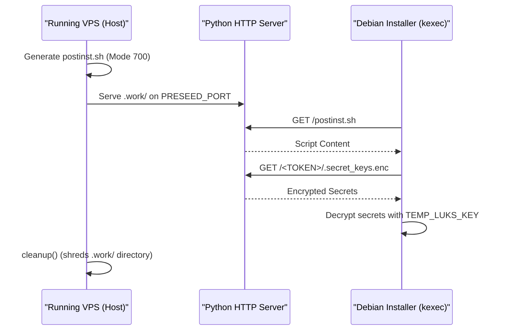

Relevant source files

The following files were used as context for generating this wiki page:

- [lib/generate\_postinst.sh](lib/generate_postinst.sh)
- [setup.sh](setup.sh)
- [lib/generate\_preseed.sh](lib/generate_preseed.sh)
- [lib/kexec\_boot.sh](lib/kexec_boot.sh)
- [README.md](README.md)

# Post-Install Generation

Post-Install Generation is a critical phase in the `vps-setup` workflow that creates the automation scripts and security payloads required to harden the system after the initial Debian installation. This process transforms a generic post-installation template into a site-specific script (`postinst.sh`) that manages user creation, SSH hardening, firewall configuration, and LUKS key rotation. Sources: [lib/generate\_postinst.sh:5-10](lib/generate\_postinst.sh#L5-L10), [README.md:109-114](README.md#L109-L114)

The generated script is executed within the target environment via the Debian installer's `preseed/late_command` functionality. It acts as the bridge between the automated OS deployment and the final hardened state of the VPS, ensuring that temporary installation secrets are rotated and permanent security policies are enforced. Sources: [lib/generate\_postinst.sh:7-9](lib/generate\_postinst.sh#L7-L9), [lib/kexec\_boot.sh:10-12](lib/kexec\_boot.sh#L10-L12)

## Architecture and Execution Flow

The generation process occurs on the host system before the `kexec` jump. The `setup.sh` main execution loop calls the generation logic after network and disk detection are complete. Sources: [setup.sh:388-393](setup.sh#L388-L393)

The diagram shows the sequence of events from configuration loading to the execution of the installer, highlighting where the post-install script is generated and staged. Sources: [setup.sh:388-403](setup.sh#L388-L403), [lib/kexec\_boot.sh:17-30](lib/kexec\_boot.sh#L17-L30)

### Template Substitution Engine
The system uses a `sed`-based substitution engine to inject environment-specific variables into the `postinst.sh.tmpl` file. A helper function, `sed_escape`, ensures that special characters in variables (like SSH keys or complex paths) do not break the `sed` command syntax. Sources: [lib/generate\_postinst.sh:13-15](lib/generate\_postinst.sh#L13-L15), [lib/generate\_postinst.sh:61-90](lib/generate\_postinst.sh#L61-L90)

## Security Payload Generation

One of the most sensitive tasks of the generation module is handling the `LUKS_PASSPHRASE`. The system avoids placing the cleartext passphrase directly into the generated `postinst.sh` script. Sources: [lib/generate\_postinst.sh:58](lib/generate\_postinst.sh#L58)

### Secret Encryption Mechanism
1.  **Token Generation**: A random 16-byte hex string (`INSTALL_TOKEN`) is generated for every installation instance. Sources: [lib/generate\_postinst.sh:40](lib/generate\_postinst.sh#L40)
2.  **Encryption**: The `LUKS_PASSPHRASE` is encrypted using AES-256-CBC with the `TEMP_LUKS_KEY` (a 32-byte random hex string used for the initial automated partition). Sources: [lib/generate\_postinst.sh:49-51](lib/generate\_postinst.sh#L49-L51), [lib/generate\_preseed.sh:32-33](lib/generate\_preseed.sh#L32-L33)
3.  **Storage**: The encrypted payload is saved to a hidden file `.secret_keys.enc` within a directory named after the unique `INSTALL_TOKEN`. Sources: [lib/generate\_postinst.sh:45-48](lib/generate\_postinst.sh#L45-L48)

| Security Element | Source | Purpose |
| :--- | :--- | :--- |
| `INSTALL_TOKEN` | `openssl rand -hex 16` | Unique subpath for secret transport over HTTP. |
| `TEMP_LUKS_KEY` | `openssl rand -hex 32` | Key used for initial disk encryption and secret encryption. |
| `.secret_keys.enc` | `openssl enc -aes-256-cbc` | AES-encrypted user passphrase payload. |

Sources: [lib/generate\_postinst.sh:40-51](lib/generate\_postinst.sh#L40-L51), [lib/generate\_preseed.sh:32-33](lib/generate\_preseed.sh#L32-L33)

## Key Configuration Mappings

The generation script maps `config.env` variables to placeholders within the template. These mappings cover network identity, user access, and system-level hardening. Sources: [lib/generate\_postinst.sh:61-90](lib/generate\_postinst.sh#L61-L90)

### Network and Identity
- **__INITRAMFS_IP__**: Formats IP configuration for `klibc-ipconfig` to enable remote SSH unlocking via Dropbear. Format: `IP=<client-ip>:<server-ip>:<gateway>:<netmask>:<hostname>:<device>:<autoconf>`. Sources: [lib/generate\_postinst.sh:36-37](lib/generate\_postinst.sh#L36-L37)
- **__HOSTNAME__ / __DOMAIN__**: Injects the system's identity. Sources: [lib/generate\_postinst.sh:68](lib/generate\_postinst.sh#L68)

### Access Control
- **__SSH_PORT__**: Configures the main OpenSSH daemon to run on a non-standard port (default 2222). Sources: [lib/generate\_postinst.sh:65](lib/generate\_postinst.sh#L65), [README.md:144](README.md#L144)
- **__SSH_PUBKEY__**: Injects the administrative user's public key for key-only authentication. Sources: [lib/generate\_postinst.sh:66](lib/generate\_postinst.sh#L66)
- **__ALLOW_SSH_FORWARDING__**: A boolean flag (`yes`/`no`) converted from the environment's `true`/`false` setting. Sources: [lib/generate\_postinst.sh:54-57](lib/generate\_postinst.sh#L54-L57)

## Staging and Delivery

Once generated, the files are staged in a restricted workspace for HTTP delivery to the Debian installer. Sources: [lib/kexec\_boot.sh:17-20](lib/kexec\_boot.sh#L17-L20)

The staging process ensures that secrets are only accessible during the narrow window of the installation process. The workspace directory is protected with `chmod 700` and files are securely shredded upon exit. Sources: [setup.sh:68-75](setup.sh#L68-L75), [lib/kexec\_boot.sh:30-41](lib/kexec\_boot.sh#L30-L41), [lib/generate\_postinst.sh:29](lib/generate\_postinst.sh#L29)

## Conclusion
Post-Install Generation is the process that ensures the "one-time config" philosophy of the project. By dynamically generating the hardening script, the system ensures that complex security configurations—such as LUKS key rotation from a temporary installer key to a user passphrase—are handled without manual intervention, while maintaining high security through encrypted secret transport and single-use installation tokens. Sources: [README.md:12-19](README.md#L12-L19), [lib/generate\_postinst.sh:5-10](lib/generate\_postinst.sh#L5-L10)
