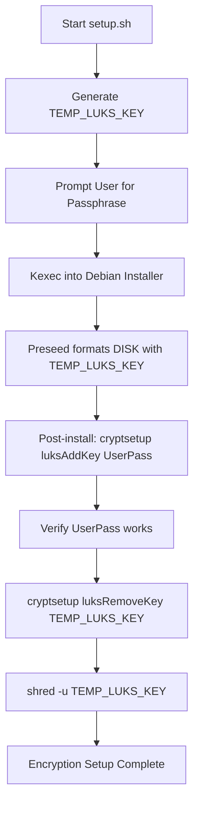
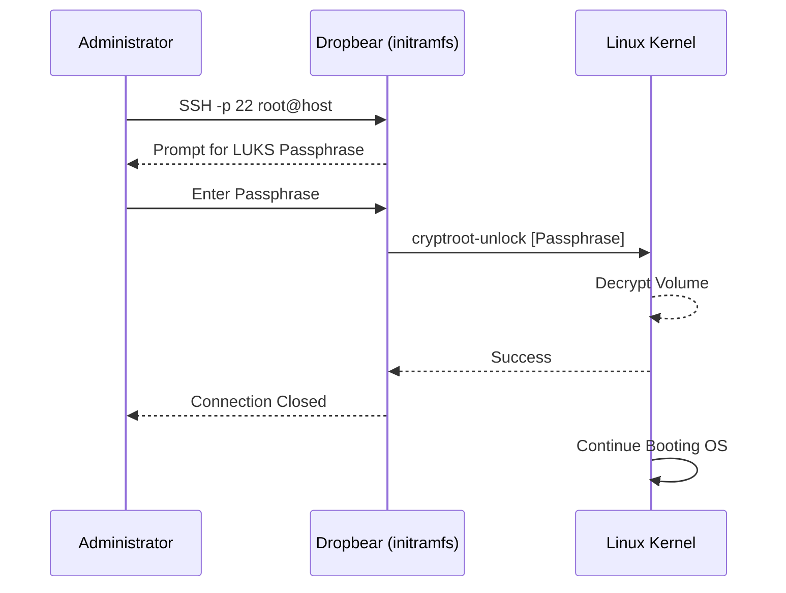

Relevant source files

The following files were used as context for generating this wiki page:

- [README.md](README.md)
- [setup.sh](setup.sh)
- [lib/generate_preseed.sh](lib/generate_preseed.sh)
- [lib/generate_postinst.sh](lib/generate_postinst.sh)
- [lib/kexec_boot.sh](lib/kexec_boot.sh)
- [lib/detect_disk.sh](lib/detect_disk.sh)

# LUKS Full-Disk Encryption Setup

The LUKS Full-Disk Encryption (FDE) setup is a core feature of the `vps-setup` project, providing automated, passphrase-based encryption for Debian reinstalls. It secures the system by encrypting the root and swap partitions within an LVM Volume Group inside a LUKS2 container. The implementation ensures that no permanent installer keys remain on the system by utilizing a temporary key rotation mechanism during the installation process.

This system also integrates remote unlocking capabilities via a `dropbear-initramfs` SSH environment. This allows administrators to provide the LUKS passphrase over the network before the main operating system boots, facilitating headless server management.

Sources: [README.md:6-10](README.md#L6-L10), [setup.sh:10-15](setup.sh#L10-L15)

## Key Management and Rotation Lifecycle

The encryption process follows a strict lifecycle to ensure that the user's permanent passphrase is never stored in plaintext on the installation media and that temporary keys used for automation are securely purged.

### Key Rotation Logic
1.  **Generation**: The `setup.sh` script generates a `TEMP_LUKS_KEY` using `openssl rand -hex 32`.
2.  **Automation**: This temporary key is used by the Debian installer (via preseed) to automate the initial partition formatting and LVM setup.
3.  **User Transition**: In the post-installation phase, the script adds the user's real passphrase to a LUKS keyslot using `cryptsetup luksAddKey`.
4.  **Verification**: The system verifies the user's passphrase can successfully unlock the volume.
5.  **Purge**: The temporary installer key is removed via `cryptsetup luksRemoveKey` and the key files are destroyed using `shred -u`.

Sources: [README.md:120-130](README.md#L120-L130), [lib/generate_preseed.sh:34-36](lib/generate_preseed.sh#L34-L36), [setup.sh:267-270](setup.sh#L267-L270)

This diagram illustrates the secure transition from a temporary automation key to the user's permanent passphrase.
Sources: [README.md:120-130](README.md#L120-L130), [lib/generate_preseed.sh:34-40](lib/generate_preseed.sh#L34-L40), [lib/generate_postinst.sh:39-45](lib/generate_postinst.sh#L39-L45)

## Disk Partitioning Layout

The system supports both UEFI and BIOS/Legacy boot modes. The encryption is applied to the primary OS disk, while secondary disks are handled according to the selected `INSTALL_ROLE`.

### Standard Partition Table
The following table describes the layout of the target OS disk:

| Partition | Size | Type | Encrypted |
| :--- | :--- | :--- | :--- |
| EFI ESP | 512 MB | fat32 | No (UEFI only) |
| /boot | 512 MB | ext4 | No |
| LUKS Container | Remaining | LUKS2 | Yes |
| └─ Swap | 1 GB | LVM | Yes |
| └─ Root (/) | Remaining | LVM (ext4) | Yes |

Sources: [README.md:108-117](README.md#L108-L117), [lib/generate_preseed.sh:65-71](lib/generate_preseed.sh#L65-L71)

### Partman Expert Recipes
The preseed configuration dynamically generates `partman` recipes based on the detected `BOOT_MODE`. These recipes define the mapping of the LUKS container and the LVM Logical Volumes (`root` and `swap`).

Sources: [lib/generate_preseed.sh:64-75](lib/generate_preseed.sh#L64-L75)

## Remote SSH Unlock (Dropbear)

To support remote management, the setup configures `dropbear-initramfs` to run during the early boot stage. This allows the administrator to SSH into the initrd environment to execute `cryptroot-unlock`.

*  **Port**: Fixed to port 22 (while the main OpenSSH daemon is moved to a custom `SSH_PORT`).
*  **Authentication**: Uses the same `SSH_PUBKEY` provided in `config.env`.
*  **Restricted Session**: The session is restricted solely to providing the LUKS passphrase.

Sources: [README.md:15-16](README.md#L15-L16), [README.md:92-98](README.md#L92-L98), [setup.sh:163-168](setup.sh#L163-L168)

This diagram shows the communication flow between the administrator and the pre-boot environment to unlock the encrypted volume.
Sources: [README.md:92-100](README.md#L92-L100), [setup.sh:426-435](setup.sh#L426-L435)

## Secret Transport and Security

Secrets, including the `TEMP_LUKS_KEY` and the user's encrypted passphrase, are transported into the installation environment using a secure, offline method.

### Initrd Injection
The project avoids using a local HTTP server for serving secrets. Instead, `lib/kexec_boot.sh` injects the following files directly into a new initrd image (`initrd.kexec.gz`):
*  `preseed.cfg`
*  `postinst.sh`
*  Encrypted secret keys stored in a directory named with a unique `INSTALL_TOKEN`.

Sources: [lib/kexec_boot.sh:35-50](lib/kexec_boot.sh#L35-L50), [lib/generate_postinst.sh:39-44](lib/generate_postinst.sh#L39-L44)

### Secret Protection
The user's passphrase is encrypted using AES-256-CBC with the `TEMP_LUKS_KEY` via OpenSSL before being placed in the initrd. This ensures that even if the installation files were intercepted, the permanent passphrase remains protected.

Sources: [lib/generate_postinst.sh:46-48](lib/generate_postinst.sh#L46-L48)

## Configuration Options

The following configuration fields in `config.env` directly impact the LUKS setup:

| Field | Default | Description |
| :--- | :--- | :--- |
| `DISK` | (auto) | The block device to be encrypted. |
| `WIPE_MODE` | `fast` | `fast` for quick wipe; `secure` to overwrite sectors with `shred`. |
| `VG_NAME` | `<hostname>-vol` | Name of the LVM Volume Group created inside LUKS. |
| `LUKS_HEADER_BACKUP_PATH` | `/root/luks-header-backup.img` | Path where the LUKS header is backed up for recovery. |

Sources: [README.md:154-162](README.md#L154-L162), [lib/detect_disk.sh:105-110](lib/detect_disk.sh#L105-L110), [lib/generate_postinst.sh:54-55](lib/generate_postinst.sh#L54-L55)

## Conclusion
The LUKS Full-Disk Encryption system in `vps-setup` provides a robust, automated security layer for cloud servers. By leveraging `kexec` for offline initrd injection and implementing a strict key rotation policy, it ensures that the system is securely encrypted from the moment of installation without leaving sensitive temporary credentials behind. The integration of Dropbear ensures this security does not compromise the remote accessibility of the server.
