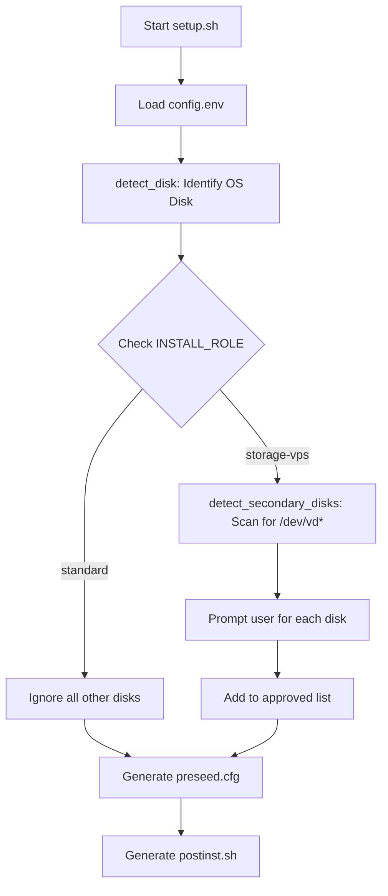

<details>
<summary>Relevant source files</summary>

The following files were used as context for generating this wiki page:

- [README.md](README.md)
- [lib/detect_disk.sh](lib/detect_disk.sh)
- [setup.sh](setup.sh)
- [lib/generate_preseed.sh](lib/generate_preseed.sh)
- [lib/generate_postinst.sh](lib/generate_postinst.sh)
</details>

# Installation Roles

Installation Roles define the operational scope and disk management behavior of the automated Debian reinstallation process. By configuring the `INSTALL_ROLE` variable, users determine how the system handles the primary OS disk versus secondary storage devices during the setup and partitioning phases. Sources: [README.md:21-23](README.md#L21-L23), [setup.sh:176-179](setup.sh#L176-L179)

The project supports two primary roles: `standard` and `storage-vps`. These roles influence the logic within the disk detection module (`lib/detect_disk.sh`) and the subsequent generation of automation scripts like `preseed.cfg` and `postinst.sh`. Sources: [lib/detect_disk.sh:13-17](lib/detect_disk.sh#L13-L17), [lib/generate_postinst.sh:80-83](lib/generate_postinst.sh#L80-L83)

## Role Overview and Comparison

The behavior of the installation is primarily distinguished by how it treats non-root block devices.

| Role | Target Focus | Secondary Disk Action | Use Case |
| :--- | :--- | :--- | :--- |
| `standard` | Primary OS Disk only | Completely ignored / untouched | Standard compute VPS with single disk |
| `storage-vps` | OS Disk + Secondary Disks | Interactive scan and optional formatting/mounting | Storage-heavy VPS with additional volumes |

Sources: [README.md:39-55](README.md#L39-L55), [lib/detect_disk.sh:79-84](lib/detect_disk.sh#L79-L84)

## Logical Flow of Role Execution

The role logic is initialized in the main `setup.sh` script and processed through specialized detection functions.



The diagram shows how the `INSTALL_ROLE` branches the execution logic during the disk detection phase, eventually converging to generate the installation payloads. Sources: [setup.sh:343-348](setup.sh#L343-L348), [lib/detect_disk.sh:79-158](lib/detect_disk.sh#L79-L158)

## Role Implementation Details

### Standard Mode (`standard`)
In `standard` mode (the default), the script focuses exclusively on the disk containing the current root filesystem (`/`). It traces the device dependency tree upwards to find the parent physical disk (e.g., resolving `/dev/mapper/root` to `/dev/sda`). Sources: [lib/detect_disk.sh:32-77](lib/detect_disk.sh#L32-L77)

```bash
if [[ "${INSTALL_ROLE}" == "standard" ]]; then
    echo "==> INSTALL_ROLE='standard': Secondary disks are completely ignored."
    export EXTRA_DISKS MOUNT_EXTRA_DISKS
    return 0
fi
```

Sources: [lib/detect_disk.sh:86-90](lib/detect_disk.sh#L86-L90)

### Storage VPS Mode (`storage-vps`)
This role triggers an active scan for block devices that are not the primary OS disk. It filters for devices where the type is `disk` and they are not removable. Sources: [lib/detect_disk.sh:93-100](lib/detect_disk.sh#L93-L100)

1.  **Scanning**: Identifies devices like `/dev/vdb` or `/dev/nvme1n1`.
2.  **Interaction**: If the session is interactive, it prompts the user to:
  *  Leave the disk untouched (default).
  *  Format to `ext4` and mount under `/mnt/<hostname>-vol`.
  *  Perform manual configuration.
3.  **Confirmation**: Requires the user to type the full device path to confirm formatting, preventing accidental data loss on secondary volumes.

Sources: [README.md:46-55](README.md#L46-L55), [lib/detect_disk.sh:124-150](lib/detect_disk.sh#L124-L150)

## Integration with Automation Payloads

The selected role and its associated disk decisions are exported as environment variables (`EXTRA_DISKS`, `MOUNT_EXTRA_DISKS`) and injected into the final installation scripts.

### Preseed Generation
The `lib/generate_preseed.sh` script uses the role information to define the `partman` recipe, though the recipe itself primarily targets the `DISK` variable (the primary OS disk). Sources: [lib/generate_preseed.sh:45-56](lib/generate_preseed.sh#L45-L56)

### Post-Installation
The `postinst.sh` script carries the role metadata to the new system. If `storage-vps` was selected and disks were approved for mounting, the post-install script handles the actual filesystem creation and `/etc/fstab` entries on the first boot. Sources: [lib/generate_postinst.sh:80-84](lib/generate_postinst.sh#L80-L84)

## Summary
Installation Roles allow `vps-setup` to be versatile across different VPS configurations. The `standard` role ensures safety for generic environments by strictly isolating the OS disk, while `storage-vps` provides an automated pathway for managing high-capacity storage volumes through user-confirmed interactive prompts. Sources: [README.md:39-55](README.md#L39-L55), [lib/detect_disk.sh:79-91](lib/detect_disk.sh#L79-L91)
