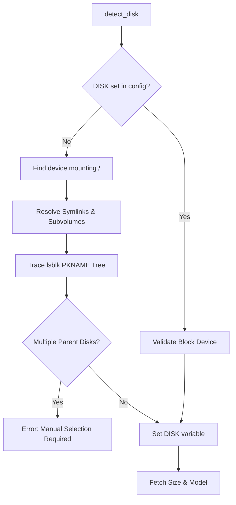
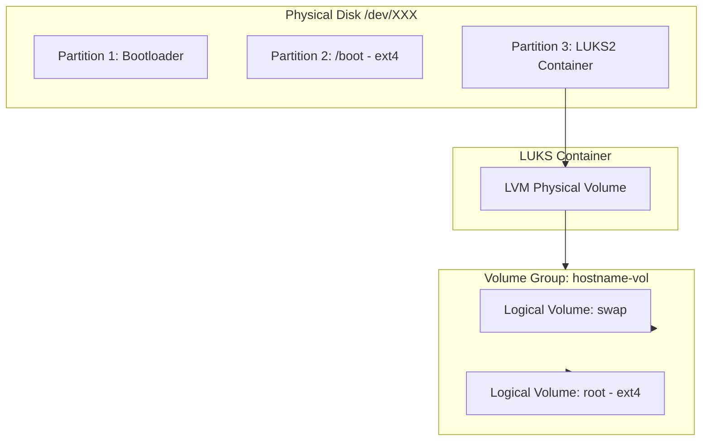
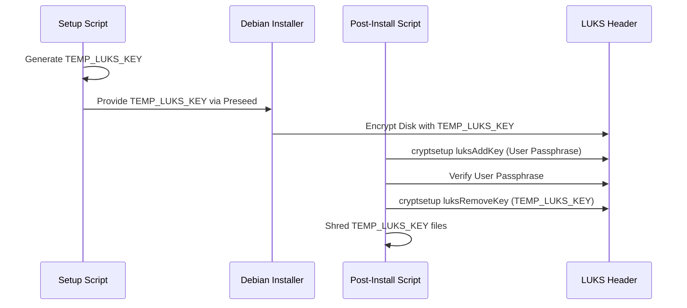

<details>
<summary>Relevant source files</summary>

The following files were used as context for generating this wiki page:

- [lib/detect_disk.sh](lib/detect_disk.sh)
- [lib/generate_preseed.sh](lib/generate_preseed.sh)
- [lib/generate_postinst.sh](lib/generate_postinst.sh)
- [setup.sh](setup.sh)
- [README.md](README.md)
- [lib/kexec_boot.sh](lib/kexec_boot.sh)

</details>

# Disk Partitioning & LVM Layout

The Disk Partitioning and LVM Layout system in `vps-setup` provides an automated, secure framework for re-provisioning a VPS with full-disk encryption (LUKS) and Logical Volume Management (LVM). The system supports both UEFI and BIOS/Legacy boot modes, ensuring compatibility across different virtualization environments while maintaining a strict security posture through encrypted swap and root partitions.

This module is responsible for identifying the primary operating system disk, managing secondary storage disks based on user-defined roles, and generating the `partman` recipes used by the Debian installer. It handles the transition from a temporary installer key to a permanent user-defined LUKS passphrase during the post-installation phase.

Sources: [README.md:1-20](README.md#L1-L20), [lib/detect_disk.sh:11-15](lib/detect_disk.sh#L11-L15), [lib/generate_preseed.sh:10-15](lib/generate_preseed.sh#L10-L15)

## Disk Detection Architecture

The system utilizes a multi-stage detection process to identify the target installation disk and any auxiliary storage devices. It prioritizes the disk currently mounting the root (`/`) filesystem to ensure the reinstall targets the existing OS location.

### Primary OS Disk Detection
The `detect_disk` function traces the device dependency tree upwards from the root mount point. It resolves symlinks and handles various naming conventions, including NVMe (`/dev/nvme*`), MMC (`/dev/mmcblk*`), and standard SCSI/Virtio (`/dev/sd*`, `/dev/vd*`) devices.



Sources: [lib/detect_disk.sh:11-88](lib/detect_disk.sh#L11-L88)

### Installation Roles and Secondary Disks
The system behavior changes significantly based on the `INSTALL_ROLE` variable:
*  **Standard Role**: Only the primary OS disk is touched. All other disks are ignored to prevent accidental data loss.
*  **Storage-VPS Role**: The system scans for non-removable block devices other than the primary disk. In interactive mode, users are prompted to either leave them untouched, format them as `ext4`, or skip for manual configuration.

| Role | Secondary Disk Action | Source |
| :--- | :--- | :--- |
| `standard` | Completely Ignored | [lib/detect_disk.sh:102-106](lib/detect_disk.sh#L102-L106) |
| `storage-vps` | Interactive Prompt (Format/Mount/Ignore) | [lib/detect_disk.sh:111-166](lib/detect_disk.sh#L111-L166) |

## LVM and LUKS Layout

The project implements a nested storage architecture where LVM resides inside a LUKS2 encrypted container. This ensures that all data, including the swap space, is encrypted at rest.

### Partition Table Structure
The physical disk layout differs based on the detected `BOOT_MODE` (UEFI vs BIOS).



*Note: The diagram illustrates the logical nesting of LVM inside the LUKS encrypted partition.*

### Partition Specifications
The specific sizes and types are defined within the `generate_preseed` function via `partman` recipes.

| Component | Size | Filesystem | Mount Point | Encrypted |
| :--- | :--- | :--- | :--- | :--- |
| **ESP (UEFI only)** | 512 MB | fat32 | `/boot/efi` | No |
| **BIOS Boot (BIOS only)** | 1 MB | N/A | N/A | No |
| **/boot** | 512 MB | ext4 | `/boot` | No |
| **LVM Swap** | 1024 MB | swap | swap | Yes |
| **LVM Root** | Remaining | ext4 | `/` | Yes |

Sources: [lib/generate_preseed.sh:65-72](lib/generate_preseed.sh#L65-L72), [README.md:204-213](README.md#L204-L213)

## Secure Key Lifecycle

The system manages LUKS security through a two-stage key rotation process to allow for fully automated installation while ensuring the final system is protected by a user-known passphrase.

### Key Rotation Process
1.  **Generation**: `lib/generate_preseed.sh` generates a `TEMP_LUKS_KEY` (32-byte random hex).
2.  **Installation**: The Debian installer uses this temporary key to encrypt the disk automatically without prompting the user.
3.  **Rotation**: During the `postinst.sh` phase, the script uses the `TEMP_LUKS_KEY` to add the user's real `LUKS_PASSPHRASE` to the LUKS keyslot.
4.  **Purge**: The temporary key is removed from the LUKS header, and the temporary secret files are shredded.



Sources: [lib/generate_preseed.sh:28-30](lib/generate_preseed.sh#L28-L30), [README.md:215-225](README.md#L215-L225), [lib/generate_postinst.sh:39-44](lib/generate_postinst.sh#L39-L44)

## Implementation Details

### Partman Recipes
The partitioning logic is injected into the preseed configuration using `partman-auto/expert_recipe`. The script dynamically builds these strings based on the detected hardware environment.

```bash
# Example UEFI Recipe (Snippet)
partman_recipe="boot-crypto :: 538 538 1075 free \$primary{ } \$iflabel{ gpt } ... method{ efi } ... 512 512 512 ext4 ... mountpoint{ /boot } ... 2048 10000 -1 ext4 ... method{ crypto } ..."
```

Sources: [lib/generate_preseed.sh:65-72](lib/generate_preseed.sh#L65-L72)

### Disk Wiping
The system supports two wipe modes defined in `config.env`:
*  **Fast**: Only the partition table and filesystem headers are removed.
*  **Secure**: Instructs the installer to overwrite sectors during the installation process (though physical destruction is not guaranteed on virtualized SSDs).

Sources: [lib/generate_preseed.sh:75-79](lib/generate_preseed.sh#L75-L79), [README.md:329-335](README.md#L329-L335)

## Conclusion
The disk partitioning and LVM system provides a robust foundation for a hardened VPS. By automating the complex interaction between LUKS, LVM, and the Debian `partman` system, `vps-setup` ensures a consistent, encrypted environment that balances ease of deployment with high-security standards. The separation of the OS disk from storage disks further protects data in multi-disk environments.
