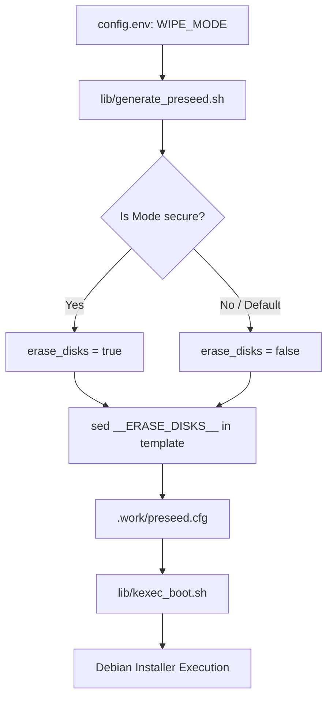
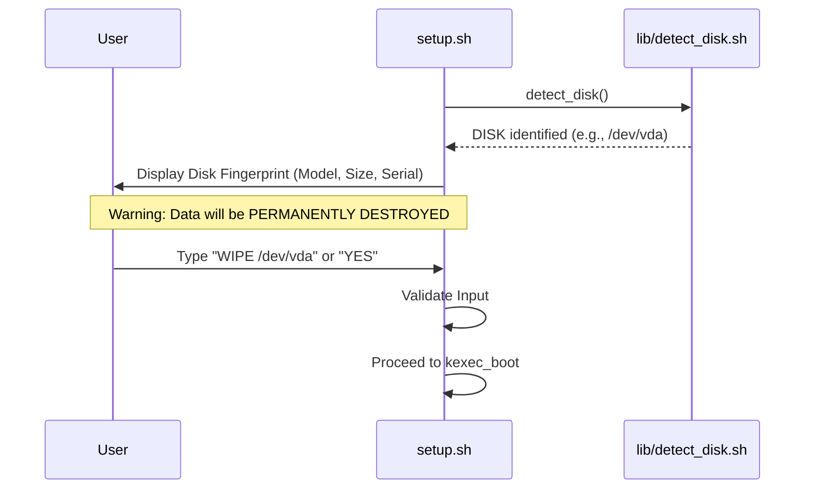

<details>
<summary>Relevant source files</summary>

The following files were used as context for generating this wiki page:

- [README.md](README.md)
- [setup.sh](setup.sh)
- [lib/detect_disk.sh](lib/detect_disk.sh)
- [lib/generate_preseed.sh](lib/generate_preseed.sh)
- [lib/generate_postinst.sh](lib/generate_postinst.sh)
- [lib/kexec_boot.sh](lib/kexec_boot.sh)
</details>

# Storage Wipe Modes

Storage Wipe Modes in the `vps-setup` project define the intensity and method by which data is removed from the target storage devices during the automated Debian installation process. These modes allow users to choose between a rapid setup and a more intensive overwrite procedure intended to hinder data recovery on the target block device.

This system integrates directly with the Debian `partman-auto` installer component through preseed configuration, determining whether the installer performs a simple partition table reset or a full sector overwrite before establishing the new LUKS-encrypted volume and LVM structure.

Sources: [README.md:204-209](README.md#L204-L209), [lib/generate_preseed.sh:91-95](lib/generate_preseed.sh#L91-L95)

## Supported Wipe Modes

The project defines two primary modes for handling existing data on the target disk. The selection is governed by the `WIPE_MODE` variable, typically configured in `config.env`.

| Mode | Configuration Value | Description | Impact |
| :--- | :--- | :--- | :--- |
| **Fast** | `fast` | Quick removal of partition tables and filesystem metadata. This is the project default. | Minimal time; metadata is gone but raw data remains. |
| **Secure** | `secure` | Instructs the installer to overwrite sectors during the installation process. | Increased install time; attempts to prevent forensic recovery. |

Sources: [README.md:204-207](README.md#L204-L207), [lib/generate_preseed.sh:91-95](lib/generate_preseed.sh#L91-L95)

### Fast Wipe Mode
In "fast" mode, the script sets the internal `erase_disks` variable to `false`. This instructs the Debian installer to proceed with partitioning without performing a full surface wipe. It is suitable for most VPS reinstallations where the primary goal is a clean OS state rather than forensic sanitization.

Sources: [README.md:205](README.md#L205), [lib/generate_preseed.sh:91-95](lib/generate_preseed.sh#L91-L95)

### Secure Wipe Mode
When `secure` mode is selected, the `erase_disks` variable is set to `true`. The project notes a specific disclaimer regarding this mode: while it attempts to overwrite sectors, it cannot guarantee physical forensic destruction on virtualized SSD/NVMe storage due to underlying hardware behaviors like wear leveling, thin provisioning, and hypervisor abstraction layers.

Sources: [README.md:206-209](README.md#L206-L209), [lib/generate_preseed.sh:91-95](lib/generate_preseed.sh#L91-L95)

## Logic Flow and Implementation

The wipe mode logic is processed during the preseed generation phase and injected into the kernel command line used by `kexec`.



The diagram shows how the `WIPE_MODE` preference flows from configuration files through the generation library into the final preseed artifact used by the installer.

Sources: [lib/generate_preseed.sh:91-135](lib/generate_preseed.sh#L91-L135), [lib/kexec_boot.sh:75-80](lib/kexec_boot.sh#L75-L80)

### Preseed Integration
The `lib/generate_preseed.sh` script handles the transformation of the `WIPE_MODE` setting into a boolean value compatible with the Debian installer's `partman` configuration. The placeholder `__ERASE_DISKS__` in `preseed.cfg.tmpl` is replaced with the resulting boolean.

```bash
# From lib/generate_preseed.sh
# Determine disk wipe mode (fast=false, secure=true)
local erase_disks="false"
if [[ "${WIPE_MODE:-fast}" == "secure" ]]; then
    erase_disks="true"
fi

# Perform template substitution
sed \
    -e "s|__ERASE_DISKS__|${erase_disks}|g" \
    ...
    "${template_file}" > "${output_file}"
```

Sources: [lib/generate_preseed.sh:91-101](lib/generate_preseed.sh#L91-L101)

## Disk Selection and Confirmation

Regardless of the wipe mode chosen, the system implements a strict confirmation protocol to prevent accidental data loss. Before `kexec` is executed, the `setup.sh` script displays a detailed fingerprint of the target disk, including device name, size, model, and serial number.

Users must explicitly confirm the destruction of all data on the target disk by typing a specific confirmation string or `YES`.



This sequence ensures that the destructive action (whether fast or secure) is only performed on the intended storage device.

Sources: [setup.sh:305-325](setup.sh#L305-L325), [lib/detect_disk.sh:17-80](lib/detect_disk.sh#L17-L80)

## Interaction with Installation Roles

The scope of the wipe depends on the `INSTALL_ROLE` defined in the system.

1.  **Standard Mode (`standard`)**: The wipe mode applies strictly to the detected OS/root disk. All secondary disks are ignored and left untouched, regardless of the `WIPE_MODE` setting.
2.  **Storage VPS Mode (`storage-vps`)**: The primary OS disk is wiped according to the selected mode. For secondary disks, the user is prompted interactively to choose an action (Untouched, Format/Mount, or Manual). If a secondary disk is marked for formatting, it undergoes a standard filesystem creation (ext4) rather than the deep preseed-based wipe applied to the OS disk.

Sources: [README.md:46-60](README.md#L46-L60), [lib/detect_disk.sh:89-100](lib/detect_disk.sh#L89-L100), [lib/generate_postinst.sh:80-82](lib/generate_postinst.sh#L80-L82)

## Summary of Configuration Elements

| Variable | Source | Default | Role |
| :--- | :--- | :--- | :--- |
| `WIPE_MODE` | `config.env` | `fast` | Controls the intensity of the disk wipe via preseed. |
| `DISK` | `config.env` / Auto | Auto-detected | The target block device for the wipe and reinstall. |
| `INSTALL_ROLE` | `config.env` | `standard` | Determines if secondary disks are included in discovery. |

Sources: [README.md:129-150](README.md#L129-L150), [setup.sh:200-210](setup.sh#L200-L210)

The Storage Wipe Modes provide a balance between installation speed and data security, integrated into the project's broader automation and hardening framework. While "fast" mode facilitates rapid deployments, "secure" mode leverages native installer capabilities to provide an additional layer of data clearance on the target OS disk.

Sources: [README.md:204-209](README.md#L204-L209), [lib/generate_preseed.sh:91-100](lib/generate_preseed.sh#L91-L100)
