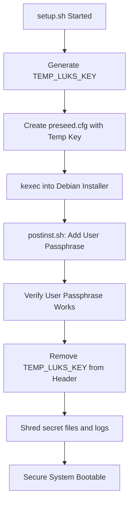
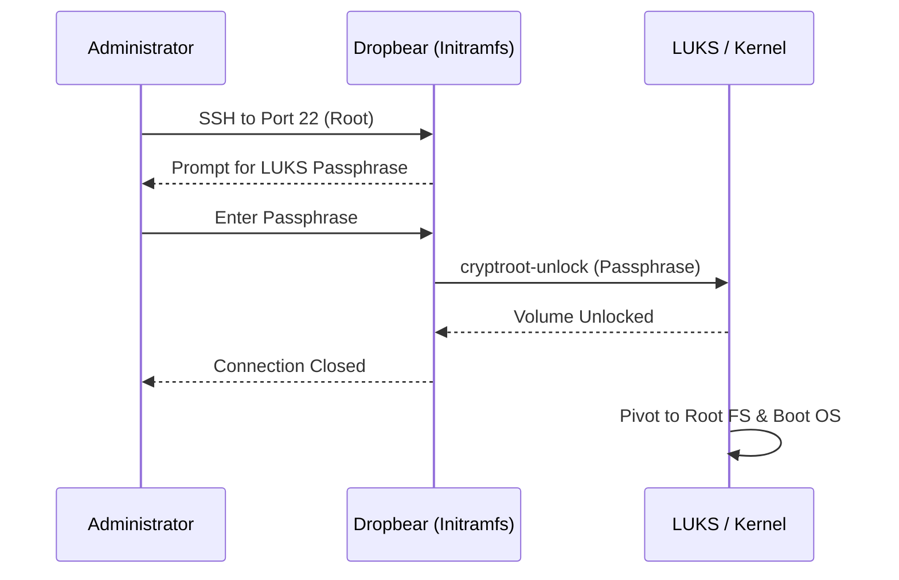

<details>
<summary>Relevant source files</summary>

The following files were used as context for generating this wiki page:

- [README.md](README.md)
- [setup.sh](setup.sh)
- [lib/detect_disk.sh](lib/detect_disk.sh)
- [lib/generate_preseed.sh](lib/generate_preseed.sh)
- [lib/generate_postinst.sh](lib/generate_postinst.sh)
- [lib/kexec_boot.sh](lib/kexec_boot.sh)
</details>

# LUKS Full-Disk Encryption

## Introduction
LUKS (Linux Unified Key Setup) Full-Disk Encryption is a core security feature of the `vps-setup` project, providing comprehensive protection for data at rest on automated Debian installations. The system implements a passphrase-based encryption scheme that covers the root filesystem and swap partitions while allowing for remote administrative access via an SSH-based pre-boot unlock mechanism.

The implementation ensures high security by employing a rotating key strategy. A temporary random key is used to facilitate the automated installation process via Debian preseed, which is subsequently replaced by the user's permanent passphrase during the post-installation phase. This approach ensures that no permanent installer keys remain on the disk after setup is complete.
Sources: [README.md:9-10](README.md#L9-L10), [README.md:154-159](README.md#L154-L159), [setup.sh:13-14](setup.sh#L13-L14)

## Key Rotation and Security Lifecycle
The security lifecycle of the LUKS container is managed through three distinct phases: generation, rotation, and cleanup. This prevents the exposure of the user's permanent passphrase in plain text within the preseed configuration files.

### 1. Installation Phase (Temporary Key)
During the initial setup, the script generates a 32-byte random hexadecimal string to serve as the `TEMP_LUKS_KEY`. This key is embedded into the `preseed.cfg` file to allow the Debian installer to partition and encrypt the disk automatically without user intervention.
Sources: [lib/generate_preseed.sh:31-33](lib/generate_preseed.sh#L31-L33), [lib/generate_preseed.sh:80](lib/generate_preseed.sh#L80)

### 2. Post-Installation (Key Rotation)
The system transitions from the temporary key to the user's permanent passphrase using the `postinst.sh` script. The user's passphrase is encrypted using AES-256-CBC with the temporary key before being transmitted to the installer environment.
Sources: [lib/generate_postinst.sh:42-49](lib/generate_postinst.sh#L42-L49), [README.md:156-157](README.md#L156-L157)

### 3. Cleanup and Hardening
After the permanent passphrase is added to a LUKS keyslot, the temporary key is removed using `cryptsetup luksRemoveKey`. The system then performs a secure wipe of temporary files and logs to ensure no traces of the installation secrets remain.
Sources: [README.md:158-160](README.md#L158-L160), [setup.sh:78-83](setup.sh#L78-L83)



The diagram shows the transition of LUKS authority from a temporary machine-generated key to the user-defined passphrase.
Sources: [setup.sh:322-348](setup.sh#L322-L348), [lib/generate_preseed.sh:31-33](lib/generate_preseed.sh#L31-L33), [lib/generate_postinst.sh:42-49](lib/generate_postinst.sh#L42-L49), [README.md:154-162](README.md#L154-L162)

## Disk Partitioning and LVM Layout
The project uses LVM (Logical Volume Manager) inside the LUKS container. The physical disk is partitioned into unencrypted boot sections and an encrypted container for the system volume group.

| Partition | Size | Filesystem | Encrypted |
|-----------|------|------------|-----------|
| EFI ESP | 512 MB | fat32 | No |
| /boot | 512 MB | ext4 | No |
| LUKS Container | Remaining | LUKS2 | Yes |
| └─ swap | 1 GB | swap | Yes |
| └─ root (/) | Remaining | ext4 | Yes |

Sources: [README.md:144-152](README.md#L144-L152), [lib/generate_preseed.sh:56-62](lib/generate_preseed.sh#L56-L62)

## Remote SSH Unlock (Dropbear)
To support headless VPS environments, the system configures `dropbear-initramfs`. This allows the administrator to SSH into the server while it is still in the initramfs stage (pre-boot) to provide the LUKS passphrase.

- **Port**: The Dropbear instance listens on port 22.
- **Access**: Restricted to root login for the sole purpose of executing `/bin/cryptroot-unlock`.
- **Identity**: Dropbear generates its own unique host keys, separate from the main OpenSSH server.
Sources: [README.md:10](README.md#L10), [README.md:117-128](README.md#L117-L128), [setup.sh:15](setup.sh#L15)



The sequence illustrates the remote interaction required to authorize the mounting of the encrypted root partition.
Sources: [README.md:120-128](README.md#L120-L128), [setup.sh:367-372](setup.sh#L367-L372)

## Disaster Recovery and Headers
Because LUKS header corruption results in total data loss, the system automatically generates a backup of the LUKS header.

- **Backup Path**: Defaults to `/root/luks-header-backup.img`.
- **Permissions**: Mode `600` (read/write by root only).
- **Verification**: The post-installation script generates a full disk encryption status report in `/root/encryption-report.txt`.
Sources: [README.md:161](README.md#L161), [README.md:214-216](README.md#L214-L216), [lib/generate_postinst.sh:56](lib/generate_postinst.sh#L56)

## Implementation Details

### LUKS Key Management Code
The following logic is used in `lib/generate_preseed.sh` to initialize the temporary security context for the installer.

```bash
# lib/generate_preseed.sh:31-33
# Generate temporary random LUKS key for automated installation
TEMP_LUKS_KEY=$(openssl rand -hex 32)
export TEMP_LUKS_KEY
```

Sources: [lib/generate_preseed.sh:31-33](lib/generate_preseed.sh#L31-L33)

### Passphrase Requirements
The `setup.sh` script enforces specific complexity requirements for the LUKS passphrase to ensure cryptographic strength.
- Minimum length: 8 characters.
- Recommended: Mix of upper/lower case, numbers, and symbols.
- User confirmation: Mandatory double-entry to prevent lockouts.
Sources: [setup.sh:197-219](setup.sh#L197-L219)

## Summary
LUKS Full-Disk Encryption in the `vps-setup` project provides a secure-by-default environment for VPS deployments. By utilizing a kexec-based installation flow and temporary key rotation, the system achieves a fully automated deployment without compromising the long-term security of the user's encryption keys. The integration of remote SSH unlocking ensures that the security of full-disk encryption does not come at the cost of server accessibility.
Sources: [README.md:9-11](README.md#L9-L11), [README.md:154-162](README.md#L154-L162), [setup.sh:13-20](setup.sh#L13-L20)
