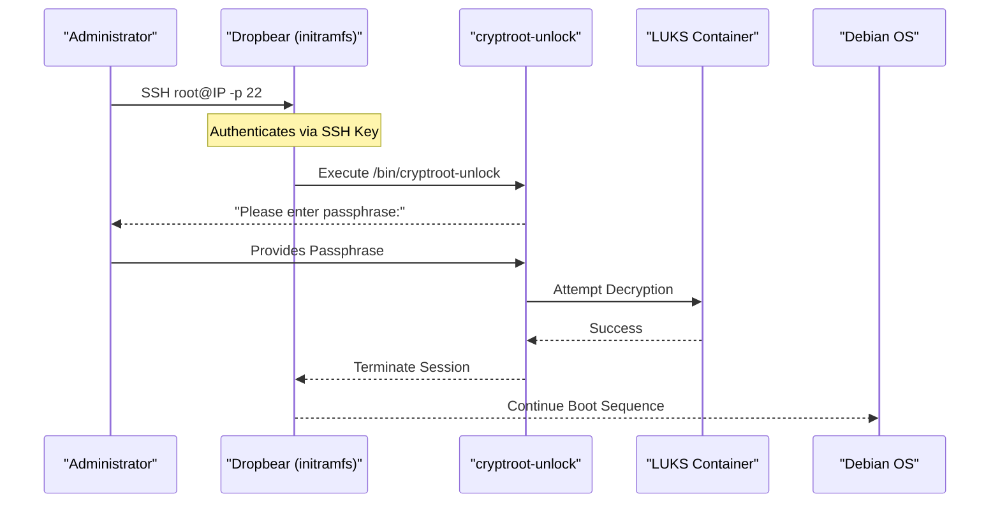

<details>
<summary>Relevant source files</summary>

The following files were used as context for generating this wiki page:

- [README.md](README.md)
- [setup.sh](setup.sh)
- [lib/generate_postinst.sh](lib/generate_postinst.sh)
- [lib/generate_preseed.sh](lib/generate_preseed.sh)
- [lib/kexec_boot.sh](lib/kexec_boot.sh)
- [lib/detect_network.sh](lib/detect_network.sh)

</details>

# Remote SSH Unlock

Remote SSH Unlock is a security feature within the `vps-setup` project that allows administrators to provide a LUKS decryption passphrase to a headless VPS during the early boot process (initramfs stage). By utilizing a lightweight SSH server (Dropbear) that runs before the main operating system boots, the system remains fully encrypted at rest while still being accessible for remote reboots without requiring physical or out-of-band console access.

This mechanism is tightly integrated with the automated Debian installation process, ensuring that the network configuration, SSH keys, and encryption parameters are correctly provisioned into the initramfs during the post-installation phase.

Sources: [README.md:9-10](README.md#L9-L10), [setup.sh:13-14](setup.sh#L13-L14)

## Architecture and Components

The Remote SSH Unlock system operates in the pre-boot environment, specifically within the `initramfs`. It relies on several key components configured during the automated setup.

### Core Components
| Component | Purpose |
| :--- | :--- |
| **Dropbear** | A lightweight SSH server installed in the initramfs to handle pre-boot connections. |
| **cryptroot-unlock** | A script executed upon SSH login that prompts the user for the LUKS passphrase and attempts to unlock the root partition. |
| **initramfs-tools** | The framework used to build the initial RAM filesystem containing the network drivers and Dropbear. |
| **Static Network Config** | Persistent IP configuration passed to the initramfs to ensure the VPS is reachable on the network before the OS starts. |

Sources: [README.md:104-106](README.md#L104-L106), [lib/generate_postinst.sh:31-33](lib/generate_postinst.sh#L31-L33)

### Logical Flow Diagram
The following diagram illustrates the sequence from the initial connection to the successful decryption of the root volume.



Sources: [README.md:100-110](README.md#L100-L110), [setup.sh:410-418](setup.sh#L410-L418)

## Configuration and Implementation

The implementation of Remote SSH Unlock is handled primarily during the generation of the `postinst.sh` script, which configures the target system after the Debian installer has partitioned the disks.

### Initramfs Network Configuration
To ensure the SSH server is reachable, the system generates a specific networking string for the initramfs. This string follows the `klibc-ipconfig` format: `IP=<client-ip>:<server-ip>:<gateway>:<netmask>:<hostname>:<device>:<autoconf>`.

Sources: [lib/generate_postinst.sh:31-33](lib/generate_postinst.sh#L31-L33)

```bash
# Example from lib/generate_postinst.sh:33
local initramfs_ip="${IPV4_ADDRESS}::${IPV4_GATEWAY}:${IPV4_NETMASK}:${HOSTNAME}::none"
```

Sources: [lib/generate_postinst.sh:33](lib/generate_postinst.sh#L33)

### Dropbear Integration
The setup script configures Dropbear to run on the standard SSH port (22) within the initramfs. This is distinct from the main OpenSSH daemon, which is hardened to run on a custom port (default `2222`) once the system is fully booted.

*  **Authentication**: Dropbear in the initramfs uses the same `SSH_PUBKEY` provided in `config.env`.
*  **Restricted Access**: The session is restricted solely to executing the unlock command.
*  **Host Keys**: Dropbear generates its own unique host keys in the initramfs, which may differ from the main OS OpenSSH keys.

Sources: [README.md:102-104](README.md#L102-L104), [setup.sh:176-178](setup.sh#L176-L178), [lib/generate_postinst.sh:75](lib/generate_postinst.sh#L75)

## Key Rotation and Security

The Remote SSH Unlock feature is part of a broader "Secret Transport" mechanism. During installation, a temporary random key (`TEMP_LUKS_KEY`) is used to facilitate automated partitioning. The Remote SSH Unlock system only becomes active with the user's permanent passphrase after the post-installation script rotates the keys.

1.  **Temporary Key**: Generated as a 32-byte hex string during preseed generation.
2.  **Encryption of Secrets**: The user's real LUKS passphrase is encrypted via AES-256-CBC using the temporary key before being transferred to the target system.
3.  **Key Replacement**: The `postinst.sh` script uses `cryptsetup luksAddKey` to add the permanent passphrase and `cryptsetup luksRemoveKey` to delete the temporary installer key.

Sources: [lib/generate_preseed.sh:28-29](lib/generate_preseed.sh#L28-L29), [lib/generate_postinst.sh:45-50](lib/generate_postinst.sh#L45-L50), [README.md:144-150](README.md#L144-L150)

## Operational Usage

Once the installation is complete, the administrator interacts with the unlock system as follows:

1.  **Initial Connection**: Use `ssh root@<IP> -p 22`. 
2.  **Host Key Management**: Because the initramfs environment is transient, the host key might trigger warnings. The project recommends `ssh-keygen -R <IP>` if conflicts occur.
3.  **Passphrase Entry**: Upon connection, the `cryptroot-unlock` prompt appears automatically.
4.  **Transition**: Once the correct passphrase is entered, the SSH session terminates, and the system continues booting into the full Debian environment where OpenSSH takes over on the configured `SSH_PORT`.

Sources: [README.md:100-114](README.md#L100-L114), [setup.sh:408-422](setup.sh#L408-L422)

### Security Baseline Comparison
| Feature | Dropbear (Initramfs) | OpenSSH (Post-Boot) |
| :--- | :--- | :--- |
| **Port** | 22 | Configurable (Default 2222) |
| **User** | root | `USERNAME` (root disabled) |
| **Purpose** | LUKS Decryption Only | General Administration |
| **Auth** | SSH Key Only | SSH Key Only |

Sources: [README.md:106-114](README.md#L106-L114), [setup.sh:175-185](setup.sh#L175-L185), [lib/generate_postinst.sh:66-70](lib/generate_postinst.sh#L66-L70)

## Conclusion
Remote SSH Unlock provides a critical bridge between full-disk encryption and the remote accessibility required for VPS management. By leveraging Dropbear in the initramfs and automating the network and key injection via `generate_postinst.sh` and `generate_preseed.sh`, the project ensures that security does not compromise the ability to perform remote maintenance.
