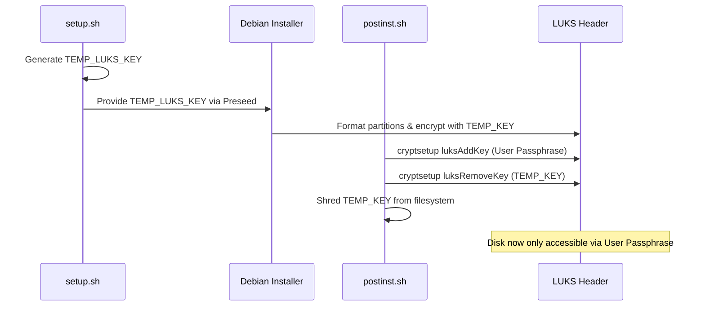

<details>
<summary>Relevant source files</summary>

The following files were used as context for generating this wiki page:

- [README.md](README.md)
- [lib/detect_disk.sh](lib/detect_disk.sh)
- [setup.sh](setup.sh)
- [lib/generate_preseed.sh](lib/generate_preseed.sh)
- [lib/generate_postinst.sh](lib/generate_postinst.sh)
</details>

# Disk Partitioning & LVM Layout

## Introduction
The `vps-setup` project provides an automated mechanism for reinstalling Debian with a specialized disk architecture focused on security and flexibility. The system implements Full-Disk Encryption (FDE) using LUKS2, managed via a Logical Volume Manager (LVM) layout. This ensures that sensitive data, including swap space, remains encrypted while allowing for organized volume management under a single encrypted container.

The architecture distinguishes between the primary OS disk, which holds the root filesystem and boot components, and optional secondary storage disks. The setup process automatically detects the boot mode (UEFI vs. BIOS) to apply the appropriate partitioning recipe, ensuring compatibility across different VPS hypervisor configurations.

Sources: [README.md:5-15](README.md#L5-L15), [lib/detect_disk.sh:137-145](lib/detect_disk.sh#L137-L145)

## Disk Architecture Overview

The primary OS disk is divided into unencrypted boot partitions and a large encrypted LUKS container. Inside the LUKS container, LVM is used to carve out functional volumes for the system.

### OS Disk Partition Table
| Partition | Size | Type | Encrypted | Description |
|-----------|------|------|-----------|-------------|
| EFI ESP | 512 MB | fat32 | No | Only created if `BOOT_MODE="uefi"` |
| `/boot` | 512 MB | ext4 | No | Contains kernel and initrd |
| LUKS Container| Remaining | LUKS2 | — | Encrypted physical volume for LVM |
| `└─ swap` | 1 GB | swap | Yes | Logical Volume for virtual memory |
| `└─ root` | Remaining | ext4 | Yes | Logical Volume for the `/` filesystem |

Sources: [README.md:144-153](README.md#L144-L153), [lib/generate_preseed.sh:48-52](lib/generate_preseed.sh#L48-L52)

### Logical Volume Management (LVM)
The LVM Volume Group (VG) is named based on the system hostname using the pattern `<hostname>-vol` (e.g., `vps-vol`). This VG resides entirely within the LUKS encrypted partition.

```mermaid
flowchart TD
    Disk[Physical Disk] --> P1[EFI ESP - 512MB]
    Disk --> P2[/boot - 512MB]
    Disk --> P3[LUKS2 Container - Remaining]
    
    subgraph LVM [LVM Volume Group: hostname-vol]
    P3 --> LV1[root LV - ext4 /]
    P3 --> LV2[swap LV - 1GB]
    end
    
    style P3 fill:#f96,stroke:#333,stroke-width:2px
    style LVM fill:#e1f5fe,stroke:#01579b
```

The diagram shows the hierarchy from physical disk partitions to the LVM logical volumes nested within the encrypted LUKS container.
Sources: [README.md:155](README.md#L155), [lib/generate_preseed.sh:45-52](lib/generate_preseed.sh#L45-L52)

## Detection Logic

The system employs automated detection to identify the target disk and the appropriate partitioning scheme.

### Primary Disk Detection
The function `detect_disk` in `lib/detect_disk.sh` identifies the disk currently hosting the root filesystem (`/`). It resolves device dependency trees to find the parent physical disk, handling standard devices (e.g., `/dev/sda`), VirtIO (e.g., `/dev/vda`), and NVMe (e.g., `/dev/nvme0n1`). 

If the root filesystem spans multiple physical disks, the script requires the user to manually set the `DISK` variable in `config.env` for safety.
Sources: [lib/detect_disk.sh:13-75](lib/detect_disk.sh#L13-L75)

### Boot Mode Detection
The partitioning recipe varies based on whether the system uses UEFI or Legacy BIOS.
*  **UEFI:** Requires an EFI System Partition (ESP) formatted as fat32.
*  **BIOS/Legacy:** Requires a small `biosgrub` partition for the bootloader on GPT disks.

Sources: [lib/detect_disk.sh:137-145](lib/detect_disk.sh#L137-L145), [lib/generate_preseed.sh:48-52](lib/generate_preseed.sh#L48-L52)

## Installation Roles

The project supports two primary roles that dictate how disks are handled during the partitioning phase.

### Standard Role (`standard`)
This is the default mode. The script detects only the current OS root disk. All secondary disks are completely ignored and left untouched to prevent accidental data loss on attached storage volumes.
Sources: [README.md:32-36](README.md#L32-L36), [lib/detect_disk.sh:100-104](lib/detect_disk.sh#L100-L104)

### Storage VPS Role (`storage-vps`)
This role initiates a scan for all additional block devices. It prompts the user interactively for each discovered disk with three options:
1.  **Leave untouched:** Default action; no changes.
2.  **Format and mount:** Formats the disk as `ext4` and mounts it under `/mnt/<hostname>-vol`.
3.  **Manual configuration:** Skips automated handling for custom user setup.

Sources: [README.md:38-46](README.md#L38-L46), [lib/detect_disk.sh:107-160](lib/detect_disk.sh#L107-L160)

## LUKS Key Security & Lifecycle

The partitioning process utilizes a two-stage key mechanism to ensure the installer can format the disk automatically while maintaining the user's private passphrase.

### Key Lifecycle Sequence
1.  **Generation:** `setup.sh` triggers `generate_preseed.sh` to create a `TEMP_LUKS_KEY` using `openssl rand -hex 32`.
2.  **Automated Partitioning:** The Debian installer uses this temporary key to initialize the LUKS container and LVM volumes.
3.  **Passphrase Injection:** During the post-install phase (`lib/generate_postinst.sh`), the user's real passphrase (passed via an encrypted payload) is added to a LUKS keyslot using `cryptsetup luksAddKey`.
4.  **Key Rotation:** The temporary installer key is removed from the LUKS header using `cryptsetup luksRemoveKey`, leaving only the user's passphrase as a valid entry.
5.  **Header Backup:** A backup of the LUKS header is created at `/root/luks-header-backup.img` (mode 600) for disaster recovery.



This sequence ensures no permanent installer keys remain on the system after the setup is complete.
Sources: [README.md:159-168](README.md#L159-L168), [lib/generate_preseed.sh:26-28](lib/generate_preseed.sh#L26-L28), [lib/generate_postinst.sh:37-43](lib/generate_postinst.sh#L37-L43)

## Configuration Summary

The following configuration parameters in `config.env` directly influence the disk and LVM layout:

| Variable | Default | Impact on Layout |
|----------|---------|------------------|
| `DISK` | Auto-detected | The target physical device for the OS installation. |
| `INSTALL_ROLE` | `standard` | Determines if secondary disks are scanned/formatted. |
| `WIPE_MODE` | `fast` | `fast` uses quick format; `secure` overwrites sectors during install. |
| `HOSTNAME` | `vps` | Used to name the LVM Volume Group (`<hostname>-vol`). |
| `STORAGE_AUTO_MOUNT` | `false` | Enables automatic mounting for secondary disks in storage role. |

Sources: [README.md:104-128](README.md#L104-L128), [lib/generate_preseed.sh:55-58](lib/generate_preseed.sh#L55-L58)

## Summary
The Disk Partitioning & LVM Layout in `vps-setup` provides a robust, encrypted foundation for a Debian VPS. By leveraging LVM within a LUKS2 container, the system achieves a secure separation of `/boot` from the encrypted root and swap volumes. The automated detection of boot modes and disk types, combined with a secure key rotation lifecycle, allows for hands-off deployment without sacrificing long-term cryptographic integrity.

Sources: [README.md:179-183](README.md#L179-L183), [setup.sh:386-410](setup.sh#L386-L410)
