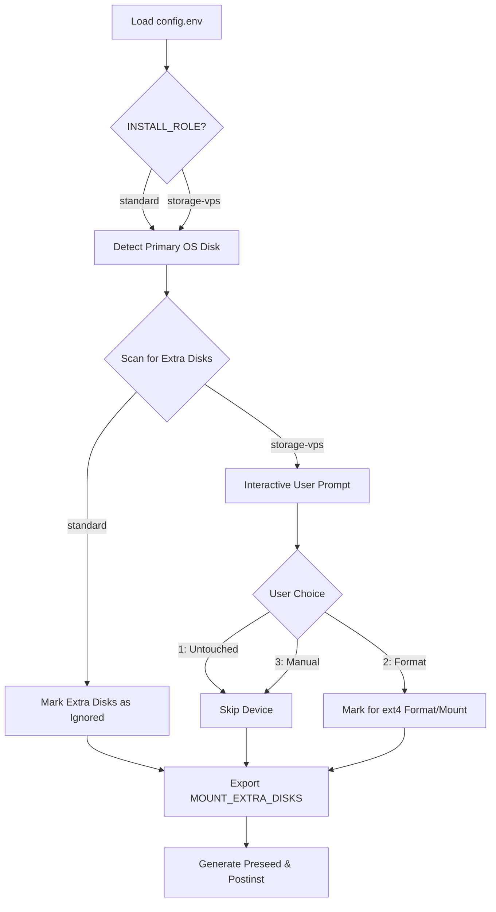

<details>
<summary>Relevant source files</summary>

The following files were used as context for generating this wiki page:

- [README.md](README.md)
- [setup.sh](setup.sh)
- [lib/detect_disk.sh](lib/detect_disk.sh)
- [lib/generate_preseed.sh](lib/generate_preseed.sh)
- [lib/generate_postinst.sh](lib/generate_postinst.sh)
</details>

# Installation Roles

Installation Roles in the `vps-setup` project define the behavior of the automated Debian reinstallation process regarding storage device management. The system supports two primary operational modes—`standard` and `storage-vps`—which dictate how the installer interacts with the primary OS disk and any secondary block devices detected during the pre-flight phase.

These roles are configured via the `INSTALL_ROLE` variable in the `config.env` file and primarily influence the logic within the disk detection module and the generated post-installation scripts.

Sources: [README.md:20-22](README.md#L20-L22), [setup.sh:197-200](setup.sh#L197-L200), [lib/detect_disk.sh:13-17](lib/detect_disk.sh#L13-L17)

## Role Definitions and Behavior

The project implements distinct logic paths for each role to ensure that secondary storage is handled according to the user's requirements, ranging from complete isolation to interactive formatting.

### Standard VPS Mode (`standard`)
This is the default installation role. In this mode, the setup script focuses exclusively on the root OS disk. Any additional disks attached to the VPS are ignored by the partitioning and mounting logic, ensuring that existing data on secondary volumes remains untouched.

*  **Scope:** OS Disk only.
*  **Safety:** High (secondary disks are not scanned for modification).
*  **Automation:** Full (no interactive prompts for secondary disks).

Sources: [README.md:38-42](README.md#L38-L42), [lib/detect_disk.sh:103-107](lib/detect_disk.sh#L103-L107)

### Storage VPS Mode (`storage-vps`)
This mode is designed for servers with multiple block devices. While it still automates the installation of the OS on the primary disk, it introduces an interactive scanning phase to handle additional storage.

*  **Scope:** OS Disk + Optional Secondary Disks.
*  **Interaction:** Prompts the user for action on each detected non-OS disk.
*  **Options:** Users can choose to leave a disk untouched, format it as `ext4` and mount it, or skip auto-handling for manual configuration.

Sources: [README.md:44-53](README.md#L44-L53), [lib/detect_disk.sh:109-111](lib/detect_disk.sh#L109-L111)

## Logic Flow for Role Selection

The following diagram illustrates how the `INSTALL_ROLE` variable affects the execution flow during the disk detection phase.



The logic ensures that no secondary disk is modified without explicit confirmation in `storage-vps` mode, while `standard` mode bypasses the scanning interaction entirely.

Sources: [lib/detect_disk.sh:103-169](lib/detect_disk.sh#L103-L169), [setup.sh:354-360](setup.sh#L354-L360)

## Configuration and Implementation

The selected role is propagated through the environment and embedded into the automation files (`preseed.cfg` and `postinst.sh`) to ensure the Debian installer and subsequent hardening scripts behave correctly.

### Relevant Configuration Fields
| Field | Default | Description |
| :--- | :--- | :--- |
| `INSTALL_ROLE` | `standard` | Determines disk handling mode (`standard` or `storage-vps`). |
| `STORAGE_AUTO_MOUNT` | `false` | Enables/disables auto-mounting in `storage-vps` mode. |
| `MOUNT_EXTRA_DISKS` | (empty) | Internal variable containing list of disks to format/mount. |

Sources: [README.md:162-163](README.md#L162-L163), [lib/detect_disk.sh:100-101](lib/detect_disk.sh#L100-L101)

### Code Implementation (Disk Detection)
The `detect_secondary_disks` function in `lib/detect_disk.sh` handles the logic branching between roles.

```bash
# lib/detect_disk.sh:103-111
if [[ "${INSTALL_ROLE}" == "standard" ]]; then
    echo "==> INSTALL_ROLE='standard': Secondary disks are completely ignored."
    export EXTRA_DISKS MOUNT_EXTRA_DISKS
    return 0
fi

echo "==> INSTALL_ROLE='storage-vps': Scanning for additional storage disks..."
```

Sources: [lib/detect_disk.sh:103-111](lib/detect_disk.sh#L103-L111)

### Template Integration
During the generation of the `postinst.sh` script, the role and the list of approved disks are injected into the template. This allows the system to perform formatting and mounting tasks during the late-command phase of the Debian installation.

```bash
# lib/generate_postinst.sh:86-88
-e "s|__INSTALL_ROLE__|$(sed_escape "${INSTALL_ROLE}")|g" \
-e "s|__MOUNT_EXTRA_DISKS__|$(sed_escape "${MOUNT_EXTRA_DISKS:-}")|g" \
-e "s|__EXTRA_DISKS__|$(sed_escape "${EXTRA_DISKS:-}")|g" \
```

Sources: [lib/generate_postinst.sh:86-88](lib/generate_postinst.sh#L86-L88)

## Summary
Installation Roles provide a safety mechanism and a configuration shortcut for different VPS hardware layouts. By selecting `standard`, users ensure their data drives are isolated from the OS reinstall process. By selecting `storage-vps`, users gain an interactive workflow to prepare and mount extra volumes automatically as part of the initial server provisioning.
