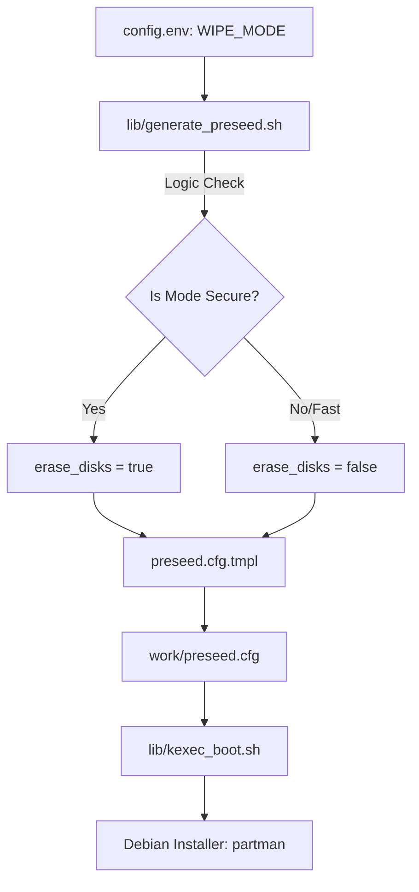
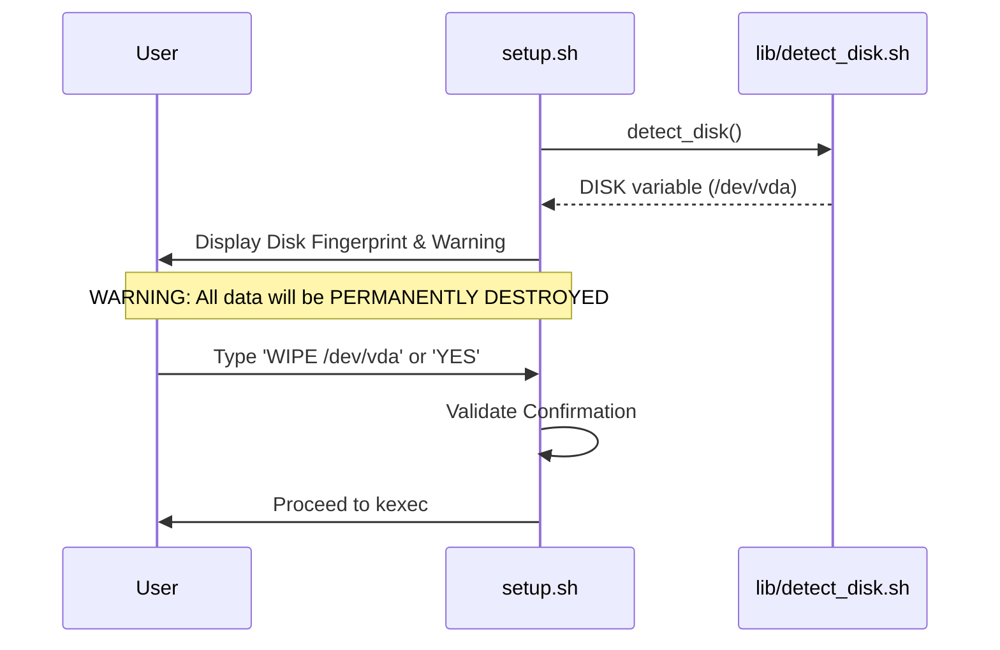

<details>
<summary>Relevant source files</summary>

The following files were used as context for generating this wiki page:

- [README.md](README.md)
- [setup.sh](setup.sh)
- [lib/detect_disk.sh](lib/detect_disk.sh)
- [lib/generate_preseed.sh](lib/generate_preseed.sh)
- [lib/kexec_boot.sh](lib/kexec_boot.sh)
- [lib/generate_postinst.sh](lib/generate_postinst.sh)
</details>

# Storage Wipe Modes

Storage Wipe Modes define the behavior and intensity of disk initialization during the automated Debian installation process. These modes determine how existing data on the target block device is handled before the new LUKS-encrypted partitions and LVM logical volumes are applied. The system primarily differentiates between quick initialization and forensic-level overwriting, though it notes specific limitations regarding virtualized storage environments.

The selection of a wipe mode is controlled via the `WIPE_MODE` configuration variable and directly influences the Debian `partman` (partition manager) behavior through the generated preseed configuration.

## Wipe Mode Specifications

The project supports two distinct wipe modes that balance installation speed against data sanitization requirements.

| Mode | Identifier | Description | Partman Impact |
|:---:|:---:|---|---|
| **Fast** | `fast` | The default mode. Performs quick removal of partition tables and filesystem headers. | `erase_disks` set to `false` |
| **Secure** | `secure` | Attempts to overwrite disk sectors during the installation process to prevent simple data recovery. | `erase_disks` set to `true` |

Sources: `[README.md:200-205]`, `[lib/generate_preseed.sh:65-69]`

### Limitations in Virtualized Environments
The `secure` wipe mode is subject to hardware and infrastructure constraints. In virtualized environments using SSD or NVMe storage, forensic destruction cannot be guaranteed due to:
*  SSD wear leveling algorithms.
*  Thin provisioning at the hypervisor level.
*  Provider-managed storage abstraction layers.

Sources: `[README.md:206-207]`

## Architecture and Data Flow

The wipe mode selection flows from the user configuration into the preseed generation logic, which eventually dictates the installer's disk operations.



The diagram shows how the `WIPE_MODE` variable is transformed into a boolean `erase_disks` flag within the preseed configuration used by the Debian installer.
Sources: `[lib/generate_preseed.sh:65-72]`, `[lib/kexec_boot.sh:80-90]`

## Logic and Implementation

### Preseed Variable Substitution
In `lib/generate_preseed.sh`, the script evaluates the `WIPE_MODE` environment variable. If the value is explicitly set to `secure`, the internal variable `erase_disks` is set to `true`. This variable is then used in a `sed` replacement operation to populate the `__ERASE_DISKS__` placeholder in the `preseed.cfg` template.

```bash
# Determine disk wipe mode (fast=false, secure=true)
local erase_disks="false"
if [[ "${WIPE_MODE:-fast}" == "secure" ]]; then
    erase_disks="true"
fi

# Perform template substitution
sed -e "s|__ERASE_DISKS__|${erase_disks}|g" \
    "${template_file}" > "${output_file}"
```

Sources: `[lib/generate_preseed.sh:65-73]`

### User Confirmation and Safety
Regardless of the chosen wipe mode, the system enforces a mandatory manual confirmation before proceeding with any destructive operations. The `display_summary` function in `setup.sh` displays a "Target Disk Confirmation Fingerprint" including device path, size, model, and serial number. The user must explicitly type `YES` or `WIPE <device_path>` to authorize the destruction of existing data.



The sequence illustrates the safety gate preventing accidental data loss during the disk initialization phase.
Sources: `[setup.sh:267-293]`, `[lib/detect_disk.sh:16-92]`

## Role-Based Storage Handling

Wipe behavior is further influenced by the `INSTALL_ROLE`, which determines which disks are targeted for initialization.

### Standard VPS Mode
*  **Target:** Only the primary OS/root disk (`/`).
*  **Wipe Scope:** Only the detected `DISK` is formatted and encrypted.
*  **Secondary Disks:** Completely ignored and left untouched, regardless of the `WIPE_MODE` setting.

### Storage VPS Mode
*  **Target:** Primary OS disk + selected secondary disks.
*  **Wipe Scope:** The primary disk is initialized according to `WIPE_MODE`. Secondary disks (`/dev/vdb`, etc.) are processed interactively.
*  **Confirmation:** No secondary disk is modified without explicit confirmation, where the user can choose to format as `ext4` or leave untouched.

Sources: `[README.md:42-55]`, `[lib/detect_disk.sh:95-168]`

## Summary of Configuration Elements

| Element | Source File | Description |
|---|---|---|
| `WIPE_MODE` | `config.env` | User-defined setting (`fast` or `secure`). |
| `erase_disks` | `lib/generate_preseed.sh` | Internal boolean passed to the preseed template. |
| `DISK` | `lib/detect_disk.sh` | Auto-detected or manually set target for the wipe operation. |
| `confirm_text` | `setup.sh` | The string required from the user to authorize the wipe. |

Sources: `[setup.sh:288]`, `[lib/generate_preseed.sh:66]`, `[lib/detect_disk.sh:110]`
