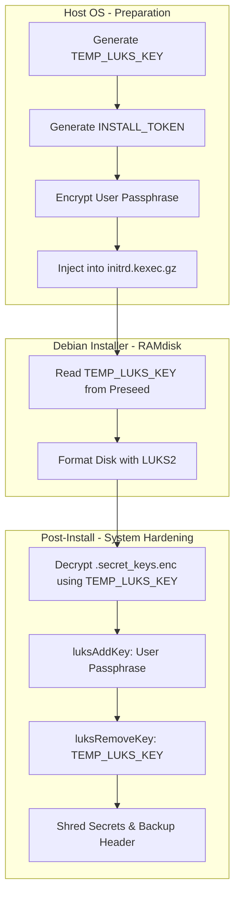

<details>
<summary>Relevant source files</summary>

The following files were used as context for generating this wiki page:

- [README.md](README.md)
- [setup.sh](setup.sh)
- [lib/generate_preseed.sh](lib/generate_preseed.sh)
- [lib/generate_postinst.sh](lib/generate_postinst.sh)
- [lib/kexec_boot.sh](lib/kexec_boot.sh)

</details>

# LUKS Key Security Lifecycle

The LUKS Key Security Lifecycle in this project defines the automated transition from a temporary, machine-generated installation key to a permanent, user-defined passphrase. This mechanism ensures that the Debian installer can proceed without manual intervention while maintaining full-disk encryption (FDE) integrity. The process involves generating temporary secrets, injecting them into a secure RAMdisk payload, and performing a final key rotation during the post-installation phase to ensure no installer-specific keys remain on the disk.

Sources: [README.md:13-14](README.md#L13-L14), [README.md:154-162](README.md#L154-L162)

## Architectural Overview

The lifecycle is divided into three distinct phases: **Pre-installation**, **Installation Execution**, and **Post-installation Rotation**. The system utilizes `kexec` to boot into a self-contained Debian netboot environment where the initial encryption occurs using a temporary key.

### Key Components

| Component | Responsibility | Source |
| :--- | :--- | :--- |
| `TEMP_LUKS_KEY` | 32-byte random hex key used for initial volume encryption. | [lib/generate_preseed.sh:26-27](lib/generate_preseed.sh#L26-L27) |
| `INSTALL_TOKEN` | 16-byte random hex string used to create a unique, restricted subpath for secrets. | [lib/generate_preseed.sh:22-23](lib/generate_preseed.sh#L22-L23) |
| `.secret_keys.enc` | AES-256-CBC encrypted payload containing the user's permanent passphrase. | [lib/generate_postinst.sh:45-51](lib/generate_postinst.sh#L45-L51) |
| `preseed.cfg` | Configuration that instructs the Debian installer to use the temporary key. | [lib/generate_preseed.sh:30-100](lib/generate_preseed.sh#L30-L100) |

## Data Flow and Transitions

The following diagram illustrates the flow of encryption secrets from the host system to the final encrypted Debian installation.



Sources: [lib/generate_preseed.sh:22-27](lib/generate_preseed.sh#L22-L27), [lib/kexec_boot.sh:46-70](lib/kexec_boot.sh#L46-L70), [README.md:154-162](README.md#L154-L162)

## Key Generation and Injection

During the setup phase, `setup.sh` triggers the generation of temporary credentials. The `TEMP_LUKS_KEY` is a random 32-byte hex string generated via `openssl rand`. This key is embedded directly into the `preseed.cfg` file to allow the `partman-crypto` module to initialize the LUKS container automatically.

To transport the user's permanent passphrase securely, the project creates a restricted directory named after the `INSTALL_TOKEN`. The passphrase is encrypted with AES-256-CBC (PBKDF2) using the `TEMP_LUKS_KEY` as the encryption password.

### Secure Transport Mechanism
The encrypted secret file and the scripts are injected into a custom `initrd` (RAMdisk) using `cpio`. This ensures a 100% offline installation where no local HTTP server is required to host secrets.

```bash
# Encrypting the secret for transport
printf '%s' "${LUKS_PASSPHRASE}" | TEMP_LUKS_KEY="${TEMP_LUKS_KEY}" \
openssl enc -aes-256-cbc -pbkdf2 -pass env:TEMP_LUKS_KEY -out "${secret_file}"

# Injecting into initrd
(cd "${work_dir}" && find preseed.cfg postinst.sh "${INSTALL_TOKEN}" | cpio -H newc -o 2>/dev/null) | gzip -9 >> "${kexec_initrd}"
```

Sources: [lib/generate_postinst.sh:45-51](lib/generate_postinst.sh#L45-L51), [lib/kexec_boot.sh:60-66](lib/kexec_boot.sh#L60-L66)

## Post-Install Key Rotation

The final phase occurs within the `postinst.sh` script, which is executed via the preseed `late_command`. This script is responsible for transitioning the LUKS volume from the temporary installer key to the user's passphrase.

### Rotation Sequence
1.  **Decryption**: The script decrypts the transport payload using the `TEMP_LUKS_KEY` to retrieve the `LUKS_PASSPHRASE`.
2.  **Validation**: The user's real passphrase is added to a new LUKS keyslot using `cryptsetup luksAddKey`.
3.  **Removal**: The temporary installer key is purged from the LUKS header using `cryptsetup luksRemoveKey`.
4.  **Verification**: The script verifies that the temporary key no longer unlocks the volume, while the user passphrase does.
5.  **Sanitization**: All temporary secret files are shredded using `shred -u`, and the `INSTALL_TOKEN` directory is removed.

Sources: [README.md:154-162](README.md#L154-L162), [lib/generate_postinst.sh:54-94](lib/generate_postinst.sh#L54-L94)

## Security Safeguards

The lifecycle includes several hardening measures to protect the encryption keys:

-  **Memory-Only Secrets**: The `TEMP_LUKS_KEY` and encrypted payloads exist only within the RAMdisk during the installation window.
-  **Shredding**: Post-installation cleanup uses `shred -u` to prevent forensic recovery of the temporary keys from the disk.
-  **Header Backup**: An unencrypted LUKS header backup is generated at `/root/luks-header-backup.img` with mode `600` permissions for disaster recovery.
-  **Remote Unlock**: The system configures `dropbear-initramfs` to allow remote SSH unlocking on port 22. This permits the user to provide the permanent passphrase at boot time without needing physical console access.

Sources: [README.md:88-95](README.md#L88-L95), [README.md:163-165](README.md#L163-L165), [lib/generate_postinst.sh:53-54](lib/generate_postinst.sh#L53-L54)

## Summary

The LUKS Key Security Lifecycle provides a robust path for automated FDE deployment. By utilizing a dual-key approach—deploying with a transient `TEMP_LUKS_KEY` and rotating to a permanent `LUKS_PASSPHRASE`—the project eliminates the risk of leaving default or insecure keys in the volume header. The use of `kexec` and `cpio` injection ensures that these secrets are handled entirely in memory and through encrypted local transport, minimizing exposure during the installation process.
