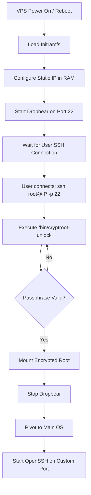
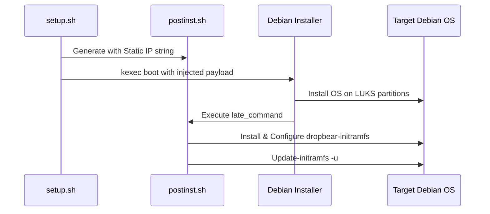

<details>
<summary>Relevant source files</summary>

The following files were used as context for generating this wiki page:

- [README.md](README.md)
- [setup.sh](setup.sh)
- [lib/generate_postinst.sh](lib/generate_postinst.sh)
- [lib/generate_preseed.sh](lib/generate_preseed.sh)
- [lib/kexec_boot.sh](lib/kexec_boot.sh)
- [lib/detect_network.sh](lib/detect_network.sh)
</details>

# Remote SSH Unlock (Dropbear)

Remote SSH Unlock is a security feature within the `vps-setup` project that allows administrators to provide a LUKS decryption passphrase to a headless VPS during the early boot process. This is achieved by integrating the Dropbear SSH server into the `initramfs` (Initial RAM Disk) environment, enabling network connectivity and secure shell access before the primary encrypted root filesystem is mounted.

In this project, Dropbear is configured to run exclusively on the standard SSH port (22) during the boot phase, providing a restricted session that automatically executes the `cryptroot-unlock` utility. This ensures that even with full-disk encryption, the server can be rebooted remotely without requiring physical or out-of-band console access for every boot sequence.

Sources: [README.md:10](README.md#L10), [README.md:104-106](README.md#L104-L106), [setup.sh:22](setup.sh#L22), [setup.sh:317](setup.sh#L317)

## Architecture and Integration

The project integrates Remote SSH Unlock by configuring the `initramfs` to support networking and the Dropbear daemon. The configuration is generated during the initial setup phase and applied during the post-installation phase of the Debian deployment.

### Components
*  **Dropbear (initramfs-only):** A lightweight SSH server that resides in the RAM disk. It is separate from the OpenSSH daemon used in the main operating system.
*  **Initramfs Networking:** Static IP configuration is passed to the kernel and initramfs to ensure the VPS is reachable on the network before the root OS loads.
*  **Cryptroot-unlock:** A standard Debian utility that bridges the SSH session to the LUKS decryption prompt.

### Data Flow for Remote Unlock
The following diagram illustrates the lifecycle of the remote unlock process from the initial boot to the fully operational OS.



Sources: [README.md:104-118](README.md#L104-L118), [setup.sh:444-453](setup.sh#L444-L453), [lib/generate_postinst.sh:29-33](lib/generate_postinst.sh#L29-L33)

## Configuration and Implementation

The implementation relies on two primary configuration vectors: network identification for the pre-boot environment and the injection of security credentials.

### Network Configuration for Initramfs
To ensure the server is reachable during the `initramfs` stage, the `generate_postinst.sh` script constructs a specific IP string format required by `klibc-ipconfig`. This string includes the client IP, gateway, netmask, and hostname.

```bash
# Format: IP=<client-ip>:<server-ip>:<gateway>:<netmask>:<hostname>:<device>:<autoconf>
local initramfs_ip="${IPV4_ADDRESS}::${IPV4_GATEWAY}:${IPV4_NETMASK}:${HOSTNAME}::none"
```

Sources: [lib/generate_postinst.sh:29-33](lib/generate_postinst.sh#L29-L33), [lib/detect_network.sh:25-45](lib/detect_network.sh#L25-L45)

### User Access and Security
Access to the pre-boot Dropbear instance is restricted and distinct from the main system's SSH configuration:
*  **Port Allocation:** Dropbear uses port **22** by default, while the main OpenSSH daemon is moved to a custom port (e.g., **2222**) to prevent conflicts and enhance security.
*  **Authentication:** Only SSH public key authentication is permitted. The `SSH_PUBKEY` defined in `config.env` is utilized for both the main OS and the Dropbear initramfs environment.
*  **Restricted Session:** The root login in initramfs is restricted solely to the execution of `cryptroot-unlock`.

Sources: [README.md:106-120](README.md#L106-L120), [setup.sh:176-181](setup.sh#L176-L181), [lib/generate_postinst.sh:35-77](lib/generate_postinst.sh#L35-L77)

### Summary of Differences: Dropbear vs. OpenSSH

| Feature | Dropbear (Pre-Boot) | OpenSSH (Main OS) |
| :--- | :--- | :--- |
| **Port** | 22 | Configurable (Default: 2222) |
| **User** | root | `USERNAME` from config |
| **Function** | LUKS Passphrase Entry | General System Admin |
| **Auth Method** | SSH Key Only | SSH Key Only |
| **Shell** | `/bin/cryptroot-unlock` | standard (bash/zsh) |

Sources: [README.md:106-120](README.md#L106-L120), [setup.sh:176-181](setup.sh#L176-L181), [lib/generate_postinst.sh:60-63](lib/generate_postinst.sh#L60-L63)

## Deployment Logic

The `Remote SSH Unlock` feature is deployed via the project's automation scripts.

1.  **Detection:** `lib/detect_network.sh` identifies the necessary static IP details.
2.  **Generation:** `lib/generate_postinst.sh` embeds the initramfs network string (`__INITRAMFS_IP__`) into the post-installation script.
3.  **Injection:** The `lib/kexec_boot.sh` script takes the generated `postinst.sh` and other configurations, injecting them directly into a new `initrd.kexec.gz` payload using `cpio`.
4.  **Execution:** After the automated Debian installation finishes, the post-install script configures the `dropbear-initramfs` package within the target system.



Sources: [lib/generate_postinst.sh:29-80](lib/generate_postinst.sh#L29-L80), [lib/kexec_boot.sh:49-75](lib/kexec_boot.sh#L49-L75), [lib/detect_network.sh:84-118](lib/detect_network.sh#L84-L118)

## Conclusion
Remote SSH Unlock (Dropbear) is a critical availability feature for the `vps-setup` automated reinstall system. By leveraging `initramfs` integration, it bridges the gap between hardware initialization and a secured, encrypted operating system environment, ensuring that high-security full-disk encryption does not sacrifice remote manageability.

Sources: [README.md:1-15](README.md#L1-L15), [setup.sh:22-30](setup.sh#L22-L30)
