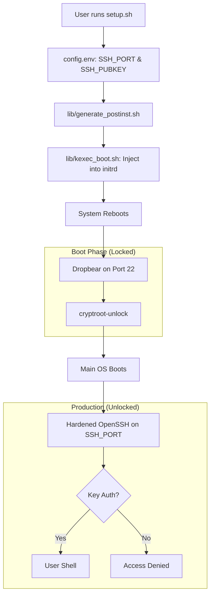

<details>
<summary>Relevant source files</summary>

The following files were used as context for generating this wiki page:

- [lib/generate\_postinst.sh](lib/generate_postinst.sh)
- [README.md](README.md)
- [setup.sh](setup.sh)
- [lib/generate\_preseed.sh](lib/generate_preseed.sh)
- [lib/kexec\_boot.sh](lib/kexec_boot.sh)
</details>

# SSH Hardening (OpenSSH)

SSH Hardening is a core security pillar of the `vps-setup` project, designed to secure remote access to the newly installed Debian system. The project implements a dual-layer SSH architecture: a restricted Dropbear instance within the initramfs for remote LUKS decryption and a hardened OpenSSH daemon for primary OS management.

The hardening process involves disabling password-based authentication, enforcing public-key only access, remapping the default service port to a non-standard value, and restricting access to specific users. These configurations are generated during the setup phase and applied via a post-installation script executed within the target environment.

Sources: [README.md:12-12](README.md#L12), [README.md:214-220](README.md#L214-L220), [setup.sh:16-16](setup.sh#L16)

## Architecture and Access Flow

The project distinguishes between two distinct phases of SSH access: pre-boot (LUKS unlock) and post-boot (OS management).

### Pre-boot: Dropbear SSH
During the boot sequence, while the root filesystem is still encrypted, a `dropbear-initramfs` instance listens on port 22. This instance is restricted solely to executing `/bin/cryptroot-unlock`. It uses a separate set of host keys generated within the initramfs.

### Post-boot: Hardened OpenSSH
Once the system is unlocked and fully booted, the primary OpenSSH daemon starts on a custom port (default `2222`). This daemon is configured with strict hardening policies to prevent unauthorized access.

The following diagram illustrates the lifecycle of an SSH connection from initial setup to production access:



The diagram shows how configuration flows from `config.env` through the injection process into the final system state. 
Sources: [README.md:122-140](README.md#L122-L140), [lib/kexec\_boot.sh:44-60](lib/kexec\_boot.sh#L44-L60), [setup.sh:220-220](setup.sh#L220)

## Configuration Parameters

Hardening parameters are defined in `config.env` and processed by `lib/generate_postinst.sh` to populate the `postinst.sh.tmpl` template.

| Parameter | Default | Project Security Enforcement |
| :--- | :--- | :--- |
| `SSH_PORT` | `2222` | Changes default port 22 to mitigate automated brute-force attacks. |
| `SSH_PUBKEY` | — | The only permitted method of authentication; no password is set. |
| `ALLOW_USERS` | `${USERNAME}` | Restricts SSH access to the specific non-root user created during setup. |
| `ALLOW_SSH_FORWARDING` | `false` | Disables TCP port forwarding by default. |
| `PermitRootLogin` | `no` | Explicitly disabled on the main OpenSSH daemon. |
| `PasswordAuthentication`| `no` | Explicitly disabled to prevent credential-based attacks. |

Sources: [README.md:175-180](README.md#L175-L180), [setup.sh:176-189](setup.sh#L176-L189), [lib/generate\_postinst.sh:45-50](lib/generate\_postinst.sh#L45-L50)

## Implementation Logic

The hardening logic is implemented through template substitution in the post-installation phase.

### Template Substitution
The file `lib/generate_postinst.sh` uses `sed` to inject user-defined SSH settings into the post-install script. This script is then executed by the Debian installer's `late_command`.

```bash
# Example of substitution in lib/generate_postinst.sh
local allow_tcp="no"
if [[ "${ALLOW_SSH_FORWARDING:-false}" == "true" ]]; then
    allow_tcp="yes"
fi

sed \
    -e "s|__USERNAME__|$(sed_escape "${USERNAME}")|g" \
    -e "s|__ALLOW_USERS__|$(sed_escape "${allow_users}")|g" \
    -e "s|__SSH_PORT__|$(sed_escape "${SSH_PORT}")|g" \
    -e "s|__SSH_PUBKEY__|$(sed_escape "${SSH_PUBKEY}")|g" \
    -e "s|__ALLOW_SSH_FORWARDING__|$(sed_escape "${allow_tcp}")|g" \
    "${template_file}" > "${output_file}"
```

Sources: [lib/generate\_postinst.sh:45-64](lib/generate\_postinst.sh#L45-L64)

### Security Constraints in `setup.sh`
The main `setup.sh` script validates the `SSH_PORT` to ensure it does not conflict with the Dropbear instance used for LUKS unlocking. If `SSH_PORT` is set to `22`, the script terminates with an error.

```bash
if [[ -z "${SSH_PORT:-}" ]] \
    || ! [[ "${SSH_PORT}" =~ ^[0-9]+$ ]] \
    || (( SSH_PORT < 1 || SSH_PORT > 65535 )) \
    || (( SSH_PORT == 22 )); then
    log_error "SSH_PORT must be a number from 1 to 65535 and must not be 22 (reserved for dropbear)."
    errors=$((errors + 1))
fi
```

Sources: [setup.sh:182-189](setup.sh#L182-L189)

## Interaction with Firewall and Fail2ban

SSH Hardening is complemented by network-level security controls:
1.  **UFW (Uncomplicated Firewall):** The system defaults to "deny incoming." The custom `SSH_PORT` is automatically added to the allowed rules during post-installation.
2.  **Fail2ban:** An SSH jail is activated by default. This monitors logs for failed connection attempts and bans offending IP addresses, even on the non-standard port.

Sources: [README.md:13-14](README.md#L13-L14), [setup.sh:220-221](setup.sh#L220-L221)

## Summary

SSH Hardening in the `vps-setup` project creates a secure, key-only access environment that separates pre-boot recovery from post-boot operations. By enforcing non-standard ports, disabling root logins, and integrating with active defense tools like Fail2ban, the system provides a production-ready security baseline immediately upon completion of the automated install.
