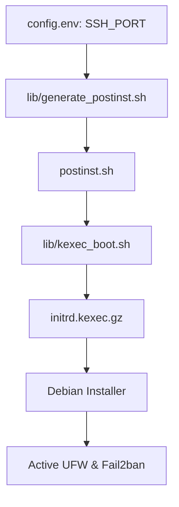
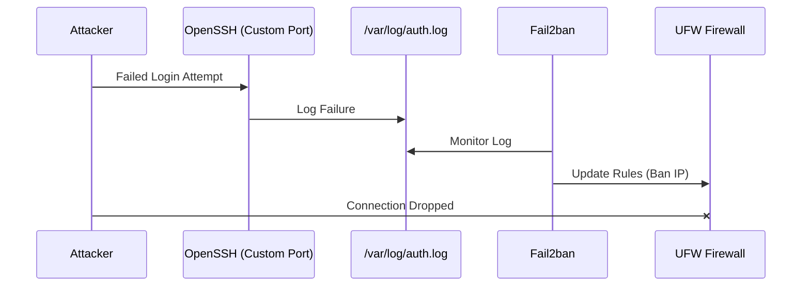

Relevant source files

The following files were used as context for generating this wiki page:

- [lib/generate\_postinst.sh](lib/generate_postinst.sh)
- [setup.sh](setup.sh)
- [README.md](README.md)
- [lib/generate\_preseed.sh](lib/generate_preseed.sh)
- [lib/kexec\_boot.sh](lib/kexec_boot.sh)

# Firewall & Fail2ban Setup

The Firewall and Fail2ban setup is a core security component of the automated VPS reinstall project. Its primary purpose is to secure the newly installed Debian system by enforcing a "default deny" incoming traffic policy while protecting exposed services from brute-force attacks. This system is integrated into the automated deployment pipeline, ensuring that the VPS is protected immediately upon its first boot.

The setup utilizes **UFW (Uncomplicated Firewall)** for packet filtering and **Fail2ban** for intrusion prevention, specifically targeting the SSH service. The configuration is dynamically generated based on user-defined parameters such as custom SSH ports, ensuring that management access remains available while all other unauthorized entry points are closed.

Sources: [setup.sh:17-18](setup.sh#L17-L18), [README.md:12-12](README.md#L12)

## Architecture and Integration

The security configuration is defined during the pre-installation phase and executed during the post-installation phase. The `setup.sh` script orchestrates the collection of configuration data, which is then injected into a post-install script.

### Configuration Flow
1.  **Variable Collection**: The user defines `SSH_PORT` and other security parameters in `config.env`.
2.  **Template Substitution**: `lib/generate_postinst.sh` reads these variables and injects them into the `postinst.sh.tmpl` template.
3.  **Payload Injection**: The generated `postinst.sh` is bundled into a custom initrd payload by `lib/kexec_boot.sh`.
4.  **Execution**: After the Debian installer finishes, the `postinst.sh` script runs inside the new system to enable UFW and Fail2ban.

Sources: [lib/generate_postinst.sh:56-78](lib/generate_postinst.sh#L56-L78), [lib/kexec_boot.sh:42-65](lib/kexec_boot.sh#L42-L65)

The diagram shows how the SSH port configuration flows from the initial environment file through the generation scripts into the final system installation.
Sources: [lib/generate_postinst.sh](lib/generate_postinst.sh), [lib/kexec_boot.sh](lib/kexec_boot.sh)

## UFW Firewall Configuration

The project implements a strict firewall policy. The UFW configuration is automated to prevent accidental lockout by ensuring the custom SSH port is explicitly allowed before the firewall is enabled.

### Firewall Features
*  **Default Policy**: All incoming traffic is denied by default.
*  **Dynamic Port Opening**: The firewall automatically opens the port specified in the `SSH_PORT` variable (defaulting to 2222).
*  **Persistence**: The firewall is enabled to start automatically on system boot.

Sources: [setup.sh:255-255](setup.sh#L255), [README.md:144-144](README.md#L144), [lib/generate_postinst.sh:58-58](lib/generate_postinst.sh#L58)

| Component | Setting | Source File |
| :--- | :--- | :--- |
| Default Incoming | Deny | [README.md:12-12](README.md#L12) |
| SSH Port | `__SSH_PORT__` (Dynamic) | [lib/generate_postinst.sh:58-58](lib/generate_postinst.sh#L58) |
| Implementation | UFW | [setup.sh:17-18](setup.sh#L17-L18) |

## Fail2ban Intrusion Prevention

Fail2ban is deployed to mitigate brute-force attacks against the SSH service. It monitors system logs and dynamically updates firewall rules to ban IP addresses that exhibit malicious behavior.

### SSH Jail Implementation
The project specifically activates the SSH jail. Because the project hardens SSH by disabling password authentication and moving the daemon to a non-standard port, Fail2ban is configured to monitor the specific port defined in the configuration.

Sources: [setup.sh:256-256](setup.sh#L256), [README.md:12-12](README.md#L12)

This diagram illustrates the interaction between the custom SSH port logging and Fail2ban's automated blocking mechanism.
Sources: [README.md:144-144](README.md#L144), [setup.sh:17-18](setup.sh#L17-L18)

## Security Parameters

The following configuration options in `config.env` directly impact the Firewall and Fail2ban setup:

| Variable | Description | Default |
| :--- | :--- | :--- |
| `SSH_PORT` | The TCP port used for the OpenSSH daemon and UFW allow rule. | `2222` |
| `ALLOW_SSH_FORWARDING` | Controls whether TCP forwarding is permitted in the security baseline. | `false` |
| `USERNAME` | Used to define the `AllowUsers` list in SSH, which influences logging. | — |

Sources: [setup.sh:144-156](setup.sh#L144-L156), [README.md:104-125](README.md#L104-L125), [lib/generate_postinst.sh:56-61](lib/generate_postinst.sh#L56-L61)

## Conclusion
The Firewall and Fail2ban setup provides an essential layer of defense for the VPS. By integrating UFW with a default-deny policy and Fail2ban with an active SSH jail, the system ensures that only authorized traffic on the specified custom SSH port can reach the server. This automated hardening eliminates the window of vulnerability that typically exists between OS installation and manual security configuration.

Sources: [README.md:144-144](README.md#L144), [setup.sh:255-256](setup.sh#L255-L256)
