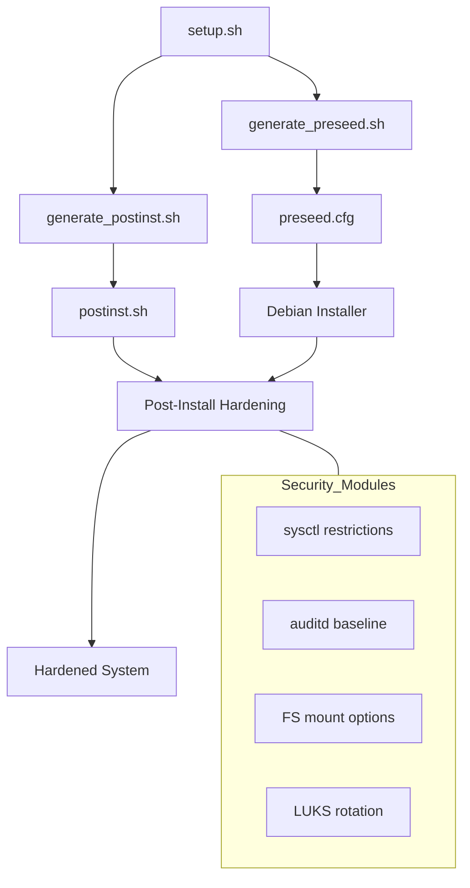

<details>
<summary>Relevant source files</summary>

The following files were used as context for generating this wiki page:

- [lib/generate\_postinst.sh](lib/generate_postinst.sh)
- [README.md](README.md)
- [setup.sh](setup.sh)
- [lib/generate\_preseed.sh](lib/generate_preseed.sh)
- [lib/kexec\_boot.sh](lib/kexec_boot.sh)

</details>

# Kernel & Filesystem Hardening

Kernel and Filesystem Hardening within the `vps-setup` project refers to a suite of automated security configurations applied during and after the Debian installation process. The primary goal is to minimize the attack surface of the OS by restricting kernel parameters via `sysctl`, enforcing strict filesystem mount options, and ensuring data at rest is protected through full-disk encryption.

These hardening measures are integrated into the automated pipeline, beginning with the generation of a secure `preseed.cfg` and concluding with a comprehensive `postinst.sh` script that executes within the target environment. The project emphasizes production-grade patterns, such as `auditd` logging, unprivileged filesystem restrictions, and automated security patching.
Sources: [README.md:1-25](README.md#L1-L25), [setup.sh:10-22](setup.sh#L10-L22)

## Hardening Architecture

The hardening process is distributed across several stages of the installation lifecycle, ensuring that security is baked into the system from the initial boot.



The diagram shows how configuration templates are transformed into active hardening scripts that are executed during the final stages of the Debian installation.
Sources: [setup.sh:282-315](setup.sh#L282-L315), [lib/generate\_postinst.sh:22-30](lib/generate\_postinst.sh#L22-L30)

## Filesystem Hardening

The project enforces strict mount options for temporary and shared memory filesystems to prevent the execution of malicious binaries and unauthorized device creation.

### Mount Restrictions
Temporary filesystems are configured with specific flags to mitigate common exploitation vectors:
*  **nodev**: Prevents the interpretation of character or block special devices.
*  **nosuid**: Disables the effect of set-user-identifier or set-group-identifier bits.
*  **noexec**: Prevents the execution of binaries on the filesystem.

| Filesystem | Mount Options | Purpose |
| :--- | :--- | :--- |
| `/tmp` | `nodev,nosuid,noexec` | Restrict user-writable temporary storage |
| `/dev/shm` | `nodev,nosuid,noexec` | Restrict shared memory segments |

Sources: [README.md:21](README.md#L21), [README.md:195](README.md#L195)

### Storage and Partitioning Logic
The `lib/generate_preseed.sh` script defines a `partman_recipe` that enforces a structured layout for the primary OS disk, incorporating both boot-level and LVM-level separation.

```mermaid
flowchart TD
    subgraph Disk_Layout
    direction TB
    P1[EFI ESP / BIOS Boot]
    P2[/boot - ext4]
    subgraph LUKS_Container
    direction TB
    P3[LVM Physical Volume]
    P3 --> V1[swap - Encrypted]
    P3 --> V2[/ - root - Encrypted]
    end
    end
    P1 --- P2 --- LUKS_Container
```

The diagram illustrates the hierarchical layout of the disk, where the root and swap partitions are encapsulated within an encrypted LVM volume inside a LUKS2 container.
Sources: [lib/generate\_preseed.sh:65-75](lib/generate\_preseed.sh#L65-L75), [README.md:118-128](README.md#L118-L128)

## Kernel Hardening & Audit

Kernel-level hardening is achieved through `sysctl` restrictions and continuous monitoring via `auditd`.

### System Restrictions
*  **sysctl Restrictions**: The project applies kernel parameter restrictions to harden the network stack and process management.
*  **auditd**: Automated installation and configuration of `auditd` to provide comprehensive logging of system events.
*  **Unattended Upgrades**: Configuration is set strictly for Debian security patches (`-security`) to ensure the kernel and core libraries remain patched against known vulnerabilities.
Sources: [README.md:21](README.md#L21), [README.md:188-190](README.md#L188-L190), [setup.sh:18-20](setup.sh#L18-L20)

### Security Baseline Management
After installation, the system generates an immutable baseline backup of all security configuration files in `/root/security-baseline/`. This allows administrators to verify the integrity of hardening settings against a known-good state.
Sources: [README.md:184-187](README.md#L184-L187)

## LUKS Lifecycle & Key Security

Hardening extends to the disk encryption lifecycle, ensuring that temporary installation secrets are purged and permanent keys are verified.

1.  **Temporary Key Generation**: `setup.sh` generates a `TEMP_LUKS_KEY` used for automated partitioning.
2.  **Secret Transport**: Secrets are stored under a single-use random subpath (`/INSTALL_TOKEN/.secret_keys`) with `600` permissions.
3.  **Key Rotation**: The `postinst.sh` script adds the user's permanent passphrase to the LUKS keyslot and removes the temporary installer key.
4.  **Verification**: The rotation is verified using `cryptsetup luksOpen --test-passphrase` before the temporary key is shredded.
5.  **Disaster Recovery**: A LUKS header backup is generated at `/root/luks-header-backup.img` with restricted `600` permissions.

Sources: [README.md:130-143](README.md#L130-L143), [lib/generate\_preseed.sh:38-40](lib/generate\_preseed.sh#L38-L40), [lib/generate\_postinst.sh:40-48](lib/generate\_postinst.sh#L40-L48)

## Conclusion
The Kernel & Filesystem Hardening implementation in `vps-setup` provides a multi-layered security approach. By combining full-disk encryption with restrictive filesystem mount flags, kernel `sysctl` tuning, and automated security auditing, the project ensures that the resulting VPS environment adheres to high-security standards immediately upon deployment. Significance is placed on the automated rotation of encryption secrets and the creation of a secure configuration baseline for post-installation auditing.
Sources: [README.md:175-195](README.md#L175-L195), [setup.sh:10-25](setup.sh#L10-L25)
