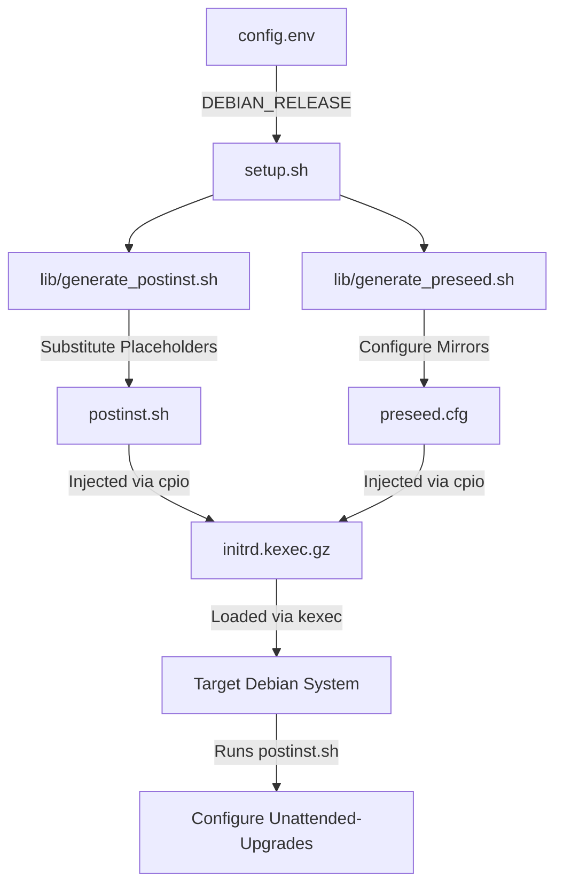
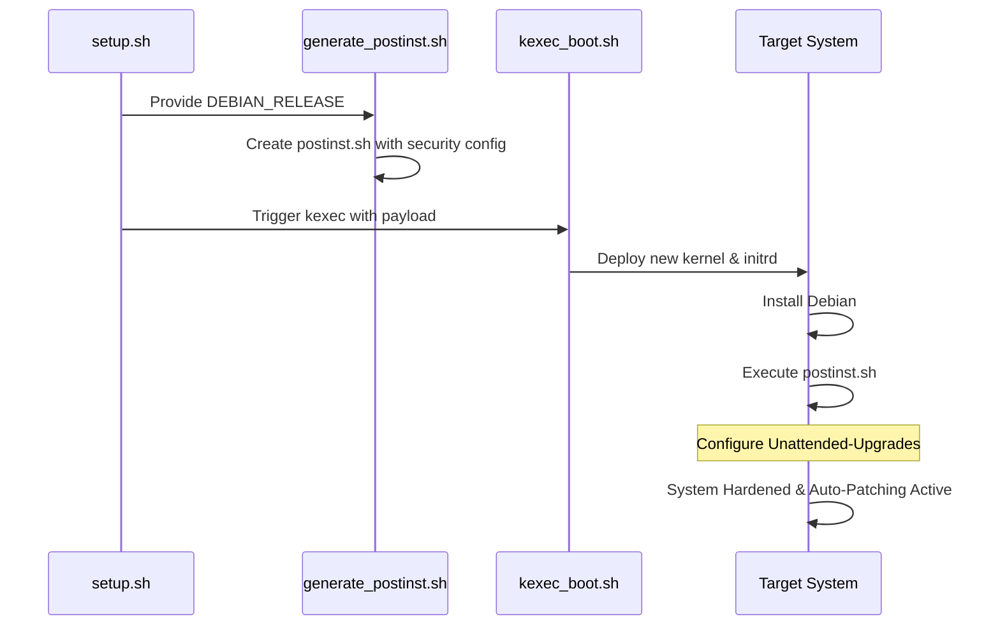

Relevant source files

The following files were used as context for generating this wiki page:

- [README.md](README.md)
- [setup.sh](setup.sh)
- [lib/generate\_postinst.sh](lib/generate_postinst.sh)
- [lib/generate\_preseed.sh](lib/generate_preseed.sh)
- [lib/download.sh](lib/download.sh)
- [lib/detect\_network.sh](lib/detect_network.sh)
- [lib/kexec\_boot.sh](lib/kexec_boot.sh)

# Unattended Security Upgrades

The **Unattended Security Upgrades** system is a core hardening component of the `vps-setup` project, designed to ensure the automated installation of critical security patches on newly deployed Debian instances. By automating this process, the system maintains the security posture of the VPS without requiring manual intervention by the administrator.

Within the project's architecture, this feature is integrated into the post-installation phase. It is strictly scoped to focus on security vulnerabilities, specifically targeting repositories designated with the `-security` suffix to avoid the stability risks associated with automatic feature or package upgrades.

Sources: [README.md:15](README.md#L15), [README.md:214-215](README.md#L214-L215), [setup.sh:14](setup.sh#L14)

## System Architecture and Logic

The implementation of Unattended Security Upgrades relies on the orchestration of several scripts that prepare the environment, define the upgrade scope, and inject configuration into the target system.

### Upgrade Scoping
The system differentiates between standard updates and security patches. To ensure system stability, it specifically limits automatic updates to the Debian security repository for the configured release (e.g., `trixie`). This prevent breaking changes that might occur if general feature updates were applied automatically.

Sources: [README.md:214-215](README.md#L214-L215), [setup.sh:14](setup.sh#L14)

### Data Flow for Configuration
The configuration for upgrades is dynamically generated based on the user's environment settings. The variable `DEBIAN_RELEASE` is propagated from the initial configuration through the generation libraries into the final scripts that execute on the VPS.

1.  **Configuration Loading**: `setup.sh` loads the `DEBIAN_RELEASE` (defaulting to `trixie`) and the `DEBIAN_MIRROR` from `config.env`.
2.  **Post-Install Script Generation**: `lib/generate_postinst.sh` performs template substitution, replacing the `__DEBIAN_RELEASE__` placeholder in the post-install template.
3.  **Preseed Integration**: `lib/generate_preseed.sh` similarly prepares the installer configuration to ensure the correct mirrors are available for the `unattended-upgrades` package to fetch data.

Sources: [setup.sh:226-227](setup.sh#L226-L227), [lib/generate_postinst.sh:76](lib/generate_postinst.sh#L76), [lib/generate_preseed.sh:94](lib/generate_preseed.sh#L94)

### Visualizing the Upgrade Configuration Flow

The following diagram illustrates how the upgrade configuration is prepared and eventually applied to the target system.

This diagram shows the path from configuration variables to the actual enforcement of security upgrade policies on the remote VPS.
Sources: [lib/generate_postinst.sh:53-77](lib/generate_postinst.sh#L53-L77), [lib/kexec_boot.sh:42-65](lib/kexec_boot.sh#L42-L65)

## Deployment Lifecycle

The unattended upgrades feature is not installed on the host system running the setup; instead, it is prepared as a "payload" to be activated after the `kexec` transition to the new OS.

### Source Integrity
The system ensures that the packages used for the initial installation and subsequent upgrades come from verified sources. `lib/download.sh` restricts mirror selection to HTTPS-only URLs and performs SHA256 checksum verification on the netboot artifacts. This establishes a "Chain of Trust" for all future updates performed by the system.

Sources: [lib/download.sh:34-40](lib/download.sh#L34-L40), [lib/download.sh:91-118](lib/download.sh#L91-L118)

### Post-Installation Execution
The logic for enabling the upgrades is contained within `postinst.sh`, which is executed in the final stages of the Debian installation via the preseed `late_command`. This script:
*  Sets the system timezone to ensure update schedules are accurate.
*  Configures the package manager to point to the correct security repositories.
*  Enables the `unattended-upgrades` service.

Sources: [lib/generate_postinst.sh:71](lib/generate_postinst.sh#L71), [lib/generate_preseed.sh:48](lib/generate_preseed.sh#L48)

## Configuration Reference

The following table details the parameters that influence the behavior of Unattended Security Upgrades within the project.

| Parameter | Source File | Default Value | Description |
| :--- | :--- | :--- | :--- |
| `DEBIAN_RELEASE` | `setup.sh` | `trixie` | Determines which security repository to track (e.g., trixie-security). |
| `DEBIAN_MIRROR` | `setup.sh` | `https://deb.debian.org/debian` | The primary source used to fetch upgrade packages; MUST use HTTPS. |
| `TIMEZONE` | `setup.sh` | `UTC` | Ensures update cron jobs run at expected times. |
| `INSTALL_TOKEN` | `lib/generate_postinst.sh` | Random Hex | Secures the transport of sensitive keys during the installation window. |

Sources: [setup.sh:226-231](setup.sh#L226-L231), [lib/generate_postinst.sh:30-31](lib/generate_postinst.sh#L30-L31), [lib/download.sh:15-18](lib/download.sh#L15-L18)

### Security Upgrades Sequence

This sequence details the handoff between the setup environment and the target system's security configuration.
Sources: [setup.sh:386-391](setup.sh#L386-L391), [lib/kexec_boot.sh:137-142](lib/kexec_boot.sh#L137-L142)

## Implementation Details

The upgrades are part of a broader security baseline. Upon completion of the installation, the system generates reports to verify the status of security features.

*  **Security Baseline**: A backup of the security configurations is stored in `/root/security-baseline/`.
*  **Installation Summary**: The file `/root/vps-install-summary.txt` provides a record of the applied settings, including the state of automated updates.

Sources: [README.md:144-149](README.md#L144-L149), [README.md:210-213](README.md#L210-L213)

## Conclusion
The Unattended Security Upgrades module provides a "set-and-forget" security mechanism that prioritizes system stability by strictly limiting automatic actions to security-critical patches. By leveraging HTTPS-verified mirrors and injecting configuration directly into the installation media via `kexec`, the project ensures that every new VPS deployment is inherently protected against known vulnerabilities from the moment of its first boot.
