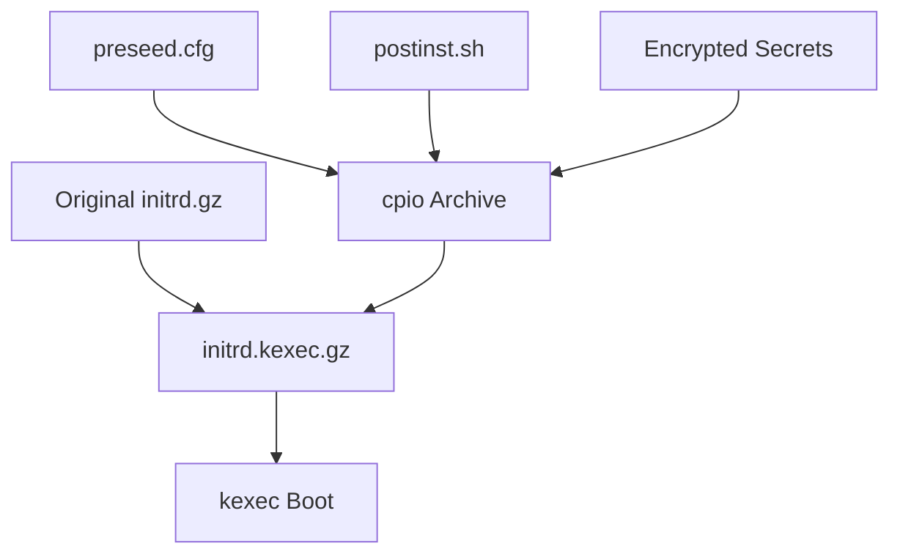
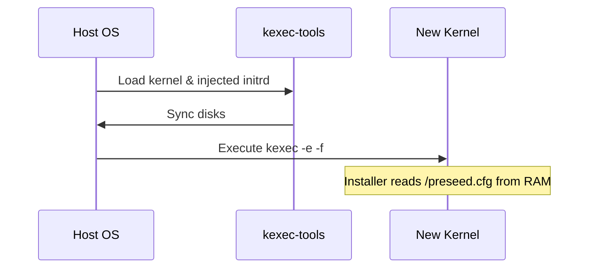

<details>
<summary>Relevant source files</summary>

The following files were used as context for generating this wiki page:

- [lib/generate\_postinst.sh](lib/generate_postinst.sh)
- [lib/kexec\_boot.sh](lib/kexec_boot.sh)
- [README.md](README.md)
- [setup.sh](setup.sh)
- [lib/generate\_preseed.sh](lib/generate_preseed.sh)
- [lib/download.sh](lib/download.sh)

</details>

# Secret Transport & Injection

Secret Transport & Injection refers to the mechanism within the `vps-setup` project that ensures sensitive data—such as LUKS passphrases and system configurations—are securely moved from the host environment into the Debian installer's RAM-based environment. By utilizing an offline payload injection method, the system avoids relying on local HTTP servers, which are prone to failure when the host OS is terminated during the `kexec` process.

This system guarantees a self-contained installation by appending encrypted secrets and configuration scripts directly to the initial RAM disk (`initrd`). The secrets are protected using a single-use installation token and temporary AES-256-CBC encryption to prevent unauthorized access during the installation window.

Sources: [README.md:126-129](README.md#L126-L129), [lib/kexec\_boot.sh:37-40](lib/kexec\_boot.sh#L37-L40)

## Architecture and Payload Injection

The injection process involves creating a custom `initrd.kexec.gz` file. The original Debian `initrd.gz` is used as a base, and a new `cpio` archive containing the preseed configuration, post-installation scripts, and encrypted secrets is appended to it.

### Injection Flow

1.  **Preparation**: The primary OS disk, network settings, and LUKS passphrase are auto-detected or provided by the user.
2.  **Secret Packaging**: A random 16-byte `INSTALL_TOKEN` is generated to create a unique, single-use subpath.
3.  **Encryption**: The user's LUKS passphrase is encrypted using AES-256-CBC with a temporary key (`TEMP_LUKS_KEY`).
4.  **Initrd Modification**: The scripts and the encrypted secret file are archived via `cpio` and appended to the existing `initrd`.



The diagram shows how the original initrd is combined with a custom cpio archive containing system configurations and secrets to form the final bootable payload.
Sources: [lib/kexec\_boot.sh:41-76](lib/kexec\_boot.sh#L41-L76), [lib/generate\_postinst.sh:36-47](lib/generate\_postinst.sh#L36-L47)

## Secret Encryption and Storage

Secrets are not stored in plain text within the injected payload. Instead, they are housed in a restricted directory named after the `INSTALL_TOKEN` and encrypted to ensure that even if the installation files were intercepted, the actual LUKS passphrase remains secure.

| Component | Function | Source |
| :--- | :--- | :--- |
| `INSTALL_TOKEN` | 16-byte random hex string used for single-use subpaths. | [lib/generate\_preseed.sh:32-33](lib/generate\_preseed.sh#L32-L33) |
| `TEMP_LUKS_KEY` | 32-byte random hex string used for AES-256-CBC encryption. | [lib/generate\_preseed.sh:36-37](lib/generate\_preseed.sh#L36-L37) |
| `.secret_keys.enc` | AES-256-CBC encrypted payload containing the real LUKS passphrase. | [lib/generate\_postinst.sh:44-47](lib/generate\_postinst.sh#L44-L47) |

### Encryption Implementation

The project uses `openssl` with PBKDF2 to encrypt the passphrase. The `TEMP_LUKS_KEY` is exported as an environment variable and passed to the encryption command to avoid appearing in process lists.

```bash
# Writing encrypted LUKS secret payload
printf '%s' "${LUKS_PASSPHRASE}" | TEMP_LUKS_KEY="${TEMP_LUKS_KEY}" \
openssl enc -aes-256-cbc -pbkdf2 -pass env:TEMP_LUKS_KEY -out "${secret_file}"
```

Sources: [lib/generate\_postinst.sh:44-47](lib/generate\_postinst.sh#L44-L47), [setup.sh:220-221](setup.sh#L220-L221)

## Kexec Boot Sequence

The `kexec` utility is used to replace the running kernel with the Debian netboot kernel without a hardware reboot. The `kexec_boot.sh` script handles the final assembly and execution.

### Command Line Injection
The kernel command line (`kcmdline`) is appended with specific parameters to force the installer to use the injected files. Key parameters include:
*  `preseed/file=/preseed.cfg`: Directs the installer to the injected preseed file at the root of the initrd.
*  `priority=critical`: Suppresses non-essential prompts during the automated install.
*  `netcfg/disable_autoconfig=true`: Prevents DHCP from overriding the injected static network configuration.



This sequence illustrates the handover from the host operating system to the new kernel, which immediately accesses the injected configuration from the RAM disk.
Sources: [lib/kexec\_boot.sh:91-131](lib/kexec\_boot.sh#L91-L131), [setup.sh:446-449](setup.sh#L446-L449)

## Post-Installation Secret Handling

Once the Debian installer finishes, the `postinst.sh` script (which was injected into the initrd) is executed. Its primary responsibility is the "LUKS Lifecycle" management:

1.  **Key Rotation**: The temporary installer key (used for the automated partitioning) is rotated. The user's real passphrase, decrypted from `.secret_keys.enc`, is added to a LUKS keyslot.
2.  **Verification**: The script tests the real passphrase using `cryptsetup luksOpen --test-passphrase`.
3.  **Cleaning**: The temporary installer key is removed from the LUKS header, and the secret files are shredded.
4.  **Sanitization**: Log files like `/var/log/vps-postinst.log` and `syslog` are sanitized to ensure no secret traces remain.

Sources: [README.md:162-171](README.md#L162-L171), [lib/generate\_postinst.sh:5-10](lib/generate\_postinst.sh#L5-L10)

## Security Safeguards

The project implements several fail-safes to ensure secret integrity:
*  **Fail-Closed Verification**: Both the netboot `linux` kernel and `initrd.gz` must pass SHA256 checksum verification against official Debian metadata before any injection occurs.
*  **Permission Restrictions**: Work directories and output files (preseed, postinst, secrets) are created with mode `700` or `600` permissions.
*  **Physical Destruction**: The `shred -u` command is used to delete temporary work files and the installation token directory after the installation process is complete or if the script exits.

Sources: [lib/download.sh:84-118](lib/download.sh#L84-L118), [setup.sh:65-70](setup.sh#L65-L70), [lib/generate\_preseed.sh:28-29](lib/generate\_preseed.sh#L28-L29)

The Secret Transport & Injection system provides a robust, offline, and encrypted bridge between a running host and a fresh, encrypted Debian installation, mitigating common risks associated with automated network installs.
