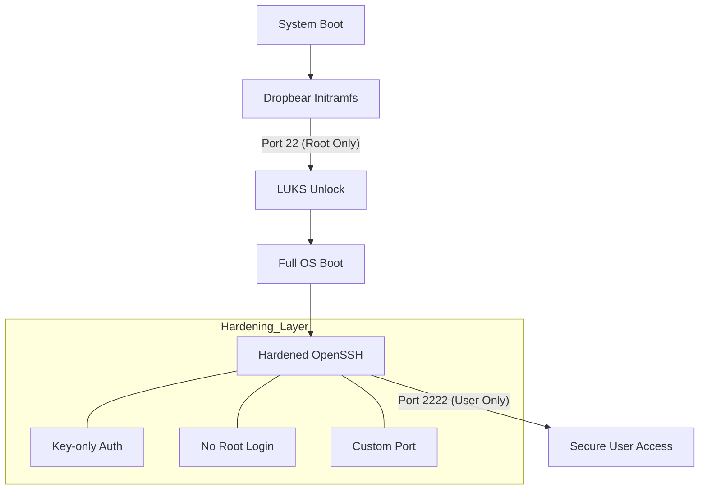
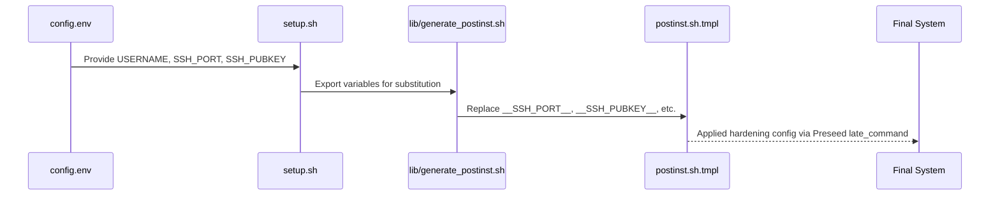

<details>
<summary>Relevant source files</summary>

The following files were used as context for generating this wiki page:

- [lib/generate\_postinst.sh](lib/generate_postinst.sh)
- [README.md](README.md)
- [setup.sh](setup.sh)
- [lib/generate\_preseed.sh](lib/generate_preseed.sh)
- [lib/kexec\_boot.sh](lib/kexec_boot.sh)
</details>

# SSH Hardening

SSH Hardening is a core security feature of the `vps-setup` project, designed to protect the system from unauthorized access through the Secure Shell protocol. The implementation follows a multi-layered approach that includes disabling password authentication, utilizing custom communication ports, and implementing a dual-service architecture for pre-boot and post-boot environments.

The hardening process is primarily orchestrated during the post-installation phase via templates and variables defined in the configuration environment. It integrates with system-level security tools like UFW (Uncomplicated Firewall) and Fail2ban to provide a robust defense-in-depth strategy.

Sources: [README.md:12](README.md#L12), [setup.sh:13-16](setup.sh#L13-L16)

## Architecture and Service Separation

The project implements a distinct separation between the pre-boot environment (LUKS decryption) and the main operating system. This is achieved by running two different SSH daemons on different ports with different security scopes.

### Pre-boot Remote Unlock (Dropbear)
During the boot process, a `dropbear-initramfs` instance is used exclusively for remote LUKS decryption. This service is constrained to port 22 and only allows a restricted root session to execute `/bin/cryptroot-unlock`.

### Production SSH (OpenSSH)
Once the system is unlocked and fully booted, the standard OpenSSH daemon takes over. This daemon is hardened by disabling root login and moving the service to a custom port (defaulting to 2222) to mitigate automated brute-force attacks.

Sources: [README.md:12](README.md#L12), [README.md:107-118](README.md#L107-L118), [setup.sh:220-222](setup.sh#L220-L222)



The diagram shows the transition from the pre-boot Dropbear service used for encryption unlocking to the hardened OpenSSH service in the main OS.

Sources: [README.md:107-118](README.md#L107-L118), [setup.sh:220-222](setup.sh#L220-L222)

## Hardening Components and Logic

The hardening logic is applied through template substitution during the generation of the post-installation script (`postinst.sh`). The `generate_postinst.sh` library replaces placeholders with user-defined values from `config.env`.

### Key Hardening Features

| Feature | Description | File Context |
| :--- | :--- | :--- |
| **Custom Port** | Moves SSH away from port 22 to a user-defined port (default 2222). | `setup.sh:111-116` |
| **Key-Only Auth** | Disables password-based authentication entirely. | `README.md:83` |
| **Root Disabled** | Prevents direct root login to the main OS OpenSSH daemon. | `README.md:118` |
| **User Restriction** | Restricts access to specific users defined in `ALLOW_USERS`. | `lib/generate_postinst.sh:54` |
| **TCP Forwarding** | Configurable toggle to allow or deny SSH tunneling. | `lib/generate_postinst.sh:50-52` |

Sources: [lib/generate_postinst.sh:50-65](lib/generate_postinst.sh#L50-L65), [README.md:12](README.md#L12), [setup.sh:111-116](setup.sh#L111-L116)

### Configuration Data Flow

The configuration for SSH hardening flows from the `config.env` file through the setup scripts into the final installer configuration.



This diagram illustrates how user-defined security parameters are injected into the post-installation templates to configure the final server environment.

Sources: [setup.sh:103-125](setup.sh#L103-L125), [lib/generate_postinst.sh:20-80](lib/generate_postinst.sh#L20-L80)

## Integration with Defensive Tools

SSH hardening is reinforced by the automatic deployment of `ufw` and `fail2ban`. The setup script ensures that only the custom SSH port is allowed through the firewall, while `fail2ban` monitors the SSH jails for suspicious activity.

- **Firewall:** UFW is configured with a "default deny incoming" policy, specifically opening only the designated `SSH_PORT`.
- **Intrusion Prevention:** Fail2ban is activated with specific jails for SSH to block IPs exhibiting malicious behavior.

Sources: [README.md:12](README.md#L12), [setup.sh:224](setup.sh#L224)

## Implementation Details

The `lib/generate_postinst.sh` script handles the preparation of these settings. It uses `sed` to escape and inject the following parameters into the deployment script:

```bash
# Example of template substitution in lib/generate_postinst.sh
sed \
    -e "s|__USERNAME__|$(sed_escape "${USERNAME}")|g" \
    -e "s|__SSH_PORT__|$(sed_escape "${SSH_PORT}")|g" \
    -e "s|__SSH_PUBKEY__|$(sed_escape "${SSH_PUBKEY}")|g" \
    -e "s|__ALLOW_SSH_FORWARDING__|$(sed_escape "${allow_tcp}")|g" \
    "${template_file}" > "${output_file}"
```

Sources: [lib/generate_postinst.sh:58-62](lib/generate_postinst.sh#L58-L62)

## Summary of Security Baseline
The project creates an immutable baseline backup of all security configuration files in `/root/security-baseline/` after installation. This allows administrators to verify that the hardening parameters, such as the disabled password authentication and custom port settings, remain intact post-deployment.

Sources: [README.md:148](README.md#L148)
