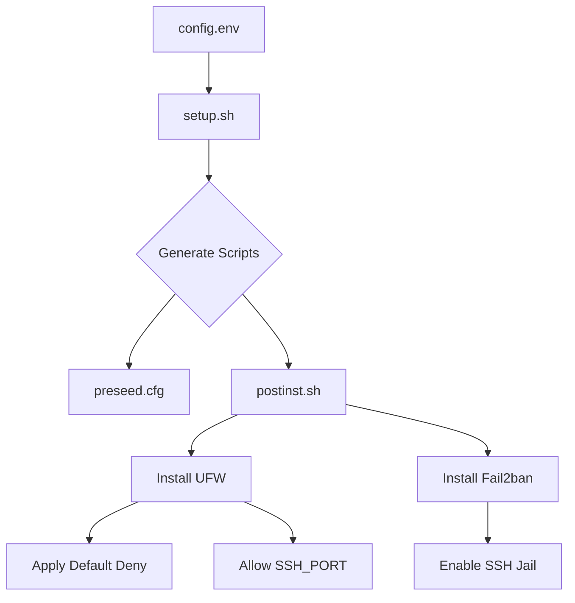
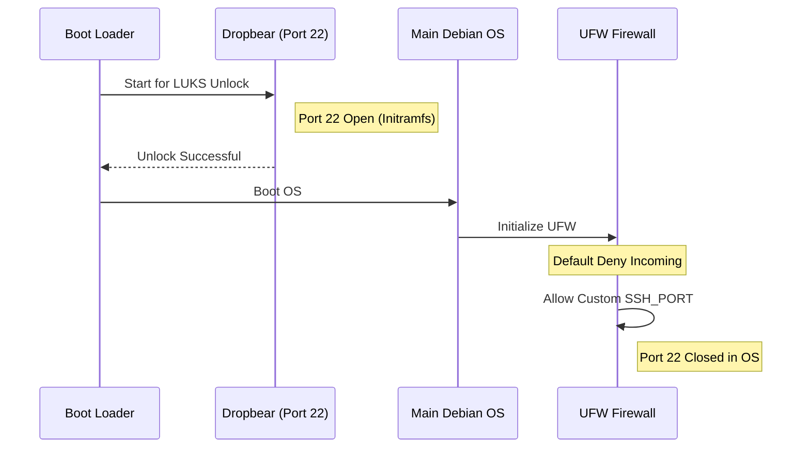

<details>
<summary>Relevant source files</summary>

The following files were used as context for generating this wiki page:

- [lib/generate\_postinst.sh](lib/generate_postinst.sh)
- [setup.sh](setup.sh)
- [README.md](README.md)
- [lib/generate\_preseed.sh](lib/generate_preseed.sh)
- [lib/kexec\_boot.sh](lib/kexec_boot.sh)

</details>

# Firewall & Fail2ban Setup

The Firewall and Fail2ban setup is a core component of the `vps-setup` security hardening suite. It implements a "default deny" posture for incoming network traffic, ensuring that only explicitly allowed services—primarily the hardened SSH daemon—are accessible from the public internet. This configuration is automated via a post-installation script generated during the setup process.

Sources: [README.md:16](README.md#L16), [setup.sh:15](setup.sh#L15)

## Architectural Overview

The security layer is applied during the `postinst.sh` execution phase, which occurs inside the newly installed Debian system. The architecture relies on Uncomplicated Firewall (UFW) for packet filtering and Fail2ban for automated intrusion prevention, specifically targeting SSH brute-force attempts.

### Security Components
*  **UFW (Uncomplicated Firewall):** Configured with a default policy to deny all incoming traffic. It explicitly permits the custom SSH port defined in the configuration.
*  **Fail2ban:** Deployed with an active "SSH jail" to monitor logs and ban IP addresses exhibiting malicious behavior.
*  **Dropbear (initramfs):** Operates on port 22 strictly for pre-boot LUKS decryption, distinct from the main OS firewall and SSH configurations.

Sources: [README.md:16-17](README.md#L16-L17), [setup.sh:190-200](setup.sh#L190-L200)

## Network Security Configuration

The system uses specific configuration variables to generate the firewall rules and hardening scripts. These variables are sourced from `config.env` and injected into the post-installation templates.

### Firewall & Port Configuration Summary

| Feature | Implementation | Configuration Variable |
| :--- | :--- | :--- |
| **Incoming Policy** | Default Deny | N/A |
| **SSH Port** | Custom (Must not be 22) | `SSH_PORT` |
| **Fail2ban Jails** | SSH active by default | N/A |
| **TCP Forwarding** | Configurable | `ALLOW_SSH_FORWARDING` |

Sources: [README.md:95](README.md#L95), [setup.sh:128-135](setup.sh#L128-L135), [lib/generate_postinst.sh:56-59](lib/generate_postinst.sh#L56-L59)

### Logical Flow of Security Provisioning

The following diagram illustrates how security configurations move from the initial setup environment into the final hardened VPS.



The diagram shows the transition from configuration variables to the active enforcement of firewall rules and monitoring jails.
Sources: [lib/generate_postinst.sh:65-92](lib/generate_postinst.sh#L65-L92), [setup.sh:354-360](setup.sh#L354-L360)

## Implementation Details

### SSH Hardening and Firewall Integration
The setup script enforces that `SSH_PORT` is not set to 22, as port 22 is reserved for the Dropbear SSH instance used for remote LUKS unlocking. The firewall is instructed to open the custom port specified by the user.

Sources: [setup.sh:128-135](setup.sh#L128-L135), [README.md:139-142](README.md#L139-L142)

### Script Generation and Template Substitution
The `lib/generate_postinst.sh` script is responsible for escaping and injecting network-related variables into the `postinst.sh.tmpl` template. This includes the SSH port and the allowed users list.

```bash
# Example of variable injection for firewall/SSH hardening
sed \
    -e "s|__SSH_PORT__|$(sed_escape "${SSH_PORT}")|g" \
    -e "s|__ALLOW_USERS__|$(sed_escape "${allow_users}")|g" \
    -e "s|__ALLOW_SSH_FORWARDING__|$(sed_escape "${allow_tcp}")|g" \
    "${template_file}" > "${output_file}"
```

Sources: [lib/generate_postinst.sh:76-79](lib/generate_postinst.sh#L76-L79)

### Service Separation
A critical security feature is the separation of the pre-boot environment and the main OS environment. The firewall configuration in the main OS does not affect the Dropbear instance, which is only active during the initramfs stage.



The sequence diagram demonstrates the lifecycle of network access from pre-boot unlocking to the final protected state of the OS.
Sources: [README.md:139-145](README.md#L139-L145), [lib/kexec_boot.sh:105-115](lib/kexec_boot.sh#L105-L115)

## Conclusion
The Firewall & Fail2ban setup provides an automated, robust security baseline by integrating UFW and Fail2ban into the Debian installation process. By utilizing custom ports and a default-deny policy, the system minimizes the attack surface while ensuring that administrative access remains secure and monitored.

Sources: [README.md:15-18](README.md#L15-L18), [setup.sh:14-20](setup.sh#L14-L20)
