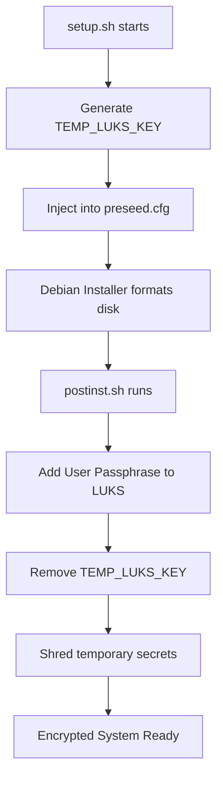
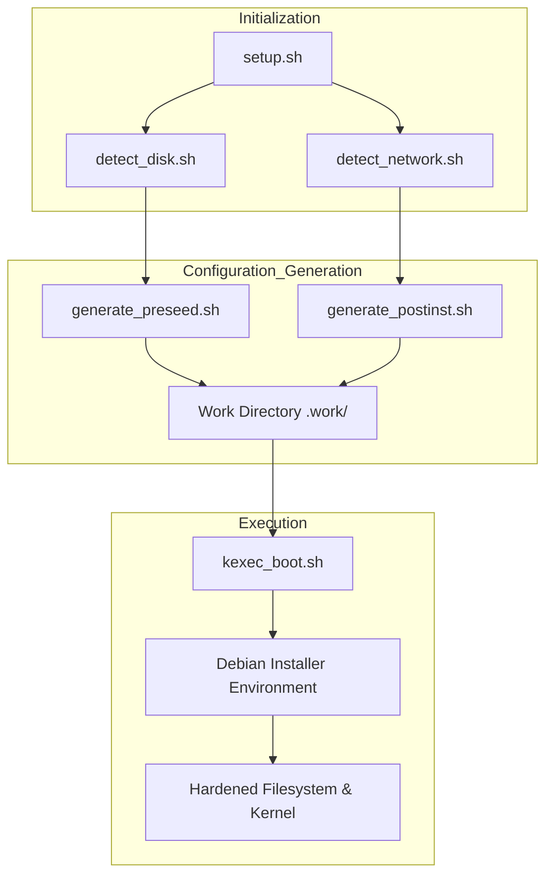

Relevant source files

The following files were used as context for generating this wiki page:

- [lib/generate_postinst.sh](lib/generate_postinst.sh)
- [README.md](README.md)
- [setup.sh](setup.sh)
- [lib/generate_preseed.sh](lib/generate_preseed.sh)
- [lib/detect_disk.sh](lib/detect_disk.sh)

# Kernel & Filesystem Hardening

Kernel and filesystem hardening in the `vps-setup` project provides a multi-layered security approach to automated Debian installations. This system implements restricted access controls, cryptographic volume protection, and optimized kernel parameters to minimize the attack surface of a newly deployed Virtual Private Server (VPS). 

The scope includes full-disk encryption using LUKS, strict mounting policies for temporary filesystems, and the integration of auditing tools like `auditd` to monitor system integrity. These configurations are prepared during the pre-installation phase and applied through a generated post-installation script that runs within the target environment.
Sources: [README.md:14-22](README.md#L14-L22), [setup.sh:10-20](setup.sh#L10-L20)

## Cryptographic Storage Hardening

The core of the system's hardening strategy is LUKS2 full-disk encryption. The project automates the transition from a temporary installation key to a permanent user-defined passphrase, ensuring that no unencrypted data remains on the primary OS disk.

### LUKS Key Lifecycle
1. **Initial Encryption**: A temporary random 32-byte hexadecimal key (`TEMP_LUKS_KEY`) is generated to allow the Debian installer to format partitions non-interactively.
2. **Key Rotation**: During the post-installation phase, the user's real passphrase is added to the LUKS keyslot.
3. **Purge**: The temporary installer key is removed from the LUKS header, and the temporary key file is shredded.
Sources: [lib/generate_preseed.sh:23-25](lib/generate_preseed.sh#L23-L25), [README.md:154-162](README.md#L154-L162)

The following diagram illustrates the flow of cryptographic keys from generation to final system state:

The workflow ensures that the temporary key used by the automated installer does not persist in the final production environment.
Sources: [README.md:154-165](README.md#L154-L165), [lib/generate_postinst.sh:37-45](lib/generate_postinst.sh#L37-L45)

## Filesystem Security Policies

The project enforces strict mounting options for volatile and temporary directories to prevent the execution of malicious binaries and unauthorized privilege escalation.

### Restricted Mount Options
Directories such as `/tmp` and `/dev/shm` are configured with specific security flags in the filesystem table.
- **nodev**: Prevents the interpretation of block or character special devices on the filesystem.
- **nosuid**: Disables the effect of set-user-identifier and set-group-identifier bits.
- **noexec**: Prevents the execution of binaries directly from the partition.
Sources: [README.md:20](README.md#L20), [README.md:214](README.md#L214)

### Data Destruction and Sanitization
During setup, the system provides different levels of disk wiping to ensure previous data cannot be recovered.
| Mode | Mechanism | Security Level |
| :--- | :--- | :--- |
| `fast` | Quick partition table and filesystem removal | Low (Meta-data only) |
| `secure` | Overwrites sectors during installation | High (Sector-level overwrite) |
Sources: [README.md:204-209](README.md#L204-L209), [lib/generate_preseed.sh:66-70](lib/generate_preseed.sh#L66-L70)

## Kernel Hardening & Auditing

Kernel-level protections are applied through `sysctl` restrictions and system auditing tools to monitor and mitigate runtime threats.

### System Auditing and Monitoring
The project installs and configures `auditd` to provide a baseline for security events. This allows administrators to track changes to critical system files and monitor sensitive syscalls. Additionally, a "security baseline" is created by backing up all initial security configurations to `/root/security-baseline/`.
Sources: [README.md:20](README.md#L20), [README.md:180](README.md#L180), [setup.sh:176](setup.sh#L176)

### Sysctl Restrictions
Configuration templates apply `sysctl` hardening to the kernel, which typically includes:
- Disabling IP forwarding (unless specified).
- Protecting against ICMP redirects.
- Enabling kernel-level address space layout randomization (ASLR) support.
Sources: [setup.sh:176](setup.sh#L176), [lib/generate_postinst.sh:58-62](lib/generate_postinst.sh#L58-L62)

## Component Architecture for Hardening

The hardening logic is distributed across several library scripts that prepare the environment for the final `kexec` jump.

This architecture separates the detection of hardware (disks/network) from the generation of security policies, allowing for dry-run inspections before applying hardening measures.
Sources: [setup.sh:290-330](setup.sh#L290-L330), [lib/detect_disk.sh:11-20](lib/detect_disk.sh#L11-L20)

## Security Configuration Summary

| Feature | Implementation Component | File Path |
| :--- | :--- | :--- |
| **LUKS2 FDE** | Partman Auto-Crypto | `templates/preseed.cfg.tmpl` |
| **Secure /tmp** | Mount Options Flag | `README.md` |
| **Audit Logs** | auditd package | `setup.sh` |
| **Secret Shredding** | `shred -u` command | `lib/generate_postinst.sh` |
| **SSH Hardening** | Custom Port / No Root | `lib/generate_postinst.sh` |
Sources: [README.md:19-22](README.md#L19-L22), [lib/generate_postinst.sh:40-70](lib/generate_postinst.sh#L40-L70), [lib/generate_preseed.sh:50-60](lib/generate_preseed.sh#L50-L60)

## Summary
Kernel & Filesystem Hardening in the `vps-setup` repository is a systematic process of securing a VPS from the ground up. By utilizing LUKS for storage encryption, enforcing strict filesystem mount flags (`noexec`, `nosuid`, `nodev`), and implementing kernel-level auditing via `auditd`, the project provides a robust security foundation. The automation of these tasks ensures that security best practices are applied consistently without manual intervention, significantly reducing the likelihood of misconfiguration.
