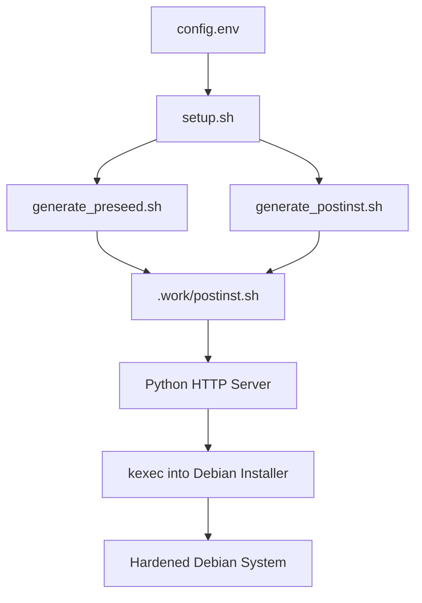
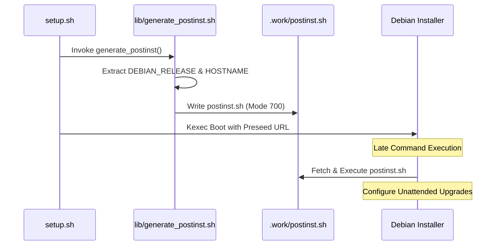

Relevant source files

The following files were used as context for generating this wiki page:

- [lib/generate_postinst.sh](lib/generate_postinst.sh)
- [README.md](README.md)
- [setup.sh](setup.sh)
- [lib/generate_preseed.sh](lib/generate_preseed.sh)
- [lib/download.sh](lib/download.sh)

# Unattended Upgrades

Unattended Upgrades is a core system maintenance feature within the `vps-setup` project designed to ensure the security and stability of the reinstalled Debian system. Its primary purpose is to automate the installation of critical security patches without requiring manual intervention from the administrator. This feature is part of the project's broader server hardening suite, which includes UFW firewall configuration, Fail2ban integration, and kernel hardening.

Sources: [README.md:16](README.md#L16), [setup.sh:15](setup.sh#L15)

Within the project's architecture, Unattended Upgrades are configured strictly for Debian security patches (labeled as `-security`). This ensures that while the system stays protected against known vulnerabilities, normal package upgrades or feature changes are not automatically applied, preventing unexpected breakage of system services or configurations.

Sources: [README.md:210-211](README.md#L210-L211)

## Configuration and Integration

The Unattended Upgrades feature is integrated into the automated installation workflow via the preseed and post-installation mechanisms. The `setup.sh` script serves as the entry point, coordinating the generation of configuration files that eventually enable the service on the target system.

### Deployment Workflow
The deployment follows a structured path from local configuration to remote execution:

1.  **Template Generation**: The `generate_postinst.sh` and `generate_preseed.sh` scripts prepare the environment by injecting environment variables from `config.env` into system templates.
2.  **Preseed Configuration**: The `preseed.cfg` file instructs the Debian installer to include necessary packages.
3.  **Post-Installation Execution**: The `postinst.sh` script, executed during the `late_command` phase of the installer, applies final hardening and service configurations.

Sources: [lib/generate_postinst.sh:16-18](lib/generate_postinst.sh#L16-L18), [lib/generate_preseed.sh:15-17](lib/generate_preseed.sh#L15-L17), [setup.sh:317-320](setup.sh#L317-L320)

### Orchestration Flow
The following diagram illustrates how the system prepares the environment for automated updates during the setup process:

The diagram shows the transition from local configuration to the final hardened system state where Unattended Upgrades are active.
Sources: [setup.sh:305-345](setup.sh#L305-L345), [lib/kexec_boot.sh:18-35](lib/kexec_boot.sh#L18-L35)

## Technical Implementation

The implementation relies on the `unattended-upgrades` package being present in the final OS. While the specific package list is managed through `config.env` and the `EXTRA_PACKAGES` variable, the feature is highlighted as a standard component of the system's security posture.

### Key Configuration Variables
Several variables defined in the setup phase influence the environment in which upgrades operate:

| Variable | Source | Description |
| :--- | :--- | :--- |
| `DEBIAN_RELEASE` | `config.env` | Target release (e.g., `trixie`) used to define the security repositories. |
| `DEBIAN_MIRROR` | `config.env` | The source repository for fetching security updates. |
| `EXTRA_PACKAGES` | `config.env` | Allows users to ensure `unattended-upgrades` and related tools are installed. |
| `HOSTNAME` | `config.env` | Used for system identification in update logs. |

Sources: [README.md:129-158](README.md#L129-L158), [lib/generate_preseed.sh:31-40](lib/generate_preseed.sh#L31-L40)

### Security Constraints
Unattended Upgrades operate under specific security constraints defined by the project's hardening goals:
*  **Restricted Scope**: Only security-related updates are permitted.
*  **Secure Transport**: During installation, the scripts use temporary random tokens (`INSTALL_TOKEN`) and restricted permissions (mode `700` or `600`) to protect the deployment of configuration logic.
*  **Auditability**: Post-install actions are logged to `/var/log/vps-postinst.log`, and an installation summary is generated at `/root/vps-install-summary.txt` to verify the state of security services.

Sources: [README.md:104-106](README.md#L104-L106), [lib/generate_postinst.sh:30-40](lib/generate_postinst.sh#L30-L40), [README.md:210-211](README.md#L210-L211)

## System Interaction Diagram

This sequence diagram details the interaction between the setup script and the installer components to finalize the security configuration.

This diagram represents the transfer of configuration logic from the host to the target system during the reinstallation process.
Sources: [lib/generate_postinst.sh:22-45](lib/generate_postinst.sh#L22-L45), [lib/kexec_boot.sh:65-80](lib/kexec_boot.sh#L65-L80), [setup.sh:343-345](setup.sh#L343-L345)

## Conclusion

Unattended Upgrades provide a critical "set-and-forget" security layer for the VPS, ensuring that Debian security patches are applied automatically while maintaining system stability by excluding non-security updates. By integrating this into the automated `preseed` and `postinst` workflow, the project ensures every reinstalled instance meets a high security baseline from the first boot.
