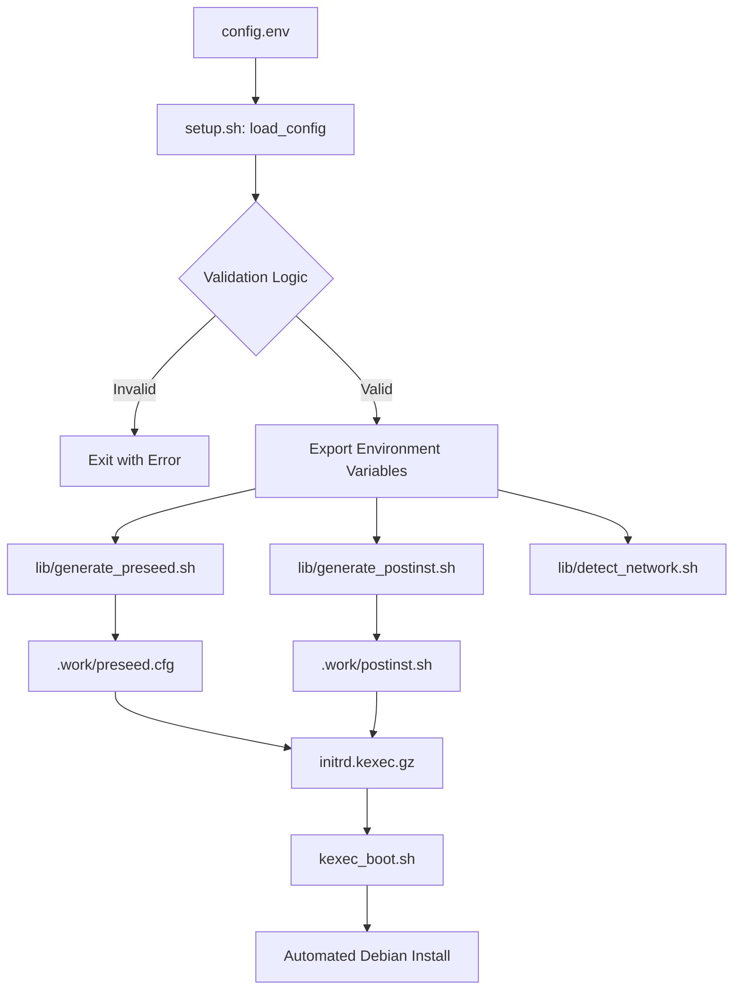
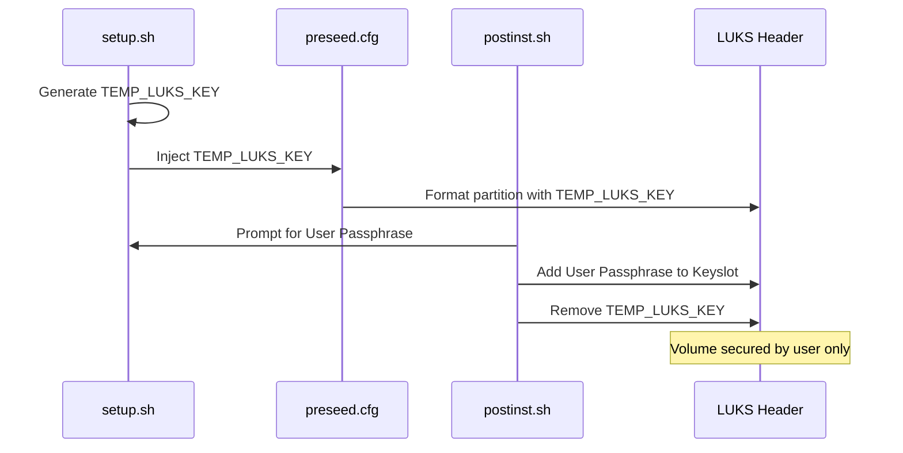

Relevant source files

The following files were used as context for generating this wiki page:

- [README.md](README.md)
- [setup.sh](setup.sh)
- [lib/generate_preseed.sh](lib/generate_preseed.sh)
- [lib/generate_postinst.sh](lib/generate_postinst.sh)
- [lib/detect_network.sh](lib/detect_network.sh)
- [lib/detect_disk.sh](lib/detect_disk.sh)
- [lib/download.sh](lib/download.sh)
- [lib/kexec_boot.sh](lib/kexec_boot.sh)

# Configuration Reference (config.env)

The `config.env` file serves as the central configuration hub for the VPS Setup automation tool. It defines the environment variables that govern the entire Debian reinstallation process, including user identity, network parameters, disk partitioning strategies, and security hardening levels. By editing this file once, users can ensure consistent deployments across multiple rebuilds or various VPS providers.

This configuration is sourced by the main `setup.sh` script and propagated through various library scripts to generate the `preseed.cfg` and `postinst.sh` files. These generated artifacts are ultimately injected into a custom RAMdisk for a fully automated, unattended installation via `kexec`.
Sources: [README.md:1-25](README.md#L1-L25), [setup.sh:163-166](setup.sh#L163-L166)

## Configuration Lifecycle and Data Flow

The configuration defined in `config.env` undergoes a multi-stage validation and transformation process before influencing the target system. The following diagram illustrates how configuration data flows from the environment file to the final installation.

The logic ensures that manual overrides in `config.env` always take precedence over auto-detected system values.
Sources: [setup.sh:163-239](setup.sh#L163-L239), [lib/generate_preseed.sh:22-108](lib/generate_preseed.sh#L22-L108), [lib/kexec_boot.sh:58-75](lib/kexec_boot.sh#L58-L75)

## Core System Configuration

These variables define the identity and basic environment of the new Debian installation.

| Variable | Required | Default | Description |
| :--- | :--- | :--- | :--- |
| `USERNAME` | Yes | — | Non-root user created with NOPASSWD sudo privileges. |
| `HOSTNAME` | No | `vps` | System hostname for the new installation. |
| `DOMAIN` | No | *(empty)* | Domain name (defaults to `local` in preseed if empty). |
| `TIMEZONE` | No | `UTC` | System timezone (e.g., `Asia/Kolkata`). |
| `LOCALE` | No | `en_US.UTF-8` | System locale. |
| `KEYMAP` | No | `us` | Keyboard layout for console and installer. |
| `DEBIAN_RELEASE` | No | `trixie` | Target Debian version (currently Debian 13). |

Sources: [README.md:129-138](README.md#L129-L138), [setup.sh:205-212](setup.sh#L205-L212), [lib/generate_preseed.sh:55-58](lib/generate_preseed.sh#L55-L58)

## Security and SSH Hardening

Security configuration is a primary focus, particularly regarding LUKS encryption and SSH access.

### SSH Variables
The project enforces a custom port for OpenSSH to avoid conflicts with the pre-boot unlock environment.

- **`SSH_PORT`**: Defines the main OpenSSH daemon port. Must not be `22` as that is reserved for `dropbear-initramfs` remote unlocking. (Default: `2222`).
- **`SSH_PUBKEY`**: The SSH public key authorized for the new user. Authentication is key-only by default.
- **`ALLOW_SSH_FORWARDING`**: A boolean (`true`/`false`) that determines if TCP forwarding is permitted in the OpenSSH configuration. (Default: `false`).
- **`ALLOW_USERS`**: Specifically restricts OpenSSH access to listed users (defaults to the `USERNAME` value).

Sources: [README.md:131-133](README.md#L131-L133), [setup.sh:196-203](setup.sh#L196-L203), [lib/generate_postinst.sh:53-58](lib/generate_postinst.sh#L53-L58)

### LUKS Encryption Logic
While not a single variable in `config.env`, the LUKS lifecycle is driven by the interaction of the `TEMP_LUKS_KEY` (generated during setup) and the user-provided `LUKS_PASSPHRASE`.

Sources: [lib/generate_preseed.sh:35-37](lib/generate_preseed.sh#L35-L37), [lib/generate_postinst.sh:45-51](lib/generate_postinst.sh#L45-L51), [README.md:195-202](README.md#L195-L202)

## Disk and Role Configuration

The `INSTALL_ROLE` determines how the script handles primary and secondary storage devices.

- **`INSTALL_ROLE="standard"`**: The script auto-detects the current root disk and targets only that disk for reinstallation. Secondary disks are ignored.
- **`INSTALL_ROLE="storage-vps"`**: The script scans for secondary disks and prompts for interactive formatting (ext4) and mounting under `/mnt/<hostname>-vol`.
- **`DISK`**: Manual override for the target OS disk (e.g., `/dev/sda`). If empty, the system attempts to trace the parent block device of the current `/` mount.
- **`WIPE_MODE`**: `fast` (default) for quick partition removal or `secure` for overwriting sectors during installation.

Sources: [README.md:46-60](README.md#L46-L60), [lib/detect_disk.sh:12-45](lib/detect_disk.sh#L12-L45), [lib/generate_preseed.sh:79-82](lib/generate_preseed.sh#L79-L82)

## Network Configuration

Network settings are critical for `kexec` to maintain connectivity during the transition to the installer.

| Variable | Source | Logic |
| :--- | :--- | :--- |
| `INTERFACE` | `ip route` | Auto-detects the interface with the default route. Filters virtual interfaces like `docker*` or `veth*`. |
| `IPV4_ADDRESS` | `ip addr` | The static IPv4 address to be assigned to the new system. |
| `IPV4_NETMASK` | `ip addr` | The subnet mask. Supports both dotted-decimal and CIDR formats. |
| `IPV4_GATEWAY` | `ip route` | The default IPv4 gateway. |
| `DNS_SERVERS` | `/etc/resolv.conf` | Space-separated list of DNS servers. Defaults to `1.1.1.1 1.0.0.1` if not detected. |

Sources: [lib/detect_network.sh:16-58](lib/detect_network.sh#L16-L58), [setup.sh:221-233](setup.sh#L221-L233)

## Software and Mirror Configuration

- **`DEBIAN_MIRROR`**: The APT mirror URL. The script enforces **HTTPS** for security and performs auto-upgrade of legacy HTTP mirrors (e.g., `deb.debian.org`) to their HTTPS equivalents.
- **`EXTRA_PACKAGES`**: A space-separated list of additional Debian packages to be installed during the automated setup.

Sources: [setup.sh:215-227](setup.sh#L215-L227), [lib/download.sh:13-30](lib/download.sh#L13-L30)

## Conclusion

The `config.env` file is the foundational blueprint for the automated deployment. By integrating user-defined variables with robust auto-detection and validation logic, the system ensures that complex configurations—such as LUKS encryption, remote SSH unlocking, and specific network topologies—are applied consistently and securely during the `kexec`-driven installation process.
