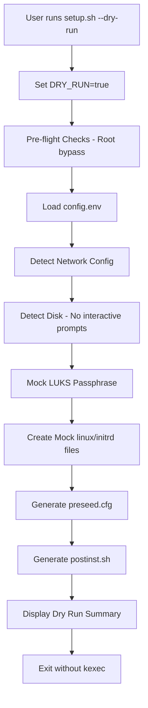
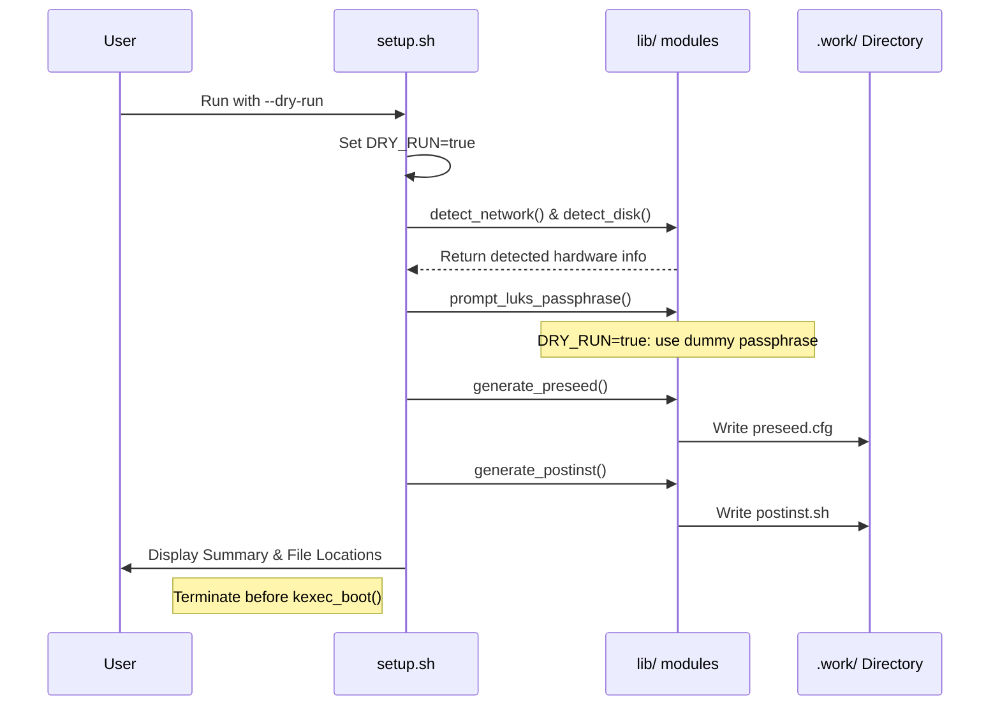

<details>
<summary>Relevant source files</summary>

The following files were used as context for generating this wiki page:

- [setup.sh](setup.sh)
- [README.md](README.md)
- [lib/generate_preseed.sh](lib/generate_preseed.sh)
- [lib/generate_postinst.sh](lib/generate_postinst.sh)
- [lib/detect_disk.sh](lib/detect_disk.sh)
</details>

# Dry Run Mode

Dry Run Mode is a diagnostic and safety feature within the `vps-setup` project that allows users to simulate the entire Debian reinstallation process without making any changes to the host system. It generates all necessary configuration files, including the Debian preseed and post-installation hardening scripts, based on the current environment and `config.env` settings.

The primary purpose of this mode is to allow for the inspection of generated artifacts before committing to the destructive `kexec` execution. It bypasses root-only requirements, skips actual netboot file downloads, and mocks encryption secrets to provide a complete view of the installation logic that would be applied during a live run.

Sources: [setup.sh:343-348](setup.sh#L343-L348), [README.md:36-39](README.md#L36-L39), [README.md:79-81](README.md#L79-L81)

## Execution Flow and Logic

When Dry Run Mode is activated, the script alters the standard installation pipeline to prioritize file generation and environmental reporting over execution. It sets a global `DRY_RUN` variable to `true`, which is then utilized by various library modules to branch logic and suppress destructive or high-resource commands.

### Logic Branching
The system behavior changes in the following ways during a dry run:
- **Privilege Requirements**: The check for root (EUID 0) is bypassed, allowing non-root users to test configuration generation.
- **Dependency Management**: Missing dependencies trigger warnings rather than installation attempts.
- **Secrets Management**: Instead of prompting the user for a real LUKS passphrase, the system generates a dummy "dryrun-test-passphrase-123" to facilitate template substitution.
- **Network & Disk Detection**: Scanners still run to provide an accurate summary, but secondary disk modification prompts are bypassed by defaulting to "untouched" status.
- **Resource Acquisition**: Actual downloads of the Debian kernel and initrd are skipped; instead, zero-byte mock files are created in the working directory.

Sources: [setup.sh:105-108](setup.sh#L105-L108), [setup.sh:146-148](setup.sh#L146-L148), [setup.sh:267-271](setup.sh#L267-L271), [setup.sh:425-427](setup.sh#L425-L427), [lib/detect_disk.sh:138-141](lib/detect_disk.sh#L138-L141)

### Architectural Flow Diagram
The following flowchart illustrates how Dry Run Mode intercepts the standard installation process.



The diagram shows the sequential path of the script when the `--dry-run` flag is passed, specifically highlighting the mocking and bypass points.
Sources: [setup.sh:343-449](setup.sh#L343-L449)

## Core Components and File Artifacts

Dry Run Mode focuses on the generation of the `.work/` directory contents. These artifacts are the exact files that would be injected into the RAMdisk payload during a real installation.

| Artifact | File Path | Description |
| :--- | :--- | :--- |
| **Preseed Config** | `.work/preseed.cfg` | The automated Debian installer configuration containing network, mirror, and partitioning recipes. |
| **Post-Install Script** | `.work/postinst.sh` | The hardening script containing SSH configuration, firewall rules, and security policies. |
| **Mock Kernel** | `.work/linux` | A zero-byte placeholder for the Debian installer kernel. |
| **Mock Initrd** | `.work/initrd.gz` | A zero-byte placeholder for the Debian installer initrd. |
| **Mock Secrets** | `.work/[TOKEN]/.secret_keys.enc` | An encrypted payload containing the dummy LUKS passphrase. |

Sources: [setup.sh:332-340](setup.sh#L332-L340), [lib/generate_postinst.sh:40-45](lib/generate_postinst.sh#L40-L45), [lib/generate_preseed.sh:21-25](lib/generate_preseed.sh#L21-L25)

### Function Interoperability
Several key functions across the library scripts specifically check the `DRY_RUN` variable:

- `cleanup()`: Prevents the secure shredding of generated files at the end of the script so they can be inspected.
- `prompt_luks_passphrase()`: Automatically exports a dummy `LUKS_PASSPHRASE`.
- `detect_secondary_disks()`: Disables interactive terminal prompts, preventing the script from hanging in automated testing environments.

Sources: [setup.sh:91-95](setup.sh#L91-L95), [setup.sh:267-273](setup.sh#L267-L273), [lib/detect_disk.sh:138-141](lib/detect_disk.sh#L138-L141)

## Usage and Inspection

To initiate Dry Run Mode, the user must provide the `--dry-run` or `-n` flag.

```bash
# Execute Dry Run
sudo ./setup.sh --dry-run

# Inspect artifacts
cat .work/preseed.cfg
cat .work/postinst.sh
```

Sources: [setup.sh:353-358](setup.sh#L353-L358), [README.md:83-85](README.md#L83-L85)

### Sequence of Interaction
The sequence diagram below shows how the user interacts with the system during a dry run compared to a live installation.



The sequence demonstrates the termination of the script before any system-level changes occur, ensuring the host OS remains untouched.
Sources: [setup.sh:343-453](setup.sh#L343-L453), [lib/generate_preseed.sh:15-18](lib/generate_preseed.sh#L15-L18)

## Summary of Significance

Dry Run Mode is a critical tool for verifying that the auto-detection logic for networks (via `detect_network.sh`) and disks (via `detect_disk.sh`) correctly interprets the VPS environment. By inspecting the generated `preseed.cfg` and `postinst.sh`, developers can ensure that the partitioning recipes and network configurations match the expected hardware profile before triggering the irreversible `kexec` boot process.

Sources: [setup.sh:331-341](setup.sh#L331-L341), [README.md:144-148](README.md#L144-L148)
