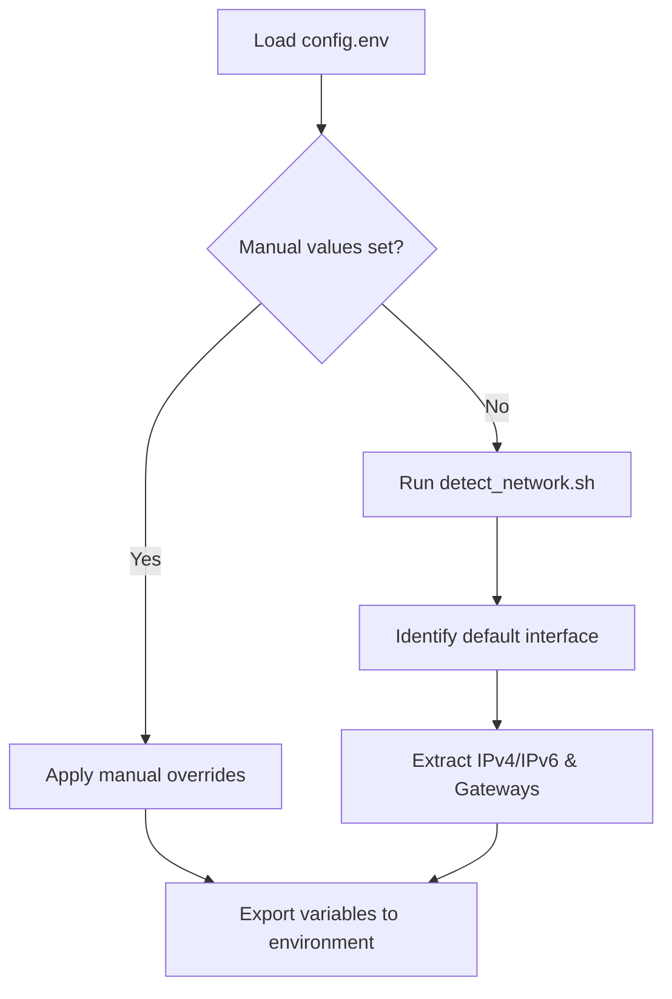
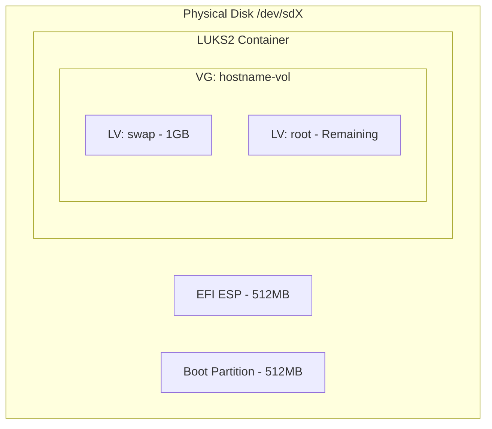

Relevant source files

The following files were used as context for generating this wiki page:

- [README.md](README.md)
- [setup.sh](setup.sh)
- [lib/detect_network.sh](lib/detect_network.sh)
- [lib/detect_disk.sh](lib/detect_disk.sh)
- [lib/generate_preseed.sh](lib/generate_preseed.sh)
- [lib/generate_postinst.sh](lib/generate_postinst.sh)

# Configuration Reference (config.env)

The `config.env` file serves as the central configuration hub for the VPS Setup automation project. It defines the parameters for user accounts, network settings, disk partitioning, and security hardening, allowing for consistent and repeatable deployments across different VPS instances.

This file is sourced by the main `setup.sh` script and its libraries to populate variables used in generating the Debian preseed configuration and post-installation hardening scripts. While many values are auto-detected from the running system, `config.env` provides the necessary overrides and user-specific details required for a successful installation.
Sources: [README.md:46-51](README.md#L46-L51), [setup.sh:166-173](setup.sh#L166-L173)

## Core Configuration Parameters

The configuration is divided into user identity, network infrastructure, and system behavior settings. Required fields must be set by the user, while optional fields utilize sensible defaults or auto-detection logic.

### User and Access Security
These settings define the primary non-root user and the parameters for SSH access. The system enforces key-only authentication; passwords for the new user are locked by default.

| Field | Required | Default | Description |
|-------|----------|---------|-------------|
| `USERNAME` | Yes | — | Non-root user with NOPASSWD sudo privileges. |
| `SSH_PORT` | No | `2222` | The port for the main OpenSSH daemon. Must not be 22. |
| `SSH_PUBKEY` | Yes | — | Public key for SSH authentication. Supports Ed25519, RSA, etc. |
| `ALLOW_SSH_FORWARDING` | No | `false` | Enables or disables TCP port forwarding. |

Sources: [README.md:129-142](README.md#L129-L142), [setup.sh:176-194](setup.sh#L176-L194), [lib/generate_postinst.sh:50-53](lib/generate_postinst.sh#L50-L53)

### Network Configuration
The script attempts to auto-detect these values using `iproute2` commands. If auto-detection fails or specific static values are required, they should be defined here.

The diagram shows the precedence logic where `config.env` values override auto-detected network parameters.
Sources: [lib/detect_network.sh:15-66](lib/detect_network.sh#L15-L66)

| Field | Description |
|-------|-------------|
| `IPV4_ADDRESS` | Static IPv4 address for the new installation. |
| `IPV4_NETMASK` | Subnet mask (dotted decimal or CIDR prefix). |
| `IPV4_GATEWAY` | Default gateway for IPv4 traffic. |
| `DNS_SERVERS` | Space-separated list of DNS servers (e.g., `1.1.1.1 1.0.0.1`). |
| `INTERFACE` | Target network interface name. |

Sources: [README.md:144-150](README.md#L144-L150), [lib/detect_network.sh:68-83](lib/detect_network.sh#L68-L83)

## Installation Roles and Disk Management

The `INSTALL_ROLE` variable determines how the script handles primary and secondary storage devices.

### Role Logic
- **standard**: Focuses exclusively on the primary OS disk. Secondary disks are ignored.
- **storage-vps**: Scans for additional disks and provides interactive prompts for formatting (ext4) and mounting under `/mnt/<hostname>-vol`.

Sources: [README.md:32-44](README.md#L32-L44), [lib/detect_disk.sh:10-14](lib/detect_disk.sh#L10-L14)

### Disk Partitioning Schema
The project uses LVM on top of LUKS2 encryption. The `DISK` parameter can be manually set (e.g., `/dev/sda`) or auto-detected by tracing the root mount point (`/`).

This diagram illustrates the default partitioning layout generated by the preseed recipe based on the `BOOT_MODE` (UEFI vs BIOS).
Sources: [README.md:156-165](README.md#L156-L165), [lib/generate_preseed.sh:45-51](lib/generate_preseed.sh#L45-L51)

## System Environment and Packages

| Field | Default | Description |
|-------|---------|-------------|
| `HOSTNAME` | `vps` | System hostname used in network and LVM naming. |
| `TIMEZONE` | `Asia/Kolkata` | System timezone. |
| `LOCALE` | `en_US.UTF-8` | System locale and language settings. |
| `DEBIAN_RELEASE` | `trixie` | The target Debian suite (e.g., trixie/testing). |
| `DEBIAN_MIRROR` | `https://deb.debian.org/debian` | APT repository source. |
| `EXTRA_PACKAGES` | — | Additional packages to be installed during preseed. |

Sources: [README.md:129-152](README.md#L129-L152), [setup.sh:204-213](setup.sh#L204-L213)

## Security Configuration
The configuration influences several hardening measures implemented during the post-installation phase:
- **Unattended Upgrades**: Restricted to security patches only.
- **Firewall**: UFW defaults to "deny incoming" with specific exceptions for the configured `SSH_PORT`.
- **LUKS Rotation**: The script uses a `TEMP_LUKS_KEY` for the initial automated install, which is then replaced by the user's `LUKS_PASSPHRASE` during post-installation.
Sources: [README.md:168-176](README.md#L168-L176), [lib/generate_postinst.sh:38-47](lib/generate_postinst.sh#L38-L47)

## Summary of Significant Files
The configuration logic is distributed across the following components:
- `setup.sh`: Validates core requirements like `USERNAME` and `SSH_PUBKEY`.
- `lib/detect_network.sh`: Provides fallback values for network fields.
- `lib/detect_disk.sh`: Implements the `INSTALL_ROLE` logic for disk selection.
- `lib/generate_preseed.sh`: Maps configuration variables to the `preseed.cfg` template.
- `lib/generate_postinst.sh`: Maps configuration to the `postinst.sh` hardening script.

The `config.env` file is the primary interface for users to control the behavior of these scripts without modifying the underlying logic.
Sources: [setup.sh:166-220](setup.sh#L166-L220), [lib/generate_preseed.sh:65-90](lib/generate_preseed.sh#L65-L90)
