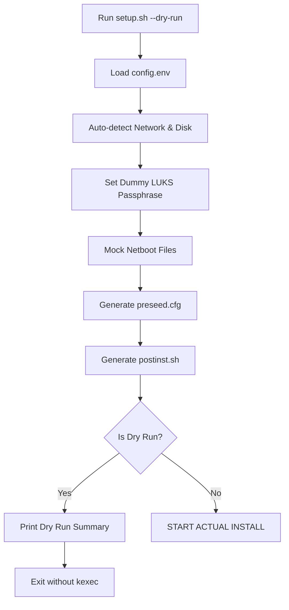

<details>
<summary>Relevant source files</summary>

The following files were used as context for generating this wiki page:

- [README.md](README.md)
- [setup.sh](setup.sh)
- [lib/detect_disk.sh](lib/detect_disk.sh)
- [lib/generate_postinst.sh](lib/generate_postinst.sh)
- [lib/generate_preseed.sh](lib/generate_preseed.sh)
- [lib/detect_network.sh](lib/detect_network.sh)
</details>

# Dry Run Mode

Dry Run Mode is a diagnostic and safety feature within the VPS Setup project that allows users to generate and inspect all installation configuration files without executing any destructive actions or modifying the running system. It is designed to validate the auto-detection logic for network and disk configurations and to verify the final templates for the Debian installer.

Sources: [README.md:19](README.md#L19), [setup.sh:255-257](setup.sh#L255-L257)

When activated, the system bypasses the actual downloading of netboot files, suppresses the `kexec` execution (the "point of no return"), and prevents the deletion of temporary working files, allowing for manual inspection of the generated scripts in the `.work/` directory.

Sources: [setup.sh:100-103](setup.sh#L100-L103), [setup.sh:319-322](setup.sh#L319-L322)

## Execution and Logic Flow

Dry Run Mode is triggered by passing the `--dry-run` or `-n` flags to the main `setup.sh` script. This sets a global `DRY_RUN` environment variable to `true`, which alters the behavior of various internal modules.

### High-Level Dry Run Sequence
The following diagram illustrates how Dry Run Mode intercepts the standard installation flow:



Sources: [setup.sh:255-265](setup.sh#L255-L265), [setup.sh:316-322](setup.sh#L316-L322)

## Component Behavior in Dry Run

Several modules adjust their logic when `DRY_RUN` is active to ensure the script remains non-destructive while providing accurate configuration previews.

### Pre-flight and Configuration
In Dry Run Mode, the script relaxes certain requirements. For instance, the script typically requires root privileges, but this check is bypassed during a dry run to allow users to test configuration generation on non-privileged environments.

Sources: [setup.sh:110-113](setup.sh#L110-L113), [setup.sh:163-166](setup.sh#L163-L166)

### Disk and Network Detection
The detection modules run as normal to ensure the generated files contain the correct metadata for the target hardware. However, the `detect_secondary_disks` function defaults to leaving secondary disks "UNTOUCHED" during a dry run to prevent interactive prompts or accidental markings for formatting.

Sources: [lib/detect_disk.sh:137-140](lib/detect_disk.sh#L137-L140), [lib/detect_network.sh:18-20](lib/detect_network.sh#L18-L20)

### Security and LUKS Passphrases
Since Dry Run Mode is used for template inspection, the script avoids sensitive interactive prompts. If `LUKS_PASSPHRASE` is not provided, the system assigns a dummy value (`dryrun-test-passphrase-123`) to satisfy the template requirements for `preseed.cfg` and `postinst.sh`.

Sources: [setup.sh:221-226](setup.sh#L221-L226)

## Generated Artifacts

During a dry run, the script populates the `.work/` directory with specific artifacts. Unlike a standard run, these files are not shredded upon exit.

| File | Description | Source |
| :--- | :--- | :--- |
| `preseed.cfg` | Debian installer configuration including partitioning recipes. | [lib/generate_preseed.sh:17](lib/generate_preseed.sh#L17) |
| `postinst.sh` | Post-installation hardening script containing SSH and firewall rules. | [lib/generate_postinst.sh:17](lib/generate_postinst.sh#L17) |
| `linux` | Mock/empty file representing the Debian kernel (in Dry Run). | [setup.sh:305-306](setup.sh#L305-L306) |
| `initrd.gz` | Mock/empty file representing the Debian initrd (in Dry Run). | [setup.sh:305-306](setup.sh#L305-L306) |

## Data Substitution Logic

The transformation of templates into final artifacts is handled by `lib/generate_preseed.sh` and `lib/generate_postinst.sh`. These scripts use `sed` to replace placeholders with auto-detected or configured values.

```bash
# Example of substitution used in Dry Run
sed \
    -e "s|__USERNAME__|$(sed_escape "${USERNAME}")|g" \
    -e "s|__SSH_PORT__|$(sed_escape "${SSH_PORT}")|g" \
    "${template_file}" > "${output_file}"
```

Sources: [lib/generate_postinst.sh:54-58](lib/generate_postinst.sh#L54-L58), [lib/generate_preseed.sh:65-70](lib/generate_preseed.sh#L65-L70)

## Conclusion

Dry Run Mode provides a critical validation layer for the VPS Setup process. By generating identical configuration files to those used in a live installation—while mocking external dependencies and bypassing the `kexec` execution—it ensures that the user can audit the networking, partitioning, and security configurations before committing to a full system reinstallation.

Sources: [setup.sh:324-335](setup.sh#L324-L335)
