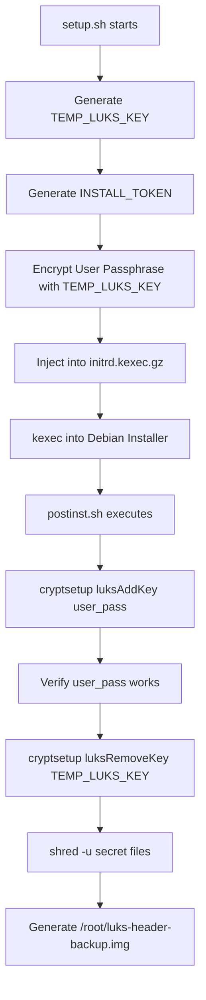

<details>
<summary>Relevant source files</summary>

The following files were used as context for generating this wiki page:

- [lib/generate_postinst.sh](lib/generate_postinst.sh)
- [README.md](README.md)
- [setup.sh](setup.sh)
- [lib/generate_preseed.sh](lib/generate_preseed.sh)
- [lib/kexec_boot.sh](lib/kexec_boot.sh)
- [lib/detect_disk.sh](lib/detect_disk.sh)
</details>

# LUKS Header Backup & Recovery

LUKS Header Backup & Recovery is a critical security and disaster recovery feature within the automated VPS setup project. Its primary purpose is to ensure that the encrypted volume remains accessible even in the event of header corruption, while maintaining a strict security posture during the automated installation process. This is achieved by generating an unencrypted backup of the LUKS2 header following the successful rotation of temporary installation keys to permanent user passphrases.

The system automates the lifecycle of LUKS keys, transitioning from a temporary random key used during the Debian preseed installation to a user-defined passphrase. Once the permanent key is verified and the temporary key is purged, the system generates a header backup image to facilitate off-site disaster recovery.
Sources: [README.md:129-137](README.md#L129-L137), [README.md:204-206](README.md#L204-L206)

## Architecture and Key Lifecycle

The LUKS security architecture follows a multi-stage process to ensure no permanent installer key remains on the system. The process begins with the generation of a `TEMP_LUKS_KEY` and concludes with the creation of the header backup file.

### LUKS Key Rotation Flow
1. **Initial Encryption**: `setup.sh` generates a `TEMP_LUKS_KEY` (a 32-byte random hex string) which is injected into the `preseed.cfg`.
2. **Automated Partitioning**: The Debian installer uses this temporary key to encrypt the target disk.
3. **Key Migration**: The `postinst.sh` script (generated by `lib/generate_postinst.sh`) adds the user's real passphrase to a LUKS keyslot using `cryptsetup luksAddKey`.
4. **Verification and Shredding**: The script verifies the real passphrase works, removes the `TEMP_LUKS_KEY` from the header, and shreds all temporary secret files.
5. **Backup Generation**: A final LUKS header backup is created for recovery purposes.

Sources: [lib/generate_preseed.sh:26-28](lib/generate_preseed.sh#L26-L28), [README.md:143-150](README.md#L143-L150), [lib/generate_postinst.sh:42-45](lib/generate_postinst.sh#L42-L45)

### Key Components

| Component | Description | Source File |
| :--- | :--- | :--- |
| `TEMP_LUKS_KEY` | 32-byte random hex string for initial encryption. | [lib/generate_preseed.sh:26](lib/generate_preseed.sh#L26) |
| `INSTALL_TOKEN` | 16-byte random hex string for securing secret transport. | [lib/generate_preseed.sh:22](lib/generate_preseed.sh#L22) |
| `.secret_keys.enc` | AES-256-CBC encrypted payload containing the user passphrase. | [lib/generate_postinst.sh:42-45](lib/generate_postinst.sh#L42-L45) |
| `luks-header-backup.img` | The resulting header backup file (default 600 permissions). | [README.md:151](README.md#L151) |

## Data Flow Diagram

The following diagram illustrates the lifecycle of secrets from the initial setup to the final generation of the header backup.



The diagram shows the sequential transformation of keys and the eventual creation of the recovery image after the temporary installation artifacts are securely destroyed.
Sources: [setup.sh:354-365](setup.sh#L354-L365), [lib/kexec_boot.sh:53-65](lib/kexec_boot.sh#L53-L65), [lib/generate_postinst.sh:34-45](lib/generate_postinst.sh#L34-L45), [README.md:143-151](README.md#L143-L151)

## Backup Implementation

The header backup is generated during the post-installation phase. The path for this backup is configurable but defaults to `/root/luks-header-backup.img`.

### Configuration Elements
The backup process is governed by specific environment variables and template placeholders defined during the generation of the post-install script.

*  **Backup Path**: Defined by `LUKS_HEADER_BACKUP_PATH` (default: `/root/luks-header-backup.img`).
*  **Permissions**: The backup is explicitly created with mode `600` (root read/write only) to prevent unauthorized access.
*  **Verification**: The system generates an `encryption-report.txt` in `/root/` alongside the backup to document the status of the disk encryption.

Sources: [lib/generate_postinst.sh:53-54](lib/generate_postinst.sh#L53-L54), [README.md:151](README.md#L151), [README.md:204-206](README.md#L204-L206)

### Manual Recovery and Retrieval
The project documentation emphasizes that the header backup should be moved off-site for true disaster recovery. If the LUKS header on the disk becomes corrupted, this `.img` file is required to restore access to the encrypted LVM volume group.

To retrieve the backup securely after installation:

```bash
umask 077 && ssh -p 2222 yourname@YOUR_VPS_IP 'sudo cat /root/luks-header-backup.img' > ./luks-header-backup.img
```

Sources: [README.md:162-163](README.md#L162-L163), [README.md:195-197](README.md#L195-L197)

## Security Constraints

The LUKS Header Backup & Recovery system operates under several critical security constraints to prevent leakage of the header or the passphrases:

1.  **Restricted Transport**: The user passphrase is never stored in plain text. It is encrypted using `AES-256-CBC` with the `TEMP_LUKS_KEY` as the password before being injected into the initrd.
2.  **Volatile Secrets**: The `TEMP_LUKS_KEY` and the encrypted secret payload exist only during the installation window. The `postinst.sh` script is responsible for the immediate destruction of these artifacts.
3.  **Sanitization**: Logs such as `/var/log/vps-postinst.log` and the system `syslog` are sanitized to ensure no sensitive LUKS metadata or keys remain in the filesystem.
4.  **Baseline Auditing**: The system creates an immutable baseline in `/root/security-baseline/` which includes backups of security configuration files relevant to the encryption and SSH environment.

Sources: [lib/generate_postinst.sh:42-45](lib/generate_postinst.sh#L42-L45), [README.md:149-150](README.md#L149-L150), [README.md:191-193](README.md#L191-L193), [README.md:208-210](README.md#L208-L210)

## Summary

LUKS Header Backup & Recovery provides a robust mechanism for ensuring long-term access to encrypted VPS volumes. By automating the transition from temporary installation keys to user-defined passphrases and mandating a header backup, the project balances the requirement for "no-touch" automated deployment with high-standard cryptographic security. The resulting `/root/luks-header-backup.img` serves as the primary recovery artifact for disk-level failures.
Sources: [README.md:13-14](README.md#L13-L14), [README.md:143-151](README.md#L143-L151)
