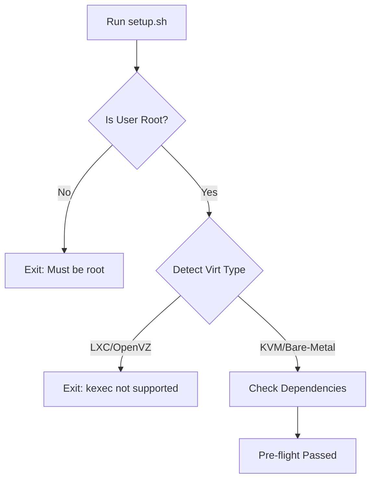
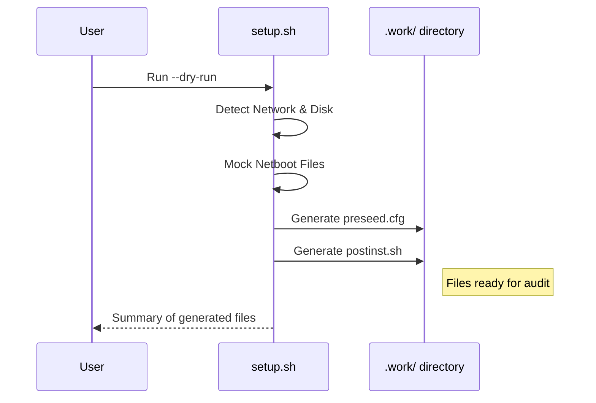
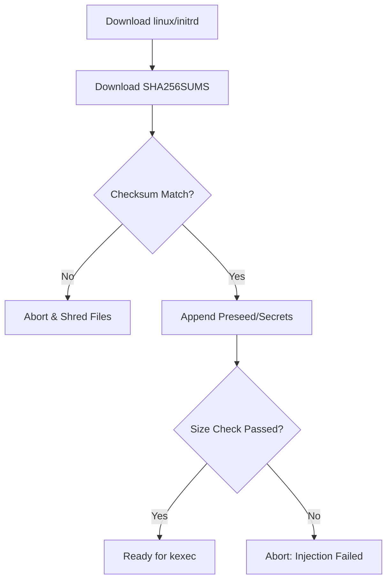

Relevant source files

The following files were used as context for generating this wiki page:

- [README.md](README.md)
- [setup.sh](setup.sh)
- [lib/detect_disk.sh](lib/detect_disk.sh)
- [lib/detect_network.sh](lib/detect_network.sh)
- [lib/download.sh](lib/download.sh)
- [lib/generate_preseed.sh](lib/generate_preseed.sh)
- [lib/generate_postinst.sh](lib/generate_postinst.sh)
- [lib/kexec_boot.sh](lib/kexec_boot.sh)

# Testing & Validation Checklist

The Testing & Validation Checklist provides a structured framework for verifying the automated Debian 13 installation and hardening process. It ensures that critical components—such as LUKS encryption, network auto-detection, and remote SSH unlocking—function correctly before the system is promoted to a production environment.

This checklist covers pre-flight validations, dry-run simulations, and post-installation verification steps designed to confirm the integrity of the self-contained RAMdisk payload and the final hardened OS state.

## 1. Pre-Deployment Validation

Before executing the installation, the system performs several automated checks to ensure the environment is compatible with `kexec` and that all necessary configuration parameters are present.

### Virtualization & Hardware Verification
The script validates that the host is running on full virtualization (KVM, Xen, VMware, or Bare-Metal), as container-based virtualization like LXC or OpenVZ does not support `kexec` operations.

Sources: [setup.sh:65-98](setup.sh#L65-L98), [README.md:46-50](README.md#L46-L50)

### Configuration Integrity
The validation logic ensures that the `config.env` file contains valid entries for critical security and networking parameters.

| Component | Validation Criteria | Source |
| :--- | :--- | :--- |
| **USERNAME** | Must be set, not "changeme", and lowercase alphanumeric. | [setup.sh:185-188](setup.sh#L185-L188) |
| **SSH_PUBKEY** | Must be a valid SSH public key (RSA, ED25519, etc.). | [setup.sh:190-195](setup.sh#L190-L195) |
| **SSH_PORT** | Must be 1-65535 and NOT port 22 (reserved for Dropbear). | [setup.sh:197-202](setup.sh#L197-L202) |
| **DEBIAN_MIRROR** | Must be a valid HTTPS URL. | [setup.sh:216-220](setup.sh#L216-L220), [lib/download.sh:16-20](lib/download.sh#L16-L20) |

## 2. Dry Run & Simulation Mode

The project includes a mandatory `DRY_RUN` mode to validate the logic of preseed generation and network detection without making permanent changes.

### Dry Run Execution Flow
In Dry Run mode (`sudo ./setup.sh --dry-run`), the system generates all artifacts in the `.work/` directory for manual inspection.

Sources: [setup.sh:293-305](setup.sh#L293-L305), [setup.sh:401-405](setup.sh#L401-L405)

**Verification Points for Dry Run:**
*  **Preseed Accuracy:** Check `.work/preseed.cfg` for correct network values and disk identifiers. Sources: [README.md:95-99](README.md#L95-L99), [lib/generate_preseed.sh:91-118](lib/generate_preseed.sh#L91-L118)
*  **Hardening Logic:** Inspect `.work/postinst.sh` to ensure the correct SSH port and public keys are injected. Sources: [README.md:100-101](README.md#L100-L101), [lib/generate_postinst.sh:62-85](lib/generate_postinst.sh#L62-L85)

## 3. Network & Storage Validation

The automation relies on accurate hardware discovery. The checklist requires verifying the auto-detected values against the actual VPS provider specifications.

### Network Auto-Detection Logic
The `lib/detect_network.sh` module filters out virtual interfaces to identify the primary public interface.

*  **Interface Filtering:** It explicitly ignores `docker*`, `veth*`, `br-*`, `tun*`, `wg*`, and `tailscale` interfaces. Sources: [lib/detect_network.sh:17-21](lib/detect_network.sh#L17-L21)
*  **DNS Cleaning:** Loopback resolvers (`127.*` or `::1`) are stripped to prevent installer failures. Sources: [lib/detect_network.sh:53-61](lib/detect_network.sh#L53-L61)

### Storage Role Verification
The validation process differs based on the `INSTALL_ROLE` set in the configuration.

| Role | Verification Expectation | Source |
| :--- | :--- | :--- |
| **standard** | Only the primary OS disk is detected; all other disks are ignored. | [lib/detect_disk.sh:78-82](lib/detect_disk.sh#L78-L82) |
| **storage-vps** | Interactive prompt appears for each secondary disk (e.g., `/dev/sdb`). | [lib/detect_disk.sh:86-114](lib/detect_disk.sh#L86-L114) |

Sources: [README.md:52-68](README.md#L52-L68), [lib/detect_disk.sh:15-70](lib/detect_disk.sh#L15-L70)

## 4. Artifact Integrity & Injection

To prevent on-path attacks, the system validates all downloaded Debian netboot artifacts before they are executed via `kexec`.

### Secure Artifact Pipeline
1.  **HTTPS Mirror Enforcement:** Non-HTTPS mirrors are rejected to prevent artifact substitution. Sources: [lib/download.sh:16-20](lib/download.sh#L16-L20)
2.  **SHA256 Verification:** The script downloads `SHA256SUMS` and verifies both `linux` and `initrd.gz` before proceeding. Failure results in immediate abortion. Sources: [lib/download.sh:91-125](lib/download.sh#L91-L125)
3.  **Payload Injection:** The system verifies that the final `initrd.kexec.gz` is larger than the original, confirming that the preseed and secrets were successfully appended. Sources: [lib/kexec_boot.sh:57-64](lib/kexec_boot.sh#L57-L64)

Sources: [lib/download.sh:84-131](lib/download.sh#L84-L131), [lib/kexec_boot.sh:38-66](lib/kexec_boot.sh#L38-L66)

## 5. Post-Installation Verification Suite

Once the VPS reboots, the following checklist must be completed to ensure the system is correctly hardened and accessible.

### Connectivity & Security Check
*  [ ] **Remote LUKS Unlock:** Connect via `ssh root@<IP> -p 22`. Verify that Dropbear prompts for the passphrase. Sources: [README.md:112-117](README.md#L112-L117)
*  [ ] **Hardened SSH Access:** Connect via `ssh [user]@<IP> -p <custom_port>`. Verify that password authentication is disabled and only the SSH key works. Sources: [README.md:123-125](README.md#L123-L125), [setup.sh:197-202](setup.sh#L197-L202)
*  [ ] **LUKS Key Rotation:** Ensure the temporary installer key is removed and the user passphrase is functional. Sources: [README.md:157-160](README.md#L157-L160)

### Validation Reports
The system generates audit reports in the `/root/` directory of the new installation:
*  `/root/vps-install-summary.txt`: General installation details.
*  `/root/encryption-report.txt`: Status of LUKS volumes and keyslots.
*  `/root/security-baseline/`: Backups of hardened configuration files.

Sources: [README.md:175-180](README.md#L175-L180), [README.md:214-216](README.md#L214-L216)

## Summary
The Testing & Validation Checklist ensures that the automated deployment pipeline remains secure and reliable. By combining automated pre-flight checks, verified artifact downloads, and interactive disk handling, the `vps-setup` framework mitigates the risks associated with headless remote installations. Successful completion of this checklist confirms a production-ready, LUKS-encrypted Debian environment.
